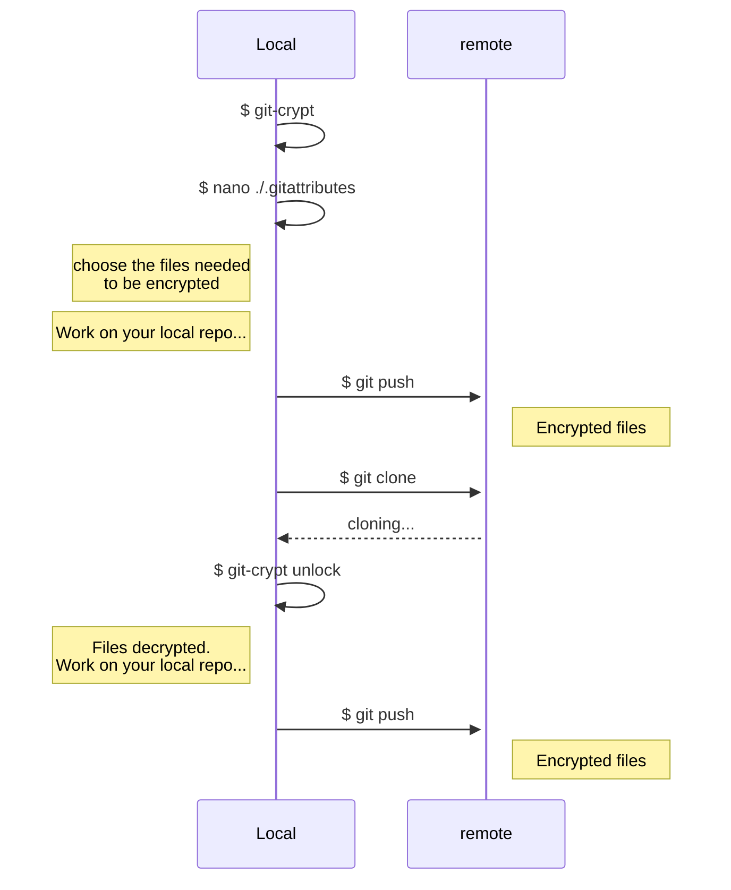

# Git-crypt

To execute the Ansible playbooks, you need to have `git-crypt` installed and have your GPG key added to the repository by someone who already has permissions. They will add it using the command `git-crypt add-gpg-user USER_ID`, where `USER_ID` is an email address or a GPG fingerprint.

Once this step is completed, you can unlock the repository with the command `git-crypt unlock`.  
This command only needs to be executed once after cloning the repository.

The files to be encrypted are specified in the `.gitattributes` file with the parameters `filter=git-crypt diff=git-crypt`.

Example:

```text
secrets.yml filter=git-crypt diff=git-crypt
```

## How to check if a file is encrypted

You can use `git-crypt status -e` to list encrypted files.

## Create a GPG key

```sh
gpg --full-generate-key
gpg --list-keys
gpg --armor --output public.key --export your.name@your.domain
```

## Add a new developer

```
gpg --import new-dev_pubkey.gpg
gpg --list-keys
```

Write down the id the key (e.g. `C4B6441EE0AFC4FDCDA147C82ABD6FA245F741B7`). Tell gpg that you trust that the key really belongs to the person you want to add, by signing the key. Make sure you select the subkey 1 (the one that is used to encrypt/decrypt, so with `usage: E`, more of that here: https://wiki.debian.org/Subkeys).
If you have multiple secret keys/identity, you can add the `--local-user` option.

```
gpg --edit-key C4B6441EE0AFC4FDCDA147C82ABD6FA245F741B7
>key 1
>sign
>save
>quit
```

Finally:

```
git-crypt add-gpg-user C4B6441EE0AFC4FDCDA147C82ABD6FA245F741B7
```

This will add a new file `.git-crypt/keys/default/0/C4B6441EE0AFC4FDCDA147C82ABD6FA245F741B7.gpg`, that contains the repo key, encrypted by the new dev's public key. A new commit is created.


## How it works (for those interested)

The repository is (partially) encrypted using a private key.

To give access to a new user, someone which already has access to the repository private key will use the public key of the new user to encrypt the repository private key. The resulting file will be added in the directory `.git-crypt/keys/default/0`.

Then the new user can use his private key to decrypt the repository private key.



You can get the ID of the key corresponding to such a file:

```sh
$ gpg --decrypt C4B64HHEE0AFC4FDCDA147C82ABD6FA245F741B7.gpg
gpg: encrypted with ECDH key, ID 73A3F7BF5E541E09
gpg: decryption failed: No secret key
```

If you already know the key, you'll also get friendly information:

```sh
$ gpg --decrypt C4B64HHEE0AFC4FDCDA147C82ABD6FA245F741B7.gpg
gpg: encrypted with 255-bit ECDH key, ID 73A3F7BF5E541E09, created 2025-02-14
      "Some Guy (Open Food Facts) <your.name@your.domain>"
gpg: decryption failed: No secret key
```

## Decrypt/encrypt

Unlock with `git-crypt unlock`. Lock with  `git-crypt lock`.
