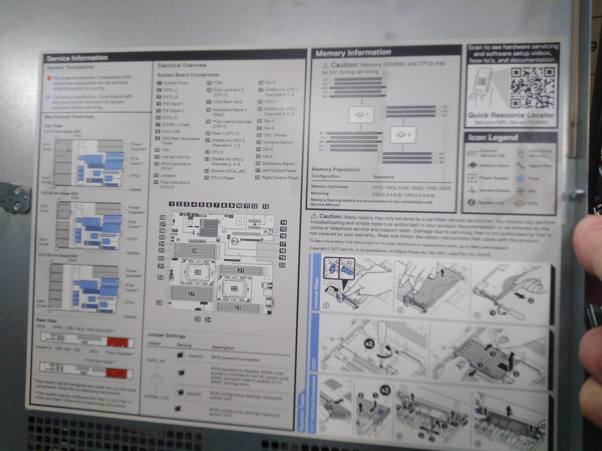
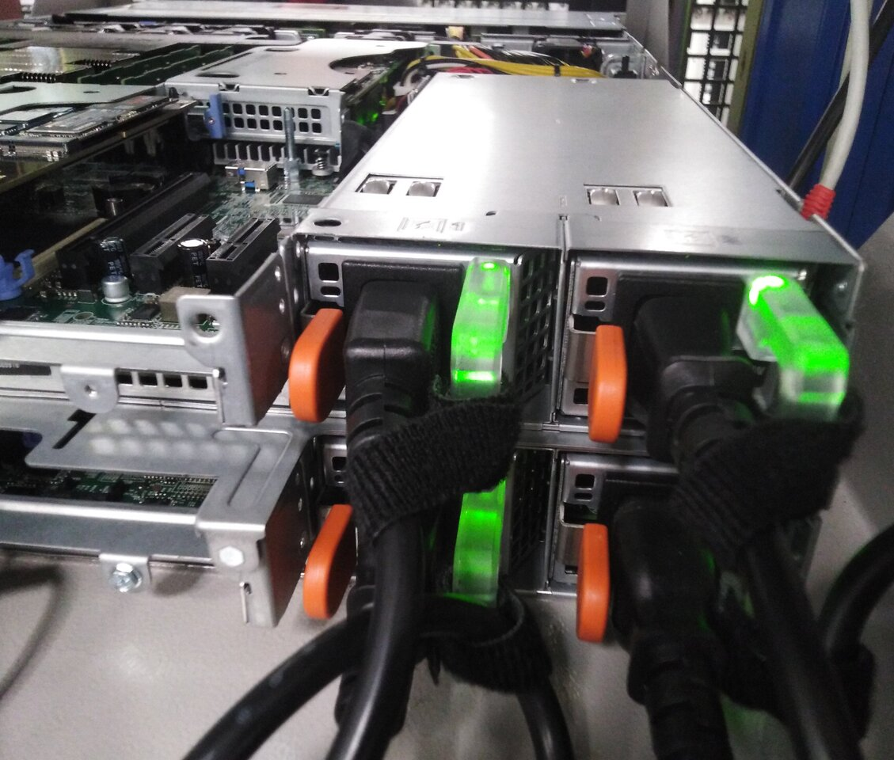
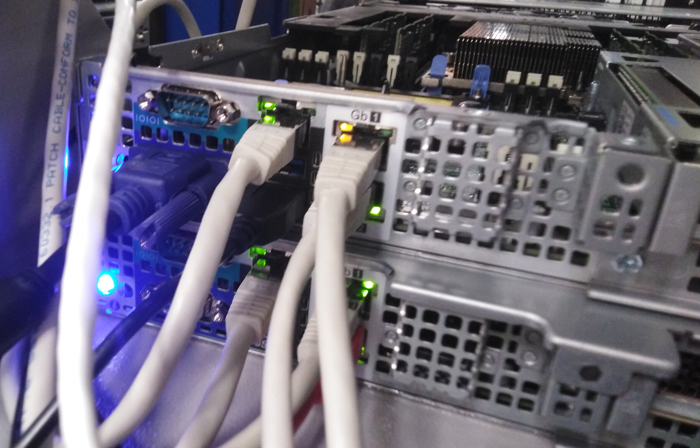

# Free Datacenter

[Fondation Free](https://www.fondation-free.fr/) is graciously providing us hosting for two servers: off1 and off2.
They also provide network and electricity for free.

## Location

Those servers are located is Bezon, near Paris. To go there we need to ask to the team there.

The two servers are piled one above another (off2 on top).
It's a bay with different Open Source projects' servers.
They have at small label on them "Open Food Facts"

## Servers

Those are DELL servers.

On the back side of server cover you find some useful instructions.

{ width=50% }

To switch a server off, plug a screen and keyboard or use ssh, login and use shutdown command.

The server switch on button is on the front panel, a small ⏼ button on the right.

There is a double plug for power supply. A small velcro helps keeps plugs in place.

{ width=50% }

There is a blue led if all is ok (on the front and on the back). If something is wrong it turns to orange and blinks. (it will be the case for example if cover is not on the server).

You can make the LED blink to identify the server by a button on the left on the front side of the server.

## IPMI

IPMI enables rebooting the server through the network.

Connecting to 213.36.253.209 with a browser or ssh we get access to an emergency console on the machine. (note: it uses a self signed certificate).

It has to be configured with the right static network configuration in BIOS to be able to work (see below)

## Network

We have three network physical interface on each server:
- one dedicated to ipmi
- one for internal network - on a dedicated small switch between OFF and OSM machines
- one for public network

{ width=50% }

### IPv4

We have the following static IP v4 addresses:
- off1:
  - 213.36.253.206/27 used for the host (vmbr0)
  - 213.36.253.215/27 used for the reverse proxy container
- off2:
  - 213.36.253.208/27 used for the host (vmbr0)
  - 213.36.253.214/27 used for the reverse proxy container

Gateway is 213.36.253.222

DNS is 213.36.253.10 (gw4-vl12.free.org)

Reverse name is set to:
- off1.openfoodfacts.org for 213.36.253.206
- off2.openfoodfacts.org for 213.36.253.208

Also we have a vmbr1 on each host with a private network,
which is forwarded through vmbr0 on the host.

### IPv6

Policy for IPv6 we have the following:

For each IPv4 address correspond an IPv6 range of `2a01:e0d:0001:c:58bf:fa<last-part-of-ipv4-address>::*/64`
last-part-of-ipv4-address is a two digit hexadecimal number.

For example `206` is `ce` in hexadecimal so `213.36.253.206` correspond to `2a01:e0d:0001:c:58bf:face::*/64`.

So we have:
- off2:
  - 2a01:e0d:0001:c:58bf:fad0:1/64 for the host (vmbr0)

Gateway is `2a01:e0d:1:c::1` (gw6-vl12.free.org)

We use ipv4 for DNS.

Also we have a private ipv6 network (vmbr1) which can be shared between the two servers.
The prefix is `fd28:7f08:b8fe`, so containers can have an ipv6 access to the internet, 
while not being publicly accessible.
It is forwarded through vmbr0 on the host.

## Disks

SATA Disks are on the front panel. You just have to push a small red button, it makes a small handle comes out and you can rack them out.

We had to use Dell SATA disks because otherwise there maybe compatibility issues (this is one of the limitation of DELL servers).

SSDs are in the back of the server (extension card)

## off2 configuration

off2.openfoodfacts.org

- 4x14Tb disks
- 2x2TB SSD
- 1x1TB SSD
- 1x60GB [optane disk](https://en.wikipedia.org/wiki/3D_XPoint)

Optane disk are as fast as flash drives but without being sensitive to rewrites (no limited life).

The 14Tb disks are in a ZFS pool mounted as RAID 1 (rpool)

Since Feb. 2023, off2 uses [Proxmox](./proxmox.md).

### BIOS settings

#### Slot bifurcation

This is to specify how the PCI card supporting SSD will work (16 port divided in 4x4).

In System BIOS / Integrated devices / Slot bifurcation: *Auto discovery of bifurcation*

#### PERC adapter

PERC Adapter Bios (Power Edge RAID Controller) is set to be  *HBA mode* for we use ZFS and don't want system RAID.

#### IDRAC / IPMI settings

Those settings are in the BIOS settings.
They enable a distant reboot of the server through a specific interface.

* disable DHCP and auto-discovery
* Static IP address: 213.36.253.209
* Gateway: 213.36.253.222
* Subnet Mask: 255.255.255.224
* Static DNS: 213.36.253.10
* Static Alter: 213.36.252.131

### Network

Apart from the IDRAC address, off2 has the 213.36.253.208 IP address.

We also have 213.36.253.214 which is dedicated to the [NGINX reverse proxmox](./nginx-reverse-proxy.md).