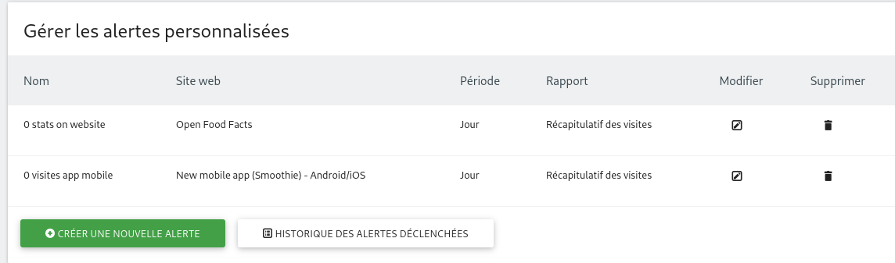

# Matomo

[Matomo](https://matomo.org/) is the web analytics platform.

Available at: https://analytics.openfoodfacts.org/

You must have a user account to access it (hopefully !). Ask for an admin to create you an account if you need it (Beware, there are personal information in the sense of GDPR like ip addresses).
Ask for it to *contact* email.

## Main running services

* nginx is used as a HTTP frontend
* php7.3-fpm run the matomo software
* mariadb is the main database for matomo, some configurations are made for performance (see `/etc/mysql/mariadb.conf.d/90-off-configs.cnf` )
* redis is used to fast track  matomo requests (see [Matomo setup for performance, below](#matomo-setup-for-performance))
* different systemd timer takes care of putting tracking from redis to mariadb and to consolidate archive reports (see [Matomo setup for performance, below](#matomo-setup-for-performance))
* prometheus exporters are installed for nginx and mysql (see [Prometheus exporters, below](#prometheus-exporters))

Most of those systemd services should email on failures.

Important configuration files are linked to this git repository (see [using git, below](#using-git))

## Alerts

You can setup alerts in matomo. In personal alerts.

We have setup alerts for main website and app if there are 0 visits.



## Important: temporary patch


Because of [Queue id should try to be more random #231](https://github.com/matomo-org/plugin-QueuedTracking/issues/231) and [Set a random visitor ID at each requests instead of using 0000000… for anonymous analytics](https://github.com/openfoodfacts/smooth-app/issues/5095)

until enough mobile app are deployed, I manually patched `plugins/QueuedTracking/Queue/Manager.php`:

```php
    protected function getQueueIdForVisitor($visitorId)
    {
        # 2024-03-08 patch from ALEX
        if ($visitorId === '0000000000000000') {
            $visitorId = chr(rand(ord('a'), ord('z')));
        }
        $visitorId = strtolower(substr($visitorId, 0, 1));
      ...
```

And also as our instance was having a hard time coping with all requests,
in `plugins/QueuedTracking/Queue/Processor.php`:

```php
    private function extendLockExpireToMakeSureWeCanProcessARequestSet(RequestSet $requestSet)
    {
        // 2 seconds per tracking request should give it enough time to process it
        // 2024-03-15 ALEX try 15 s per requests instead of 2s
        $ttl = $requestSet->getNumberOfRequests() * 150;
        $ttl = max($ttl, 30); // lock for at least 30 seconds

        return $this->queueManager->expireLock($ttl);
    }
```


## Site setup

* goto manage / websites and add a website

### GDPR

To be GDPR compliant (and user friendly) [^gdpr_ref]:

- in your Matomo Tag, you can check the option « Disable cookies » which will disable all first party tracking cookies for Matomo. [^disable_cookies]
- To ensure that you do not store the visitor IP, which is Personally Identifiable Information (PII), please go to Administration > Privacy > Anonimyze data, to enable IP anonymization, and check you have 2 bytes or 3 bytes masked from the IP address. [^ip_anon]

[^gdpr_ref]: https://fr.matomo.org/blog/2018/04/how-to-make-matomo-gdpr-compliant-in-12-steps/

[^disable_cookies]: https://fr.matomo.org/faq/general/faq_157/

[^ip_anon]: https://matomo.org/faq/general/configure-privacy-settings-in-matomo/#step-1-automatically-anonymize-visitor-ips

### In productopener

We use the `$google_analytics` variable in config to add the javascript snippet for Matomo.

## Matomo install

See also [Install log](./reports/2021-02-22-matomo-install.md) and [2023-12-11 Matomo down](./reports/2023-12-11-matomo-down.md)

### using git

We use git to track some important configurations files in this repository.

The repository is checked out in /opt/openfoodfacts-infrastructure and specific `/etc` configurations files are symlinked there (see `confs/matomo`).

### Matomo setup for performance

We setup matomo for performance (our websites requires it) with two main points:

* it does not process archives on incoming requests but instead on a systemd timer (see `confs/matomo/systemd/matomo-archive.{service,timer}`).
  See also [official doc](https://matomo.org/faq/on-premise/how-to-set-up-auto-archiving-of-your-reports/).

* on incoming update request (on a tracked website being visited),
  it does not immediately updates the database but goes in redis instead,
  we configured it with 8 queues.
  then are systemd timers jobs to process redis entries every minute (see `confs/matomo/systemd/matomo-tracking@.{timer,service}`).
  And we have an instance 0, 1, 2,… 7, to process each queue.
  See also [official doc](https://matomo.org/faq/on-premise/how-to-configure-matomo-to-handle-unexpected-peak-in-traffic/)

* `MariaDB` has been tuned a bit toward performance (using more memory) see `/etc/mysql/mariadb.conf.d/90-off-configs.cnf` (linked to this repository `confs/matomo/mysql/mariadb.conf.d/90-off-configs.cnf`)

  * we also tried to avoid "2006 MySQL server has gone away" following https://matomo.org/faq/troubleshooting/faq_183/

* Archiving is splet in more than one systemctl timer / service, by using `matomo-archive@<name>.timer/service`
  which correspond to different options it `/etc/matomo/archive-<name>.env`, so that:

  * there is one archiver specialized for the openfoodfacts.org website
  * one specialized for the mobile app
  * one for all the other websites

  ( all this thanks to `--skip-idsites`/`--force-idsites` options)

Both tracking and archiving logs to `/var/log/matomo`.

See also [2023-12-11 Matomo down](./reports/2023-12-11-matomo-down.md)

### Prometheus exporters

Nginx prometheus exporter is installed and needs the stub_status site, which exposes nginx metrics.

Mysql server prometheus exporter is installed (for MariaDB), its `/etc/default` configuration file sets the connection string.
The corresponding mysql user had to be manually created (instrutions in the config file).

### Updating the Matomo version

**read this whole section before anything**

We use the web administration to update the software.

Always do a snapshot before updating.

**IMPORTANT:** after an upgrade, you must re-apply the [temporary patches](#important-temporary-patch), you need root access to the server to do that.

### Setup robots.txt to avoid search engine indexing

Setup `/var/www/html/matomo/robots.txt` as is:
```
User-agent: *
Disallow: /
```


## How to

### How to investigate 0 visit problems

1. You first have to see if the request made by a browser to matomo returns a `204 No Content` response (use the network panel of developer tools).

   Also verify that the site_id is correct.

2. If it's ok but you don't see the visit, you may look at real time visits of your website.
   If there is no data it may means the tracking jobs are not running correctly.

   You can log on the server and use `mysql matomo_db` to look at the database,
   in particular `matomo_log_visit` table contains visit logs.

   Beware that it's a huge table, try to limit your query with something like
   `WHERE idsite=5 AND visit_last_action_time > '2024-01-16'`

   You can also see section below [How to monitor tracking jobs](#how-to-monitor-tracking-jobs).

3. incomplete graph might also come from archive processing.
   Sometimes, in this case, scaling down to days might show you right results, 
   whereas you get incomplete result at the week or month level.

   See [How to monitor archive jobs](#how-to-monitor-archive-jobs).


### How to monitor tracking jobs

When a request arrive, it is logged into redis.
We then have matomo-tracking systemd services to process the redis queue.

To see status:
```bash
# see jobs status
systemctl status matomo-tracking@{1..3}.service
# see timers status
systemctl status matomo-tracking@{1..3}.timer
```

Matomo also offers some commands to follow the status of the tracking jobs:

```bash
cd /var/www/html/matomo
./console queuedtracking:monitor

# you might also look at lock status
./console queuedtracking:lock-status
```
use `--help` for more options.

Logs are in `/var/log/matomo`

### How to monitor archive jobs

To see status:
```bash
# see jobs status
systemctl status matomo-archive@{main,2,5}.service
# see timers status
systemctl status matomo-archive@{main,2,5}.timer
```

Logs are in `/var/log/matomo`

### How to monitor database

`diagnostics:analyze-archive-table` can help see informations about tables.

Use it with `YYYY_MM` argument.

Eg.
```bash
cd /var/www/html/matomo
./console diagnostics:analyze-archive-table 2023_12
```

`database:optimize-archive-tables` can optimize tables if needed. Do it on old tables that are not moving any more. Use with a `YYYY-MM-DD` argument.

```bash
./console database:optimize-archive-table 2023-12-01
```

### How to test a command in php cli

For example I wanted to determine if we support async in CliMulti (used by `core::archive`).

The important thing is to go in the right directory and include the `console` script.

```bash
cd /var/www/html/matomo/
php -a

php > include "console";
...
php > use Piwik\CliMulti\Process;
php > echo Piwik\CliMulti\Process::isSupported();
1
php > use Piwik\CliMulti;
php > $p = new Piwik\CliMulti();
php > echo $p->supportsAsync();
1
```

