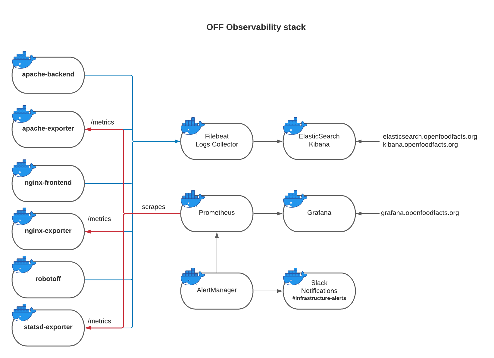

# Observability

This document describes the observability stack used at Open Food Facts to monitor applications.

Having a good observability stack is critical to spend less time when debugging failures, to have a comprehension of how applications behave over time, and to have the ability to compare a software version with the previously deployed one.

## Munin

See [Munin](./munin.md) a tool to monitor servers and services.

## Influx / Prometheus / Grafana

See [openfoodfacts-monitoring project on github](https://github.com/openfoodfacts/openfoodfacts-monitoring/)

The observability stack used in the OFF stack is comprised of the following applications:

* **Filebeat** as a logs collection agent deployed on each QEMU VM with Docker containers.

* [**ElasticSearch**](https://www.elastic.co/guide/en/elasticsearch/reference/current/index.html) for centralized storage and indexing of logs collected from Docker.

* [**Kibana**](https://kibana.openfoodfacts.org/) UI to visualize and use logs collected by ElasticSearch. [(official doc)](https://www.elastic.co/guide/en/kibana/current/index.html)

* [**Prometheus**](https://prometheus.io/docs) for scraping metrics from Prometheus exporters' `/metrics` endpoint, running as sidecar containers of the applications.

* **AlertManager** to send alerts based on Prometheus metrics, integrated with dedicated Slack channels.

* [**InfluxDB**](https://docs.influxdata.com/influxdb/v2.0/) is the storage backend for data harvested by prometheus

* [**Grafana**](https://grafana.openfoodfacts.org/) for visualizing Prometheus metrics, InfluxDB and other metrics; and create dashboards. [(official doc)](https://grafana.com/docs/grafana/latest)

* **Prometheus exporters** such as the [Apache Prometheus Exporter](https://github.com/Lusitaniae/apache_exporter), which collect metrics from applications and expose them on a port in the Prometheus metric format. Some applications natively export Prometheus metrics and do not need additional exporters.

The observability stack diagram is as follows:



## Prometheus

Some interesting pages of prometheus include:
* https://prometheus.openfoodfacts.org/alerts to show currently triggered alerts
* https://prometheus.openfoodfacts.org/targets where you can check the status of the targets (services observed by prometheus)
* https://prometheus.openfoodfacts.org/rules for alerting rules

### multi-target exporter pattern

We use the [multi-target exporter pattern](https://prometheus.io/docs/guides/multi-target-exporter/#querying-multi-target-exporters-with-prometheus) on some configurations.

This pattern helps writting a lot of targets that follow same rules in the same way.

Some points that are not easy to understand:
* targets will be in `__address__` at the begining of the process
* the last rule overwrite `__address__` to put some static value, but it's ok as previous rules where already processed
* simple params like `instance`, `app` are parameters for the job configuration, not for the target url
* to add params to target url we use `__param_xxxx` (for exemple `__param_target` to add a `target` parameter to url)
* `instance` is very important, as each job must have their separate instance name.

You can look at https://prometheus.openfoodfacts.org/targets to see if your targets are processed correctly. 
A mouse over in the "labels" column shows you parameter before processing.


## Blackbox exporter

Is a service that can be used by Prometheus to probe for websites. 

Prometheus will call the service as if it was a metric exporter with the appropriate target (that you set through `target` on `__param_target` in the configuration (if you use [multi-target exporter pattern](https://prometheus.io/docs/guides/multi-target-exporter/#querying-multi-target-exporters-with-prometheus))


## Exposing metrics behind a proxy

Prometheus server is in OVH datacenter.
To expose metrics from Free datacenter through the internet,
we use the nginx reverse proxy.

See free-exporters site configuration, and scraper configuration.

### Testing it on monitoring container

Blackbox is on port 9105 so you can test it, for example using:
```bash
# http probe
curl "http://localhost:9115/probe?module=http_probe&target=https%3A%2F%2Fsearch.openfoodfacts.org%2F"
# icmp probe
curl "http://localhost:9115/probe?module=icmp&app=ovh1&target=ov1.openfoodfacts.org"
```


## How to debug blackbox exporter probe failing

If you have a probe failing, you can test what blackbox exporter is reporting by:

* connecting in ssh to monitoring VM with a port redirection for 9115 to the container port 9115
  `ssh -L 9115:<VM internal ip>:9115 <server-name> -N`

  currently, this should be `ssh -L 9115:10.1.0.203:9115 ovh1.openfoodfacts.org -N`
* this gives you access to blackbox exporter on port http://127.0.0.1:9115
* there you have a table with current status for different probes and log of the probes, which should help you understand.
* you can test the probe with:
  http://127.0.0.1:9115/probe?module=http_probe&target=https%3A%2F%2FMYSERVER.TLD/MY/PATH
* you can also add a "debug=true" parameter to the url to see the debug output
* you might be interested in looking at the `probe_success` and `probe_http_status_code` value

You can try to reproduce the same probe with curl.
