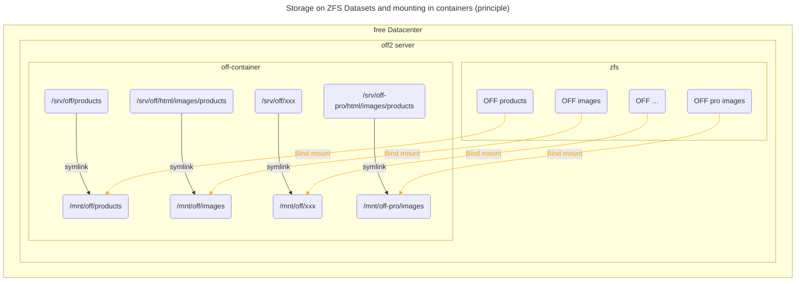
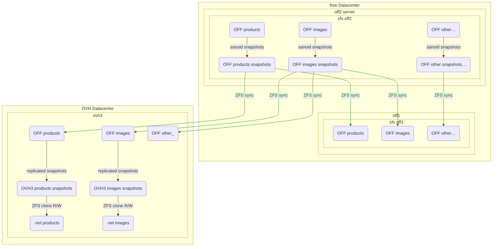
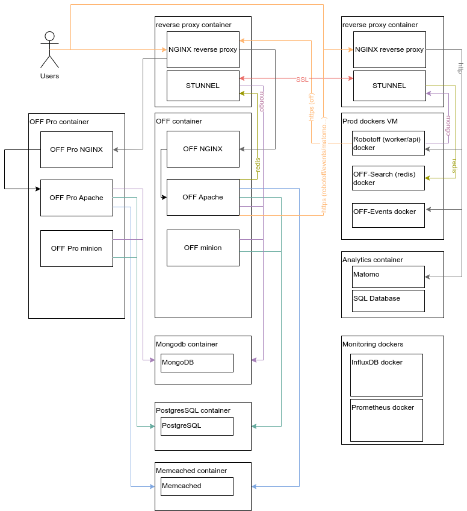

# Production architecture

## Servers

Main web server is hosted on off1 and off2 at [Free Datacenter](./free-datacenter.md)

Some other services are hosted on OVH servers.

## Proxmox

We use the [Proxmox open-source virtualization platform](./proxmox.md)

## Server configuration in git

We try to keep as much as possible the specific configurations of the server in the git repository.
Of course we should never commit any secret (but few files contains secrets).

The server has the [infrastructure git repository](https://github.com/openfoodfacts/openfoodfacts-infrastructure)
cloned in `/opt/openfoodfacts-infrastructure` by root user.

We symlink files in `/etc` to this directory, this enables updating the server with a simple `git pull` (but this still may needs services reload or restart, or a systemctl daemon-reload, etc.).

`/etc/pve` is a bit particular for it is only an image of Proxmox configuration (and not a real filesystem),
thus we cannot use symlink there. Instead, we copy the file contents to the git repository after each modifications.

see [Explanation on server configuration with git](./explain-server-config-in-git.md)
and  [How to have server config in git](./how-to-have-server-config-in-git.md)

**TODO:** we could consider automatizing the copy and sync of important (and secret less) `/etc/pve` files.

**TODO:** at the moment only off2 is fully configured using git, and ovh3 partially. We should do it also for ovh1 and ovh2.

Configurations files for off2 server are in `confs/off2/` directory.

Scripts used on off2 can be found in `scripts/off2/`.

## NGINX proxy

We have a container for the [NGINX reverse proxy](./nginx-reverse-proxy.md)

This proxy might be cascading to another Nginx specific to an installation (itself cascading to eg. an Apache for some of the requests).

It use fail2ban to ban bots, see [How to use fail2ban to ban bots](./how-to-fail2ban-ban-bots.md)

We have a special exception (for now) of images.openfoodfacts.org which is served by a nginx installed directly on the host (off2 or ovh3).

## Product Opener deployment

### One application - one container

Each Product Opener instance has its own LXC container.

That is each flavor of product-opener (off, opf, opff, obf) in public mode, and the Producer Platform is another application (it currently exists only for off).

The container contains all the needed software (the application is not further split in smaller containers as it's the case for docker installation), with exception to databases which are on separate dedicated containers.

This means:
* nginx - aka the frontend
* apache - aka the backend
* minion process
* incron process

Databases are shared between instances, for now this is more handy:
* Mongodb instance
* PostgreSQL
* Memcached

Note that we requests pass through two NGINX: the reverse proxy and the project specific nginx.
This is not a big cost, and it makes it far more easy to manage things,
for the project nginx has a lot of specific rules and directly serve static resources.

### Container configuration in Git

Inside the containers specific configurations are stored in the main product opener repository for this container.
As on host, we use symlinks in `/etc/path/to/some/config` to have configurations updated automatically on git pull.
Beware not to put files with secrets there !

### Main Folders

The idea is that a deployment should only be a git pull + some commands (like build_lang).
So we try hard to stick to the git repository layout, and only add some symlinks to the data [^data-refactor].

Here are some important Pathes:
* the main code is installed in `/srv/<flavor>` and should really keep being a clone of the git repository.
* the `/srv/<flavor>-static` contains the compiled static assets, so that on release, we just have to untar the static archive there
* the `/srv/openfoodfacts-web` contains the openfoodfacts-web repository with it's static contents
* `/mnt/<flavor>` is where the external ZFS datasets are mounted into the VM

Also we have some more folders to be able to write on data that are from other instances [^data-refactor2].
They are mounted in `/mnt/<other-flavor>` and symlinked somewhere under the `/srv/<other-flavor>` directory.

[^data-refactor]: and we really need to do a refactor at some point to simplify that and only have a few volumes: data, caches, configuration data

[^data-refactor2]: there again, we should refactor this to avoid this kind of dependencies, or at least make them more configurable

### Storage

We must try hard to separate data and software.

All data is stored on ZFS.
We have different [ZFS datasets](https://openzfs.github.io/openzfs-docs/man/7/zfsconcepts.7.html?highlight=dataset).

Some are shared between installs:
* users - `/mnt/<flavor>/users`
* orgs - `/mnt/<flavor>/orgs` (**FIXME** verify section)

Some specific to a flavor, but shared between producer and public platform:
* product images - `/mnt/<flavor>/images/` (which products folder is linked in html/images/)

Some specific to each flavor:
* products - `/mnt/<flavor>/products`
* html_data `/mnt/<flavor>/html_data` (linked in html/data)
* other data (`/mnt/<flavor>/*`) [^other-data-details] [^data-refactor3]

The datasets are mounted in the different container using a bind mount.
In proxmox, this is done by adding Mount point, `mp<number>`, entries to the container configuration, see [Bind mounting ZFS Datasets in proxmox](./proxmox.md#bind-mounting-zfs-datasets).

[^other-data-details]:
    The other data contains:
    * static data
    * `data-default`
    * `ecoscore` (external)
    * `emb_codes` (external)
    * `forest-footprint` (external)
    * `ingredients`
    * `packager-codes` (external)
    * `taxonomies`
    * `templates`
    * `po`
    * `lang`
    * real data:
    * `deleted.images`
    * `html_data`
    * `data`
        * `scanbot.xxxx` is not cache
    * cache data:
    * `build-cache`
    * `tmp`
    * `debug`
    * `new_images`
    * specific:
    * `log`
    * `users_emails.sto` linked to ./users/users_emails.sto

    Also:
    * lang  - `/mnt/<flavor>/lang` is mounted as a specific volume in docker but this is just compiled configuration data (po files)

[^data-refactor3]: and we really need to do a refactor at some point to simplify that and only have a few volumes: data, caches, configuration data

<!-- You can test it here https://mermaid.live/ -->

## ZFS storage syncs

ZFS datastest are replicated snapshoted (backups) and synced.

We use [sanoid](./sanoid.md) to manage snapshot (create them and handle retention policy).

We use [syncoid](./sanoid.md#syncoid-service-and-configuration), a companion tool of sanoid to synchronize snapshots on other servers.

Also some snapshot are used through clones to provide data for staging. (see `/opt/openfoodfacts-infrastructure/scripts/ovh3/maj-clones-nfs-VM-dockers.sh`).

<!-- You can test it here https://mermaid.live/ -->

OVH3 or OFF2 images are also used by NGINX serving `images.openfoodfacts.org`. **FIXME: add page about that**

## Network

All application must talk to each other using the internal network. To talk between machines, every communication should go through Stunnel or https.

Stunnel has the advantage to conduct any TCP stream (not UDP, sadly). No need to add specific firewall rules, Stunnel use a specific authentication.

We use Stunnel with PSK which is faster and easy to configure.
Each server connection must use unique PSK.

Here is a diagram to understand connections (not complete) ([source](img/architecture-diagram.drawio)).

