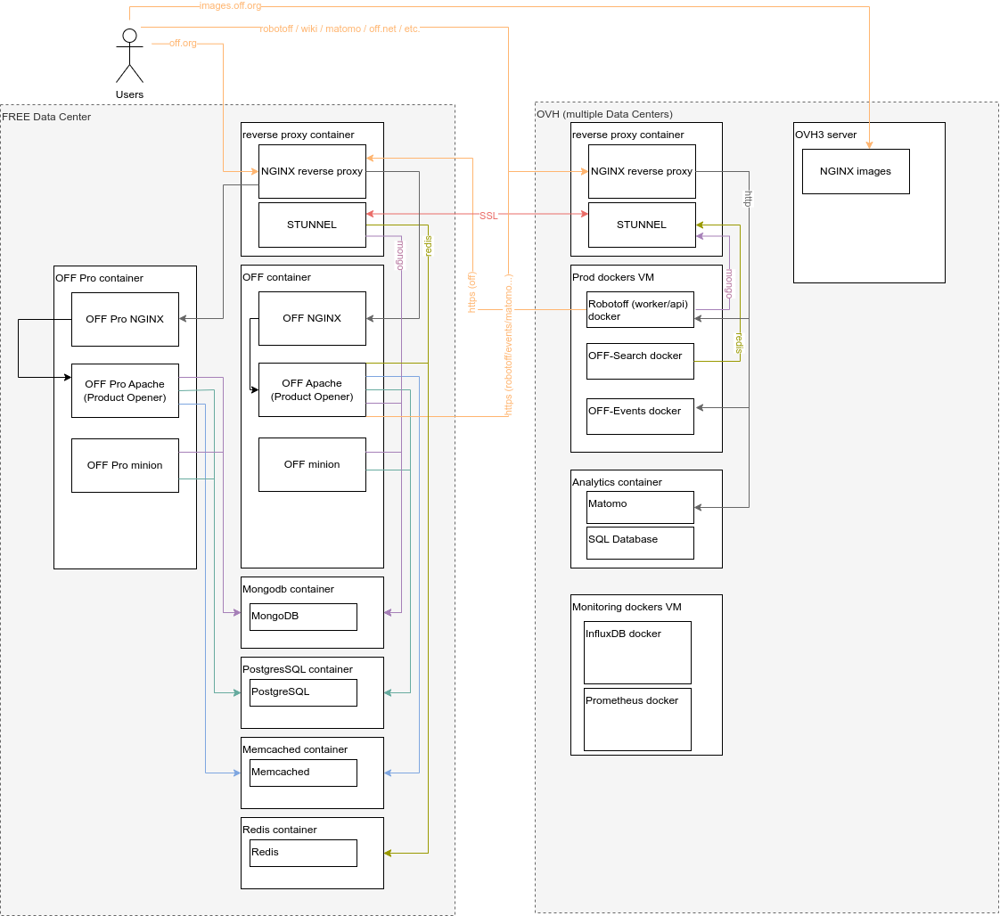

# Production architecture

## Servers

Main web server is hosted on off1 and off2 at [Free Datacenter](./free-datacenter.md)

Some other services are hosted on OVH servers

## Proxmox

We use [proxmox](./promox.md)

## NGINX proxy

We have a container for the [NGINX reverse proxy](./nginx-reverse-proxy.md)

This proxy might be cascading to another Nginx specific to an installation (itself cascading to eg. an Apache for some of the requests).

## One application - one container

Each application has its own LXC container.

An application is a flavor of product-opener (off, opf, opff, obf) in public mode. A producer platform is another application (it currently exists only for off).

The container contains all the needed software (the application is not further splitted in smaller containers as it's the case for docker installation), with exception to databases which are on separate dedicated containers.

This means:
* nginx - aka the frontend
* apache - aka the backend
* minion process
* incron process

Databases are shared between instances, for now this is more handy:
* Mongodb instance
* PostgreSQL
* Memcached

## Storage

We must try hard to separate data and software.

All data is stored on ZFS. We have different datasets.

Some are shared between installs:
* users - `/mnt/<flavor>/users`
* orgs - `/mnt/<flavor>/orgs` (**FIXME** verify section)

Some specific to a flavor, but shared between producer and public platform:
* product images - `/mnt/<flavor>/product_images` (linked in html/images/)

Some specific to each flavor:
* products - `/mnt/<flavor>/products`
* lang  - `/mnt/<flavor>/lang`
* html_data `/mnt/<flavor>/html_data` (linked in html/data)
* other data (`/mnt/<flavor>/*`)

Also all products / products images from other platform must be available to the other flavors (because we need to move products around)

**FIXME**: what about js assets (how are they compiled in prod ?) --> we should publish them on release with a github action (safer)
- icons_dist:/opt/product-opener/html/images/icons/dist:ro
- js_dist:/opt/product-opener/html/js/dist:ro
- css_dist:/opt/product-opener/html/css/dist:ro
- node_modules:/opt/product-opener/node_modules:ro

## Network

All application must talk to each other using the internal network. To talk between machines, every communication should go through Stunnel or https.

Stunnel has the advantage to conduct any TCP stream (not UDP, sadly). No need to add specific firewall rules, Stunnel use an authentication.

We use Stunnel with PSK which is faster and easy to configure.
Each server connection must use unique PSK.

Here is a diagram to understand connections (not complete) ([source](img/architecture-diagram.drawio)).

