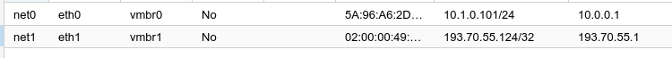
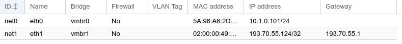

# [Postmortem] Reverse proxy down

**Date**: 2022-02-18

**Authors**: Alex <alex@openfoodfacts.org>

**Summary**: wiki.openfoodfacts.net down after ovh1 reboot, as well as all services using a CNAME on proxy1.openfoodfacts.org or proxy.openfoodfacts.org.

**Impact**: Tools / services unreachable : feedme, wiki, slack page, etc.

**Root Causes**: Network configuration on proxy (VM 101) did not return to a correct state after reboot, because of two default gateway resulting in a race condition, and in an incorrect default gateway for public ip (fail over ip) of proxy.

**Trigger**: Reboot of ovh1, to be able to cleanup some old VM, blocked by stalled processes (uninterruptible sleep)

## Diagnosis

We got a problem after rebooting ovh1 : the proxy was not responding on it's public ip.
On `proxy` VM aka `101`. We had two IPs, one internal (NAT mode) `eth0` (`10.1.0.101`) and one public (bridged) sharing a virtual bridge with host: `eth1` `193.70.55.124`.
The problem was that nated requests (passing through ovh1 ip and forwarded by iptables) did work but not requests to public ip.
* ping to ip did work
* `nc -vz 193.70.55.124 80`  did succeed
* `lsof -i tcp` in proxy did show nginx listening on all interfaces
* but doing HTTP requests manually  using `nc`, did not succeed (it was working only from inside the VM)

proxy:
```bash
root@proxy:/etc/nginx# nc -v 193.70.55.124 80
proxy1.openfoodfacts.org [193.70.55.124] 80 (http) open
GET /
<html>
<head><title>301 Moved Permanently</title></head>
```
my computer:
```bash
alex@tignasse:~$ nc -v 193.70.55.124 80
Connection to 193.70.55.124 80 port [tcp/http] succeeded!
GET / HTTP/1.1
```

Long story short: the problem was that default route was passing through eth0, and thus packets did not return.
```bash
# ip route list
default via 10.0.0.1 dev eth0
10.0.0.1 dev eth0 scope link
10.1.0.0/24 dev eth0 proto kernel scope link src 10.1.0.101
193.70.55.1 dev eth1 scope link
```
Using:
```bash
ip route del default via 10.0.0.1 dev eth0
ip route add default via 193.70.55.1 dev eth1
```
We get to:
```bash
# ip route list
default via 193.70.55.1 dev eth1
10.0.0.1 dev eth0 scope link
10.1.0.0/24 dev eth0 proto kernel scope link src 10.1.0.101
193.70.55.1 dev eth1 scope link
```

And everything works.

## Resolution tentative 1

The problem: proxmox do control the interfaces settings and in `/etc/network/interfaces`, and route are set there using `post-up` and `pre-down` rules.
But as this part is managed by Proxmox, hence this is a bit hard to modify. And at boot time, eth cards are in competition to have their route the global default and eth0 wins over eth1, leading to the non working situation.


I did try to add this a script in `/etc/network/if-up.d/90-insure-eth1-default-route`
```bash
#!/usr/bin/env bash
# this script tries to ensure defaults route is on eth1
# this is important, otherwise apps served on  eth1 won't be able to respond to incoming packets
# if eth1 is up
# it should be in /etc/network/if-up.d/

# ..note: this is a bit fragile for we hardcode the gateway here
#    but greping for right gateway in interfaces seems a bit overkill..

if ( ip address show eth1 | grep "state UP" )
then
  # and default route not via eth1
  if ! ( ip route show default | grep eth1 )
  then
    >&2 echo "Setting up default route via eth1"
    # eventually remove eth0 route
    ip route del default via 10.0.0.1 dev eth0
    # add eth1 route
    ip route add default via 193.70.55.1 dev eth1 \
      || >&2 echo "Error while adding default route via eth1"
  fi
fi
```

this is a bit complicated though and hard code ip, while we would have to keep them in sync with proxmox settings.
Note: to use a script in `/etc/network/if-up.d/`, remember to `chmod +x` but also do not use any extension (a `.sh` extension makes run-parts ignore it !).


## Final Resolution

Christian (@cquest) proposes a more radical solution: **remove gateway for eth0, and only keep it for eth1**.

This has the advantage of being driven from proxmox.

Before:


After:


This works but then we cannot use forwarding requests through ovh1 ip + iptables. But that's fine, as this was not a portable configuration however (if we have to move proxy, there would have been no ip failover).

Still we add the gateway for eth0 with ip route, until we moved all CNAME to the public ip proxy1.openfoodfacts.org.

So a second action was to move CNAME for all services behind proxy from `ovh1.openfoodfacts.org` to `proxy1.openfoodfacts.org`