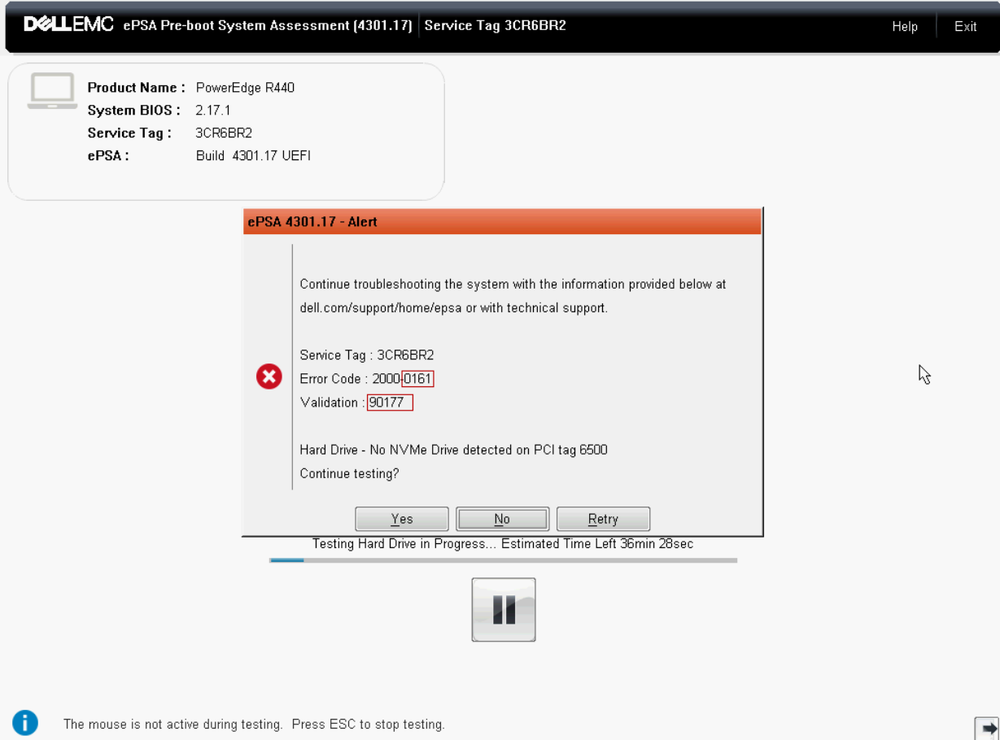

# 2022-03 Problem with PCI supporting NVMe

This happens after [OFF2 upgrade](./2023-02-17-off2-upgrade.md).

At some point, on march 14, we had this problem: the server was no more reachable.

## Diagnosis

After using IDRAC to reach it, we saw the server was not able to boot. It was booting, but after some time, did shutdown.

We upgrade the Bios (v 1.4.5 > v 2.17.1), it did not resolved.

After a looong investigation, thanks to checks we found that NVMe Drive did not seemed to be detected.

{ width=50% }

We then found that we could boot if we disabled PCI in Bios.

This means we lost the ssd disk we wanted to use as cache and fast disks at some point on the server.

Of course we had a message from zpool, at startup, unable to start the pool that was on NVMes.

[Zpool error importing rpool](../img/2023-03-16 zpool rpool error after disabling PCI.png "Zpool error importing rpool after disabling PCI"){ width=50% }

This is resolved using:
```bash
zpool import rpool -m
```

## Putting back disks

On 15th march 2023, Christian did go to the datacenter to try to put back the card to fix it.

## Still in error

On 16th Alex tried to connect the PCI again:

Connection to IDRAC: https://off2.ipmi.free.org/ as root.

* Opened a console
* In IDRAC --> reset system (warm reboot)
* in console:
  * F2 at init (to enter system setup)
  * then system bios 
  * integrated Devices 
  * go down to "slot disablement"
  * enable slot1 and slot2

Got this message:


In IDRAC I did a "System de cycle d'alimentation (cold reboot)"

It seemed to worked... but after some times the machine shuts down again and show this message.

I go back in BIOS to disable PCI slot 2 only.

It works, but of course we don't have the NVMe

Stephane tried another approach:
* in the BIOS:
  * enabled PCI slot 2
  * disabled bifurcation auto discovery
  * put 4x4x8 instead of x16
After reboot we see only one of the NVMe.

But it's wrong settings, we should use x4.

With x4 we are back to the first problem. So it's probably one of the NVMe which is faulty.
