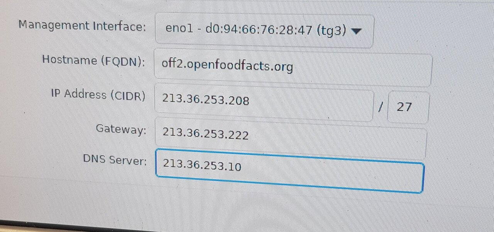

# 2023-02-17 Off2 Upgrade

## Hardware

We plug a monitor and a keyboard on off2 (on the rear).
We shut down the server. And remove both plugs.


Then we removed the two 4Tb disks (they were on the right). We unscrew them from the rail, and put the new 14Tb disks. We now have 4x14Tb.
The new 14Tb disks have exactly the same reference numbers as the old one.

Then we put the new RAMs in the server. They are symmetric to the already existing one, on the other side of the CPU. The cover indicates in which orientation memories should be connected.

We removed the card with the two SSDs on it to put a new card that support four SSD. We removed the box containing the card from the back of the server (next to ethernet ports) and plug the card out. The new card is a bit bigger than the previous so we have to remove a small piece of plastic to pull it into place. But first we put the three SSDs + the Optane disk (two on each sides). We miss one small screw for on of the SSD, but as it is blocked by the box bottom, it's not a problem.
We put the card back into the server.


{ width=50% }

{ width=50% }

{ width=50% }


Now we are ready for reboot.

We plug the server again.

We power on (small button on the right on the front of the server).

## Bios config

At some point, after memory check, the server display a dark screen and indicates some key to trigger BIOS. We hit F2 to enter BIOS (System Setup).

### Slot bifurcation
We go in:
* System BIOS
* Integrated devices
* Slot bifurcation
* we choose: Auto discovery of bifurcation

This is to specify how the PCI card supporting SSD will work (16 port divided in 4x4).

{ width=50% }

{ width=50% }

### IDRAC / IPMI
We go in Network settings to configure IDRAC / IPMI (which has its own ethernet card):
* disable DHCP and auto-discovery
* Static IP address: 213.36.253.209
* Gateway: 213.36.253.222
* Subnet Mask: 255.255.255.224
* Static Prefered DNS: 213.36.253.10
* Static Alter: 213.36.252.131

{ width=50% }


These settings are given by our host provider (free)

### PERC adapter
We go reboot and go again in the BIOS to configure PERC Adapter Bios (Power Edge RAID Controller), and change configuration to be in HBA mode for disks.

{ width=50% }


{ width=50% }


{ width=50% }

## Proxmox install

We plug the bootable USB stick with [Proxmox VE](https://www.proxmox.com/en/proxmox-ve) iso for installation.

{ width=50% }

As we re-start the server we go in boot setup (F11) and in boot option menu, we choose the USB key media to boot.

We arrive on Proxmox install screen, and start installation.

It discovers the network, and ask to validate EULA (End User License Agreement).

We have to choose the target start disk. We can see all disks are there.
We choose target ZFS. We choose RAID5, and we setup to only use the four 14TB disks. advanced config but keep the defaults.


{ width=50% }

{ width=50% }

{ width=50% }

{ width=50% }


But maybe we did two errors:

* we should have changed the HDSize to have a bigger partition (Proxomx VE choose 13Gb because this was the size of the smallest disk)
* we should have looked for an option to rename the ZFS to something else than rpool, as a ZFS pool named rpool was already present (see below)

We then add a root password, email: root@openfoodfacts.org
hostname: off2.openfoodfacts.org

Eno2 network setup:
* IP static: 213.36.253.208/27
* Gateway: 213.36.253.222
* DNS Server: 213.36.253.10

{ width=50% }

We are asked for confirmation:

{ width=50% }

And we launch install. It takes time. At the end it reboots.
We remove USB stick.

### first launch

First launch does not work and we find ourselves on a initramfs prompt.

This is due to the fact that we have two ZFS pools with the same name: `rpool`: one that was existing (on our old disks) and one we created at install (we should have tried to avoid default name at install).

`zpool import -f rpool` does not work because we have more than one numeric pool for the same name (because the zpool).

So we use `zpool list` and `zpool status` to get the numeric id.
Then `zpool import -f <numeric-id>`.


{ width=50% }


`zpool list` show us the pool.

We see the size of the pool is not what we wanted (it only took part of it), because we did not change HD Size parameter on install.

We exit with crtl+D

Now we have access to login.

We use `zpool import` to get other id for the old rpool and off-zfs

`zpool import -f <numeric id> rpool2` to import old rpool with a new name (rpool2).

{ width=50% }

And finally import the last zfs pool
`zpool import -f off-zfs`. W still need the `-f` because ZFS knows it was part of another system, and thus ask confirmation to import it in this new system.

{ width=50% }

### zfs commands

History of commands made by install for rpool:
```
2023-02-17.11:18:33 zpool create -f -o cachefile=none -o ashift=12 rpool mirror /dev/disk/by-id/ata-TOSHIBA_MG07ACA14TEY_X120A00LF9RG-part3 /dev/disk/by-id/ata-TOSHIBA_MG07ACA14TEY_X120A00PF9RG-part3 /dev/disk/by-id/ata-TOSHIBA_MG07ACA14TEY_X8F0A060F9RG-part3 /dev/disk/by-id/ata-TOSHIBA_MG07ACA14TEY_X8F0A0H8F9RG-part3
2023-02-17.11:18:33 zfs create rpool/ROOT
2023-02-17.11:18:33 zfs create rpool/data
2023-02-17.11:18:33 zfs create rpool/ROOT/pve-1
2023-02-17.11:18:34 zfs set atime=on relatime=on rpool
2023-02-17.11:18:34 zfs set compression=on rpool
2023-02-17.11:18:34 zfs set sync=disabled rpool
2023-02-17.11:22:57 zfs set sync=standard rpool
2023-02-17.11:22:57 zfs set mountpoint=/ rpool/ROOT/pve-1
2023-02-17.11:22:57 zpool set bootfs=rpool/ROOT/pve-1 rpool
2023-02-17.11:22:57 zpool export rpool
```

Then Christian on first (failing) boot:
```
2023-02-17.11:26:05 zpool import 9614896434456967606
2023-02-17.11:31:09 zpool import -N rpool
```


rpool2 was created long ago:
```
2021-02-16.11:06:54 zpool create -o ashift=12 rpool nvme0n1p2
```

And Christian on first (failing) boot:
```
2023-02-17.11:27:48 zpool import 3186033342002808046 rpool2 -f
2023-02-17.11:31:15 zpool import -c /etc/zfs/zpool.cache -aN
```

## Putting things back in place

We put the cover back in place, it make the led turn from blinking orange to stable blue again !


## Post ZFS install


### preparing the optane

We want to use the optane in 3 data pool, so we use parted to divide it into partitions.

Final partition is:

```bash
# parted /dev/nvme2n1 print
Model: INTEL MEMPEK1J016GA (nvme)
Disk /dev/nvme2n1: 14,4GB
Sector size (logical/physical): 512B/512B
Partition Table: gpt
Disk Flags: 

Number  Start   End     Size    File system  Name           Flags
 1      1049kB  7202MB  7201MB  zfs          zfs-log-hdd
 2      7202MB  10,8GB  3601MB  zfs          zfs-log-ssd
 3      10,8GB  14,4GB  3600MB  zfs          zfs-log-rpool
```

### Resizing rpool

Afterwards, Christian changed the size of the ZFS pool rpool to have 64Gb size for system.

We have the third partitions in the rpool, so resizing them will resize the `rpool` (if autoexpand is on)

For each sda/sdb/sdc/sdd
```bash
parted /dev/sdX resizepart 3 70g
```

And later on, add a log disk and set `autoexpand=on` to insure we take into account the resizing of partitions:
```
2023-02-17.16:01:03 zpool add rpool log nvme-INTEL_MEMPEK1J016GA_PHBT817502WX016N-part3
2023-02-17.16:21:17 zpool set autoexpand=on rpool
```

### Upgrading rpool2

As said above, the former rpool pool was renamed to `rpool2`.

We must upgrade it (because we changed zfs version)

We take a snapshot, and then send the snapshot to the new zfs-nvme pool.
```bash
2023-02-17.16:03:42 zfs snap -r rpool2@move
2023-02-17.16:19:05 zpool upgrade rpool2
2023-02-17.18:23:27 zfs send -vwR rpool2@move
```


### NVME pool

This was created some time before the migration, using a SSD and a log

```bash
History for 'zfs-nvme':
2023-02-08.19:05:06 zpool create off-zfs -o ashift=12 mirror nvme-Corsair_MP600_GS_22508026000132450051 nvme-WD_BLACK_SN770_2TB_22517U454111
2023-02-08.19:06:05 zpool add off-zfs log nvme-INTEL_MEMPEK1J016GA_PHBT817502WX016N
```

we mount it on first (failing) boot:
```
2023-02-17.11:28:20 zpool import off-zfs -f
```

we removed the log and put it back but using only part of the octane:
```
2023-02-17.15:57:38 zpool remove off-zfs nvme-INTEL_MEMPEK1J016GA_PHBT817502WX016N
2023-02-17.15:59:25 zpool add off-zfs log nvme-INTEL_MEMPEK1J016GA_PHBT817502WX016N-part1
```

We set some properties and rename it from off-zfs to zfs-nvme and create the zfs-nvme/pve dataset:

```
2023-02-17.16:26:03 zfs set xattr=sa off-zfs
2023-02-17.16:42:43 zpool trim off-zfs
...
2023-02-17.19:39:34 zpool export off-zfs
2023-02-17.19:39:57 zpool import off-zfs zfs-nvme
2023-02-17.19:42:19 zfs create zfs-nvme/pve
```

**EDIT:** on 2023-06-13, I re-created the zpool (it was lost in between, until we changed nvme disks).
```bash
$ zpool destroy testnvme
$ zpool create -o ashift=12 zfs-nvme mirror nvme1n1 nvme0n1
$ zpool add zfs-nvme log nvme2n1
zpool status zfs-nvme
  pool: zfs-nvme
 state: ONLINE
config:

        NAME         STATE     READ WRITE CKSUM
        zfs-nvme     ONLINE       0     0     0
          mirror-0   ONLINE       0     0     0
            nvme0n1  ONLINE       0     0     0
            nvme1n1  ONLINE       0     0     0
        logs
          nvme2n1    ONLINE       0     0     0

errors: No known data errors
```


we also receive the data from rpool2 back here:

```bash
 time zfs send -vwR rpool2@move | zfs recv off-zfs -F
```

### zfs-hdd pool

First we create partitions for this new pool.
For each sda/sdb/sdc/sdd:
```bash
parted /dev/sdX mkpart zfs-hdd zfs 70g 100%
```

We creates a zfs-hdd pool with partitions mounted as zraid1 and (sda4, sdb4, sdc4 and sdd4) and a partition on the octane disk as log and some properties.


```bash
2023-02-17.19:25:55 zpool create zfs-hdd -o ashift=12 raidz1 sda4 sdb4 sdc4 sdd4
2023-02-17.19:26:44 zfs set compress=on xattr=sa zfs-hdd
2023-02-17.19:27:27 zpool add zfs-hdd log nvme-INTEL_MEMPEK1J016GA_PHBT817502WX016N-part2
```

We also create the off, backups, images and pve volumes.
```
2023-02-17.19:32:17 zfs create zfs-hdd/off
2023-02-17.19:42:25 zfs create zfs-hdd/pve
2023-02-17.19:44:19 zfs create zfs-hdd/backups
2023-02-19.01:12:03 zfs recv zfs-hdd/off/images -s
```

And we receive images from ovh3 (with -s to be able to resume).

```bash
zfs recv zfs-hdd/off/images -s
```

### final configuration

```bash
# zpool list
NAME       SIZE  ALLOC   FREE  CKPOINT  EXPANDSZ   FRAG    CAP  DEDUP    HEALTH  ALTROOT
rpool     64.5G  1.65G  62.9G        -         -     2%     2%  1.00x    ONLINE  -
rpool2     684G   518G   166G        -         -    87%    75%  1.00x    ONLINE  -
zfs-hdd   50.7T  13.6T  37.1T        -         -     0%    26%  1.00x    ONLINE  -
zfs-nvme  1.81T   584G  1.24T        -         -     7%    31%  1.00x    ONLINE  -
```

## Other Post install

Christian installed fail2ban

Christian also copied off1 root certificate to off2 authorized_keys.

Alex installed sudo, tree, vim.

Copied my user .bashrc to /root/ (as the root .bashrc was almost empty)


## Still TODO ?

1. install iptables-persistent
1. install etckeeper
1. install rsync
1. install screen
1. removed nginx (why was it there ?)


