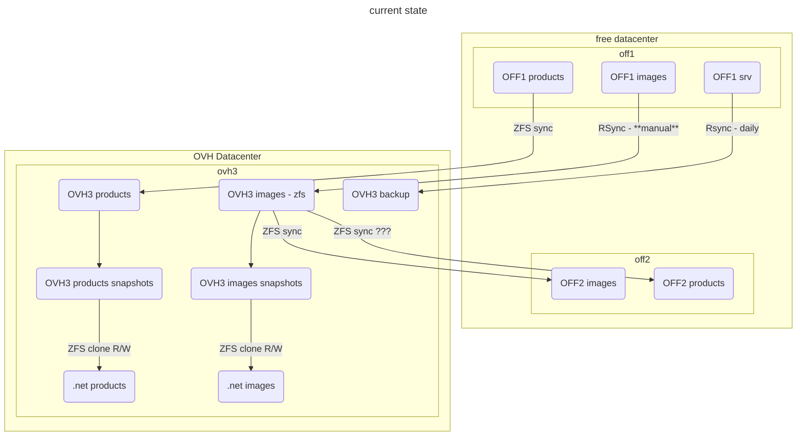
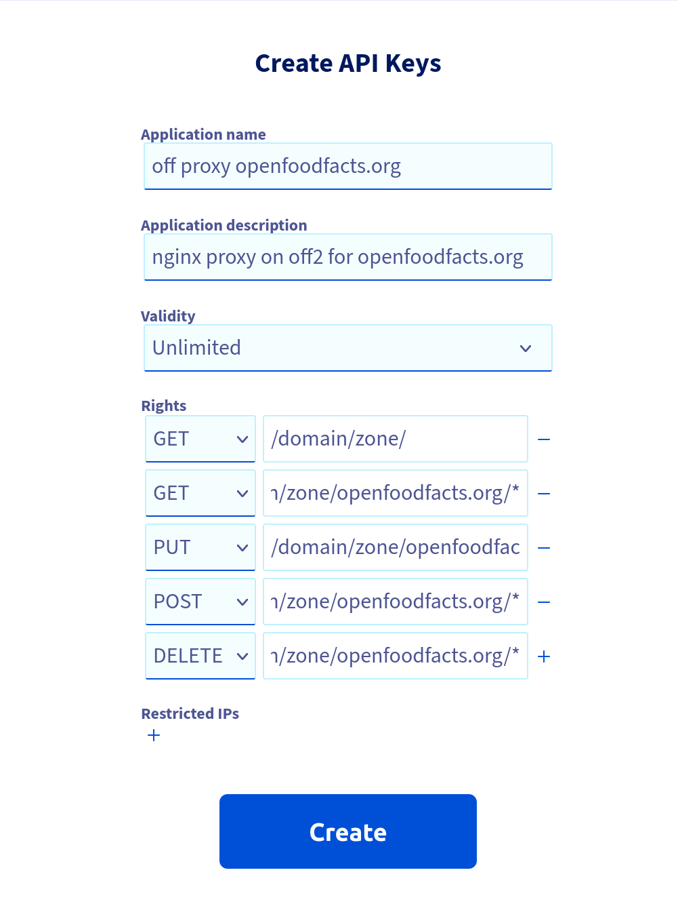
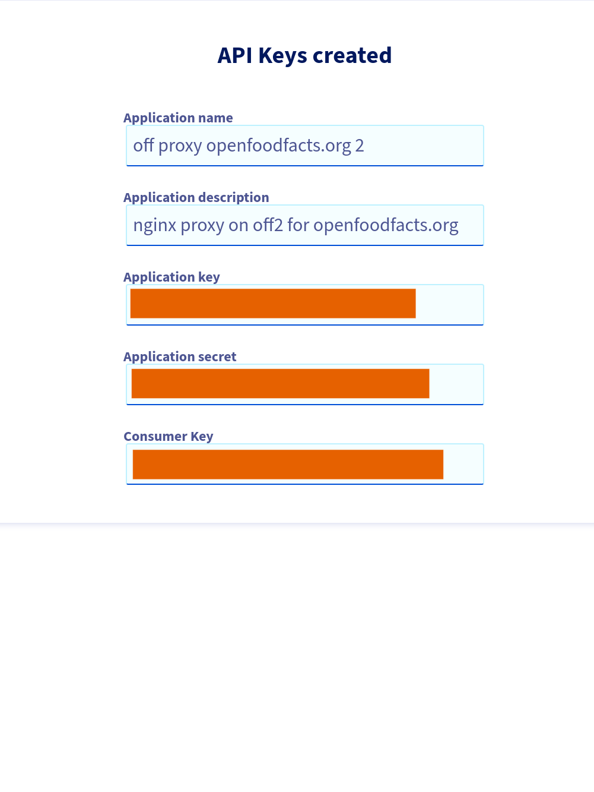

# 2023-03 OFF2 reinstall - opff migration

## Storage situation before re-install




## NGINX reverse proxy install

### Installing Container

I followed [How to create a new Container](../proxmox.md#how-to-create-a-new-container)

I add a problem running `ct_postinstall` as it wasn't able to fetch debian archives. Indeed there was no network in the CT.

1. I had to choose vmbr1 as the network bridge
2. I had to edit the host settings for vmbr1 in `/etc/network/interfaces` to add:
   ```
        post-up echo 1 > /proc/sys/net/ipv4/ip_forward
        post-up   iptables -t nat -A POSTROUTING -s '10.1.0.0/16' -o vmbr0 -j MASQUERADE
        post-down iptables -t nat -D POSTROUTING -s '10.1.0.0/16' -o vmbr0 -j MASQUERADE
    ```
    I also tweak a bit to have
    ```bash
    # ip route list
    default via 213.36.253.222 dev vmbr0 proto kernel onlink
    10.0.0.0/8 dev vmbr1 proto kernel scope link src 10.0.0.2
    213.36.253.192/27 dev vmbr0 proto kernel scope link src 213.36.253.208
    ```
3. I also had to reboot the host

I then simply install `nginx` and `stunnel4` using apt.

I also [configure postfix](../mail.md#postfix-configuration) and tested it.

### Adding the IP

Using proxmox interface, on container 110, I add net1, on vmbr0, IP 213.36.253.214/27, Gateway 213.36.253.222 (copied from Host config).

**Important**: I removed the gateway on net0 (see [here](../nginx-reverse-proxy.md#network-specific-interface)).

I reboot the container 101, and it seems to work.

### Re-enforcing security thanks to fail2ban

Created a `confs/proxy-off/fail2ban/jail.d/nginx` using debian provided feature for nginx
Then:
```bash
sudo ln -s /opt/openfoodfacts-infrastructure/confs/proxy-off/fail2ban/jail.d/nginx.conf /etc/fail2ban/jail.d/
systemctl reload fail2ban
```

**NOTE**: it's really not enough, but to analyze 403 / 401 we need a specific plugin that analyze logs.

### declaring DNS entry

I added an A record `proxy-off.openfoodfacts.org` to point to this IP in OVH DNS zones.

### Cloning git infra repository

as root, I created a ssh key as root:
```bash
ssh-keygen -t ed25519 -C "off@proxy-off.openfoodfacts.org"
cat /root/.ssh/id_ed25519.pub
```
and add it as [authorized key in openfoodfacts-infrastructure](https://github.com/openfoodfacts/openfoodfacts-infrastructure/settings/keys) with write authorization (as it will be mainly modified directly in the container).


Then I cloned the repository in /opt
```
cd /opt
git clone git@github.com:openfoodfacts/openfoodfacts-infrastructure.git
```


### NGINX configuration

To have same config as on ovh1, I added a `log_format.conf` file with log format definition:
```conf
log_format  main  '$remote_addr - $remote_user [$time_local] "$request" '
                  '$status $body_bytes_sent "$http_referer" '
                  '"$http_user_agent" "$http_x_forwarded_for"';
```
It's in the git repository, so then:

```bash
ln -s /opt/openfoodfacts-infrastructure/confs/proxy-off/nginx/log_format.conf /etc/nginx/conf.d/log_format.conf
```

### OpenPetFoodFacts host

```bash
# some shared files
ln -s /opt/openfoodfacts-infrastructure/confs/proxy-off/www/off/ /var/www/off
# conf
ln -s /opt/openfoodfacts-infrastructure/confs/proxy-off/nginx/openpetfoodfacts.org  /etc/nginx/sites-enabled/openpetfoodfacts.org
nginx -t
systemctl restart nginx
```

### certbot wildcard certificates using OVH DNS

Official documentation: https://certbot-dns-ovh.readthedocs.io/en/stable/ and https://certbot.eff.org/instructions?ws=nginx&os=debianbuster
Official documentation requires snapd… we are not keen on that, and moreover, in a lxc container [it does not seems to work well](https://forum.proxmox.com/threads/cant-install-snap-in-lxc-container.68708/).
So we go the alternate way, using the debian package.

```bash
sudo apt update
sudo apt install certbot python3-certbot-dns-ovh
```

Generate credential, following https://eu.api.ovh.com/createToken/

(useful resource for [OVH keys management](https://gandrille.github.io/linux-notes/Web_API/OVH_API/OVH_API_Keys_management.html))

Using:
* GET /domain/zone/
* GET/PUT/POST/DELETE /domain/zone/openfoodfacts.org/*

{width=50%}
{width=50%}

and we put config file in `/root/.ovhapi/openpetfoodfacts.org`
```bash
$ mkdir /root/.ovhapi
$ vim /root/.ovhapi/openpetfoodfacts.org
...
$ cat /root/.ovhapi/openpetfoodfacts.org
# OVH API credentials used by Certbot
dns_ovh_endpoint = ovh-eu
dns_ovh_application_key = ***********
dns_ovh_application_secret = ***********
dns_ovh_consumer_key = ***********

# ensure no reading by others
$ chmod og-rwx -R /root/.ovhapi
```

Try to get a wildcard using certbot, we will choose to obtain certificates using a DNS TXT record, and use tech -at- off.org for notifications
```bash
$ certbot certonly --test-cert --dns-ovh --dns-ovh-credentials /root/.ovhapi/openpetfoodfacts.org -d openpetfoodfacts.org -d "*.openpetfoodfacts.org"
...
Plugins selected: Authenticator dns-ovh, Installer None
Requesting a certificate for openpetfoodfacts.org and *.openpetfoodfacts.org
Performing the following challenges:
dns-01 challenge for openpetfoodfacts.org
dns-01 challenge for openpetfoodfacts.org
Waiting 30 seconds for DNS changes to propagate
Waiting for verification...
Cleaning up challenges
...
 - Congratulations! Your certificate and chain have been saved at:
   /etc/letsencrypt/live/openpetfoodfacts.org/fullchain.pem
```

now we can do a real certificate, by removing the `--test-cert` option. We will ask to renew & replace the existing certificate (as ith was a test one):

```bash
$ certbot certonly --test-cert --dns-ovh --dns-ovh-credentials /root/.ovhapi/openpetfoodfacts.org -d openpetfoodfacts.org -d "*.openpetfoodfacts.org"
...
 - Congratulations! Your certificate and chain have been saved at:
   /etc/letsencrypt/live/openpetfoodfacts.org/fullchain.pem
...
```

Now we install it on our website, we did it manually…
```conf
server {
    listen 80;
    listen [::]:80;
    server_name openpetfoodfacts.org *.openpetfoodfacts.org;

    return 301 https://$host$request_uri;
}

server {
    listen 443 ssl http2;
    listen [::]:443 ssl http2;
    server_name openpetfoodfacts.org *.openpetfoodfacts.org;

    # SSL/TLS settings
    ssl_certificate /etc/letsencrypt/live/openpetfoodfacts.org/fullchain.pem;
    ssl_certificate_key /etc/letsencrypt/live/openpetfoodfacts.org/privkey.pem;
    ssl_trusted_certificate /etc/letsencrypt/live/openpetfoodfacts.org/chain.pem;

...
}
```


## Putting data in zfs datasets

### creating datasets

I init a dataset for each projects: `zfs create opff`, `zfs create opff`, etc for `off`, `off-pro`, `obf` and `opf`

I then create `zfs create zfs-hdd/opff/html_data`, `zfs create zfs-hdd/opff/images`, `zfs create zfs-hdd/opff/cache` (not products because we will sync it).

And change permissions of directories:

```bash
sudo chown 1000:1000  /zfs-hdd/opff/ /zfs-hdd/opff/html_data /zfs-hdd/opff/images /zfs-hdd/opff/cache
```

### Products (for all flavors)

Notice: the script to sync is not working out of the box because it use `-i` even if distant snapshot is empty !

Initiate:
real	0m0.714s
```bash
time zfs send rpool/opff/products@20230405-1800 |ssh  10.0.0.2 zfs recv zfs-hdd/opff/products

```
```bash
time zfs send rpool/opf/products@20230405-1730 |ssh  10.0.0.2 zfs recv  zfs-hdd/opf/products
real	0m11.802s
```

```bash
time zfs send rpool/obf/products@20230405-1730 |ssh  10.0.0.2 zfs recv  zfs-hdd/obf/products
real	2m6.629s
```

```bash
time zfs send rpool/off/products@20230405-1730 |ssh  10.0.0.2 zfs recv  zfs-hdd/off/products
real    117m16.799s
```

```bash
# time zfs send rpool/off-pro/products@20230406-1000 |ssh  10.0.0.2 zfs recv  zfs-hdd/off-pro
/products

real    5m59.378s
```

Then I put off2 in the sync products scripts. So that sync products script synchronize to both machines.

Note: as we move a flavor to production on off2, we will change the sync as off2 will become the master.

### Users

~~Users are not currently in a zfs on prod but we have them on zfs on ovh3 and there is a sync every day.~~

We will nfs mount the users folder of off1.

### Products images

We will do a rsync, that we will have to repeat when putting in production.

On off2 (in a screen):

```bash
sudo rsync --info=progress2 -a -x 10.0.0.1:/srv/opff/html/images/products  /zfs-hdd/opff/images
```
this took 12 minutes.

Then I sync to ovh3 (see also below [sanoid usage](#snapshots-and-syncs-with-sanoid)):

```bash
time sudo  syncoid --no-sync-snap zfs-hdd/opff/images root@ovh3.openfoodfacts.org:rpool/opff/images
```

After first sync (which took 44 min), I also added it to sanoid.conf ovh3, but using synced template.

I also add the main dataset and images to be synced to ovh3 by adding to `/etc/sanoid/syncoid-args.conf`
```bash
--no-sync-snap zfs-hdd/opff/images root@ovh3.openfoodfacts.org:rpool/opff/images
```

### other data (and cache)

I rsync cache data on ofF2:

```bash
rsync --info=progress2 -a -x 10.0.0.1:/srv/opff/{build-cache,tmp,debug,new_images} /zfs-hdd/opff/cache
```
`build-cache` does not exist, not a problem !

I rsync other data on ofF2:
```bash
rsync --info=progress2 -a -x 10.0.0.1:/srv/opff/{deleted.images,data} /zfs-hdd/opff/
```

### Snapshots and Syncs with sanoid

I decided to use [sanoid](https://github.com/jimsalterjrs/sanoid) (packaged on debian bullseyes) to handle snapshots and syncs.

#### Installing

On OVH3 I have [to install it](https://github.com/jimsalterjrs/sanoid/blob/master/INSTALL.md#debianubuntu).
I exactly follow the instructions.

```bash
git clone https://github.com/jimsalterjrs/sanoid.git
cd sanoid
# checkout latest stable release or stay on master for bleeding edge stuff (but expect bugs!)
git checkout $(git tag | grep "^v" | tail -n 1)
ln -s packages/debian .
apt install debhelper libcapture-tiny-perl libconfig-inifiles-perl pv lzop mbuffer build-essential git
dpkg-buildpackage -uc -us
sudo apt install ../sanoid_*_all.deb
```

And enabled it:
```bash
sudo systemctl enable --now sanoid.timer
```

~~On off2, I just apt installed it.~~[^sanoid_debian] 

On off2 I install same package as the one on ovh3 (`scp ovh3.openfoodfacts.org:/home/alex/sanoid_2.1.0_all.deb` and `sudo apt install ./sanoid_2.1.0_all.deb` and `sudo systemctl enable --now sanoid.timer`)

On ovh3 I wrote the `/etc/sanoid/sanoid.conf` file to snapshot users regularly.

On off2 I wrote the `etc/sandoid.conf`


Tested it:
```bash
$ /usr/sbin/sanoid --take-snapshots --verbose
FATAL ERROR: I don't understand the setting template you've set in [zfs-hdd/off/users] in /etc/sanoid/sanoid.conf.
```
Had to modify my conf (I wrote `template=` instead of `use_template=`)

```bash
$ /usr/sbin/sanoid --take-snapshots --verbose
INFO: cache expired - updating from zfs list.
INFO: taking snapshots...
taking snapshot zfs-hdd/off/users@autosnap_2023-04-07_16:16:24_monthly
taking snapshot zfs-hdd/off/users@autosnap_2023-04-07_16:16:24_daily
taking snapshot zfs-hdd/off/users@autosnap_2023-04-07_16:16:24_hourly
INFO: cache expired - updating from zfs list.
```


I added off2 root public key (`cat /root/.ssh/id_rsa.pub`) to ovh3 (`/root/.ssh/authorized_keys`).

Made first syncoid by hand from off2, as root:
```bash
$ time syncoid root@ovh3.openfoodfacts.org:rpool/off/users zfs-hdd/off/users
INFO: Sending oldest full snapshot rpool/off/users@20211113111816 (~ 154.6 MB) to new target filesystem:
 270MiB 0:00:02 [ 103MiB/s] [=====================================================] 174%            
INFO: Updating new target filesystem with incremental rpool/off/users@20211113111816 ... syncoid_off2_2023-04-07:14:40:28 (~ 420.1 MB):
 772MiB 0:00:18 [41,2MiB/s] [=====================================================] 183%            

real	0m59,934s

$ time syncoid root@ovh3.openfoodfacts.org:rpool/off/users zfs-hdd/off/users
Sending incremental rpool/off/users@syncoid_off2_2023-04-07:14:40:28 ... syncoid_off2_2023-04-07:14:42:46 (~ 4 KB):
1,52KiB 0:00:00 [3,27KiB/s] [===================>                                  ] 38%            

real	0m2,535s
```

I decide to use `--no-sync-snap` as we already have a snapshot strategy.

Also surprisingly, the `root@` specification is mandatory.

Now I need to do a systemd service and timer on off2 for syncoid.

Did the systemd service. It's working fine (after some tweaking of the interface)

```bash
cat /etc/sanoid/syncoid-args.conf
--no-sync-snap root@ovh3.openfoodfacts.org:rpool/off/users zfs-hdd/off/users
```

And we notify systemd:

```bash
$ sudo systemctl daemon-reload
```

[^sanoid_debian]:
    There seems to be a difference between debian bullseye packaging: it uses `cron.d` and `/etc/sanoid.conf`,
    while the last stable version uses systemd timerss and `/etc/sanoid/sanoid.conf`.
    So I prefered to go for the same version on all servers, and install the 2.1.0 deb that I built on ovh3.

#### setting up snapshot and syncs


I added the shares of opff to `sanoid.conf`
```
[zfs-hdd/opff]
  use_template=prod_data
  recursive=no

[zfs-hdd/opff/cache]
  use_template=prod_data
  recursive=no

[zfs-hdd/opff/data]
  use_template=prod_data
  recursive=no

[zfs-hdd/opff/images]
  use_template=prod_data
  recursive=no
```

It's easy to start the sync for data, cache and images.

For opff root dataset it's a bit more complicated because I had it created already on off2 and ovh3, so no sync possible ! (at time of doing it I had products and images)

To be able to sync it, here is what I did:
* on off2, sync opff to a dataset with a temporary name on ovh3:
  ```bash
   sudo syncoid --no-sync-snap zfs-hdd/opff  root@ovh3.openfoodfacts.org:rpool/opff-new
  ```
* on ovh3:

  * on off2 temporarily disable the syncoid service (because we already setup sync !)
    ```bash
    sudo systemctl disable syncoid
    ```
  * choose a time far from the products updates (to avoid having to disable it)
  * on ovh3
    * move products and images dataset to opff-new
      ```bash
      sudo zfs rename rpool/opff{,-new}/products
      sudo zfs rename rpool/opff{,-new}/images
      ```
    * move opff to opff-old
      ```bash
      sudo zfs rename rpool/opff{,-old}
      ```
    * rename opff-new to opff
      ```bash
      sudo zfs rename rpool/opff{-new,}
      ```
  * on off2 reactivate syncoid service
    ```bash
    sudo systemctl enable syncoid
    ```
  * on ovh3
    * verify opff-old is empty
      ```bash
      sudo ls -a /rpool/opff-old
      sudo zfs list rpool/opff-old
      sudo zfs list rpool/opff-old -t snapshot
      ```
    * and destroy it
      ```bash
      sudo zfs destroy rpool/opff-old
      ```

Finally I added the opff sync to `syncoid-args.conf` on ovh3 and the snapshoting as synced on ovh3 in `sanoid.conf`

I also did it for the data and cache dataset:

```bash
# from off2 to ovh3
--no-sync-snap zfs-hdd/opff root@ovh3.openfoodfacts.org:rpool/opff
--no-sync-snap zfs-hdd/opff/cache root@ovh3.openfoodfacts.org:rpool/opff/cache
--no-sync-snap zfs-hdd/opff/data root@ovh3.openfoodfacts.org:rpool/opff/data
```

> **NOTE** renaming dataset:
> I had to rename data to html_data (I didn't spot there was another data dataset).
> `zfs rename zfs-hdd/opff/data zfs-hdd/opff/html_data` on both ovh3 and off2
> Then changed `/etc/sanoid/sanoid.conf` and `/etc/sanoid/syncoid_args.conf`


## Open Pet Food Facts container install


### Creating Container

I created a CT followings [How to create a new Container](../proxmox.md#how-to-create-a-new-container) it went all smooth.
I choosed a 30Gb disk, 0B swap, 4 Cores and 6 Gb memory.

I also [configure postfix](../mail.md#postfix-configuration) and tested it.


### Installing packages

Then I installed needed package following docker container:

```bash
apt install -y apache2 apt-utils cpanminus g++ gcc less libapache2-mod-perl2 make gettext wget imagemagick graphviz tesseract-ocr libtie-ixhash-perl libwww-perl libimage-magick-perl libxml-encoding-perl libtext-unaccent-perl libmime-lite-perl libcache-memcached-fast-perl libjson-pp-perl libclone-perl libcrypt-passwdmd5-perl libencode-detect-perl libgraphics-color-perl libbarcode-zbar-perl libxml-feedpp-perl liburi-find-perl libxml-simple-perl libexperimental-perl libapache2-request-perl libdigest-md5-perl libtime-local-perl libdbd-pg-perl libtemplate-perl liburi-escape-xs-perl libmath-random-secure-perl libfile-copy-recursive-perl libemail-stuffer-perl liblist-moreutils-perl libexcel-writer-xlsx-perl libpod-simple-perl liblog-any-perl liblog-log4perl-perl liblog-any-adapter-log4perl-perl libgeoip2-perl libemail-valid-perl libmath-fibonacci-perl libev-perl libprobe-perl-perl libmath-round-perl libsoftware-license-perl libtest-differences-perl libtest-exception-perl libmodule-build-pluggable-perl libclass-accessor-lite-perl libclass-singleton-perl libfile-sharedir-install-perl libnet-idn-encode-perl libtest-nowarnings-perl libfile-chmod-perl libdata-dumper-concise-perl libdata-printer-perl libdata-validate-ip-perl libio-compress-perl libjson-maybexs-perl liblist-allutils-perl liblist-someutils-perl libdata-section-simple-perl libfile-which-perl libipc-run3-perl liblog-handler-perl libtest-deep-perl libwant-perl libfile-find-rule-perl liblinux-usermod-perl liblocale-maketext-lexicon-perl liblog-any-adapter-tap-perl libcrypt-random-source-perl libmath-random-isaac-perl libtest-sharedfork-perl libtest-warn-perl libsql-abstract-perl libauthen-sasl-saslprep-perl libauthen-scram-perl libbson-perl libclass-xsaccessor-perl libconfig-autoconf-perl libdigest-hmac-perl libpath-tiny-perl libsafe-isa-perl libspreadsheet-parseexcel-perl libtest-number-delta-perl libdevel-size-perl gnumeric libreadline-dev libperl-dev
```

Also installed mailx which is handy:

```bash
apt install bsd-mailx
```

We also want nginx in this container:
```bash
apt install nginx
```


### GeoIP updates

install `geoipupdate` package:

```bash
sudo apt install geoipupdate
```

It will be triggered by a systemd timer, but we want to test if it runs correctly:
```bash
sudo systemctl start geoipupdate.service
sudo systemctl status geoipupdate.service
...
Process: 7819 ExecCondition=grep -q ^AccountID .*[^0]\+ /etc/GeoIP.conf (code=exited, stat>
        CPU: 2ms
...
mai 10 09:12:23 opff systemd[1]: geoipupdate.service: Skipped due to 'exec-condition'.
mai 10 09:12:23 opff systemd[1]: Condition check resulted in Weekly GeoIP update being skipped.
```
it does not work because we did not have an account and license key.

I had to [create an account](https://www.maxmind.com/en/geolite2/signup?utm_source=kb&utm_medium=kb-link&utm_campaign=kb-create-account) to GeoipLite2 database at maxmind.com with tech at off.org (and saved the password in our keepassx).
After login, I then created a license key (at url indicated on https://dev.maxmind.com/geoip/updating-databases) and downloaded the provided GeoIP.conf, and installed it at `/etc/GeoIP.conf`
and did a `sudo chmod o-rwx /etc/GeoIP.conf`

Test it again:
```bash
sudo systemctl start geoipupdate.service
sudo systemctl status geoipupdate.service
...
mai 10 09:45:27 opff systemd[1]: Starting Weekly GeoIP update...
mai 10 09:45:34 opff systemd[1]: geoipupdate.service: Succeeded.
mai 10 09:45:34 opff systemd[1]: Finished Weekly GeoIP update.
```
this works.


**NOTE:** I don't put this configuration in git because it has the token. The token is saved in the shared keepass file.


## Mounting volumes

We will use bind mounts to make zfs datasets available inside the machine.

See: https://pve.proxmox.com/wiki/Linux_Container#_bind_mount_points

and https://pve.proxmox.com/wiki/Unprivileged_LXC_containers

We edit /etc/subuid and /etc/subgid to add `root:1000:10`. This allow container started by root to map ids 1000 to their same ids on system.

We edit 110 conf to add sub_id exceptions:

```
# uid map: from uid 0 map 999 uids (in the ct) to the range starting 100000 (on the host)
# so 0..999 (ct) → 100000..100999 (host)
lxc.idmap = u 0 100000 999
lxc.idmap = g 0 100000 999
# we map 10 uid starting from uid 1000 onto 1000, so 1000..1010 → 1000..1010
lxc.idmap = u 1000 1000 10
lxc.idmap = g 1000 1000 10
# we map the rest of 65535 from 1010 upto 101010, so 1010..65535 → 101010..165535
lxc.idmap = u 1011 101011 64525
lxc.idmap = g 1011 101011 64525
```


```
# volumes
mp0: /zfs-hdd/opff,mp=/mnt/opff
mp1: /zfs-hdd/opff/products/,mp=/mnt/opff/products
mp2: /zfs-hdd/off/users/,mp=/mnt/opff/users
mp3: /zfs-hdd/opff/images,mp=/mnt/opff/images
mp4: /zfs-hdd/opff/html_data,mp=/mnt/opff/html_data
mp5: /zfs-hdd/opff/cache,mp=/mnt/opff/cache
```
**Important**: the order is important for the first one, otherwise `/mnt/opff/products` will be invisibilized by the mount of `/mnt/opff`.


We restart `pct reboot 110`

But we have a problem: we loose access to our home directory because of uids changes.
We fix this from the host:

```
root@off2:# chown 1001:1001 -R /zfs-hdd/pve/subvol-110-disk-0/home/alex
root@off2:# chown 1000:1000 -R /zfs-hdd/pve/subvol-110-disk-0/home/off
```


## Installing OPFF code


**NOTE:** I didn't choose to use git from the start. But for next install, I will instead use git to find the code and compare to existing ([see below](#using-git)), instead of doing it this way

### Getting the code

I then rsync the content of `/srv/opff` from off1 to the machine, (with -x to avoid sending crossing filesystems and excluding logs and html/images/products/).

I copied the `/root/.ssh/id_rsa.pub`  off off2 in the `/root/.ssh/authorized_keys` of off1


On off2:

```
sudo mkdir /zfs-hdd/pve/subvol-110-disk-0/srv/opff/
sudo rsync -x -a --info=progress2 --exclude "logs/" --exclude "html/images/products/" off1.openfoodfacts.org:/srv/opff/ /zfs-hdd/pve/subvol-110-disk-0/srv/opff/
```

Strangely /srv/opff/lang was not world readable, I changed this on off1: `chmod a+rX -R lang/` and did rsync again.

In the container:

* I created user off: `adduser off` with a complex password that I immediately forgot (on purpose).
* I give ownership to off user and group to `/srv/opff`: `chown off:off -R /srv/opff` --> it fails.
  In fact I don't have the permissions, it's because we are in a LXC container.

* On the host, we have to setup ownership correctly on `/zfs-hdd/pve/subvol-110-disk-0/srv/opff/`
  but we have to apply user id translation (see UID Mapping in [man lxc.containers.conf](https://linuxcontainers.org/lxc/manpages/man5/lxc.container.conf.5.html))
* To get correct Id:
  * in the container, I created a simple file  `/srv/off.txt` and gave ownership to `off`
  * on the host I `ls -ln /zfs-hdd/pve/subvol-110-disk-0/srv/off.txt` and get the id: 101000:101000.
* Then on the host: `sudo chown 101000:101000 -R /zfs-hdd/pve/subvol-110-disk-0/srv/opff/`
* In the container, I then created logs and html/images/products/:
  ```bash
  sudo mkdir logs
  sudo mkdir html/images/products/
  sudo chown off:off html/images/products/ logs
  ```

### linking data

Unless stated operation are done with user off.

Create a backup folder to be sure
```bash
sudo mkdir /srv/backup/
sudo chown off:off /srv/backup/
```

Remove old links:
```bash
unlink /srv/opff/products
unlink /srv/opff/users
mv /srv/opff/users_emails.sto /srv/backup
```

Create links for users and products
```bash
ln -s /mnt/opff/products /srv/opff/products
ln -s /mnt/opff/users /srv/opff/users
# old versions of Product opener needs users_emails.sto in /srv/xxx
ln -s /mnt/opff/users/users_emails.sto /srv/opff/users_emails.sto
```

Create links for data folders, also moving data zfs parts:

```bash
# html data
sudo rsync -a /srv/opff/html/data/ /mnt/opff/html_data/
sudo mv /srv/opff/html/data/ /srv/backup/
ln -s /mnt/opff/html_data/ /srv/opff/html/data
# product images
sudo rmdir /srv/opff/html/images/products/
ln -s /mnt/opff/images/products  /srv/opff/html/images/products
```

We also want to move Lang file and deleted.images in data folder but keep compatibility (it's an old version)

```bash
# deleted.images
mv /srv/opff/deleted.images /mnt/opff/
ln -s  /{mnt,srv}/opff/deleted.images
mv /srv/opff/Lang.openpetfoodfacts.org.sto /mnt/opff/data/
ln -s /mnt/opff/data/Lang.openpetfoodfacts.org.sto /srv/opff/
```

Same for cache folders
```bash
# build-cache (was non existent)
mkdir /mnt/opff/cache/build-cache
ln -s /mnt/opff/cache/build-cache /srv/opff/build-cache
mv /srv/{opff,backup}/tmp/
ln -s /mnt/opff/cache/tmp /srv/opff/tmp
mv /srv/{opff,backup}/debug 
ln -s /mnt/opff/cache/debug /srv/opff/debug
mv /srv/{opff,backup}/new_images
ln -s /mnt/opff/cache/new_images /srv/opff/new_images
```

### linking logs

We want logs to go in /var/logs.

We will create a directory for opff and also add links to nginx and apache2 logs.

```bash
sudo mkdir /var/log/opff
sudo chown off:off -R /var/log/opff
sudo -u off rmdir /srv/opff/logs/
sudo -u off ln -s /var/log/opff /srv/opff/logs
sudo  -u off ln -s ../apache2 /var/log/opff
sudo -u off ln -s ../nginx /var/log/opff
```

### linking translations

```bash
sudo -u off ln -s /srv/opff/po/openpetfoodfacts /srv/opff/po/site-specific
```


### verify config links

They where normaly kept in the transfer, but for the record:
```bash
ls -l /srv/opff/lib/ProductOpener/{SiteLang,Config}.pm
lrwxrwxrwx 1 off off 14 30 mars    2017 /srv/opff/lib/ProductOpener/Config.pm -> Config_opff.pm
lrwxrwxrwx 1 off off 16  2 janv.   2018 /srv/opff/lib/ProductOpener/SiteLang.pm -> SiteLang_opff.pm
```
and `/srv/opff/lib/ProductOpener/Config2.pm` is specific.

### some broken / strange links

Finding broken links:
`find /srv/opff -xtype l | xargs ls -l`

We have a lot in new_images and in html images folders, we can just remove them all
`find /srv/opff/new_images/ /srv/opff/html/images/bak/misc/ /srv/opff/html/images/misc.nok/ -xtype l |xargs -L 1 unlink`


We also have some html contents linked to off **FIXME decide what to do**
* /srv/opff/products -> /rpool/opff/products
* /srv/opff/ingredients/additifs/authorized_additives.txt -> /home/off-fr/cgi/authorized_additives.pl


### Using git

After using a copy of code, I decided to use git and have an opff-main branch to track change.
This is because I wanted to also track the container services configuration files there.

Here is what I did (but next time, it is better to just start from the git code).

### Finding OPFF version

on off1 in /srv/opff:
```bash
find . -xdev  -iregex ".*\.\(pl\|pm\|txt\)"|xargs ls -l --time-style=+'%Y-%m-%d'|tr -s ' ' ' '|cut -d ' ' -f 6-|sort
```

Interesting data retained `2020-05-30`.

To get modified files along with versions `git log --name-only`

I then compared code with various commits. Finally I put the tag [OPFF-v1](https://github.com/openfoodfacts/openfoodfacts-server/releases/tag/OPFF-v1) on commit [34a1c35](https://github.com/openfoodfacts/openfoodfacts-server/commit/34a1c355049b2c1017a65b9ab6419c79fe083f3c)

It's approximate because we apparently got less up to date taxonomies.

### modifying git code to match opff code

Created /srv/opff-git to clone and compare:
```bash
sudo mkdir /srv/opff-git
sudo chown off:off /srv/opff-git
```

Create a key for off (as off user), without a passphrase:
```bash
ssh-keygen -t ed25519 -C "off@opff.openfoodfacts.org"
cat /home/off/.ssh/id_ed25519.pub
```

In github add the `/home/off/.ssh/id_ed25519.pub` to deploy keys for openfoodfacts-server and  ([github docs](https://docs.github.com/en/authentication/connecting-to-github-with-ssh/managing-deploy-keys#deploy-keys)): going to settings / deploy keys / add deploy key. I did not gave write access.

With user off, clone git:
```bash
cd /srv/opff-git/
git clone -b OPFF-v1 --single-branch --depth=10 git@github.com:openfoodfacts/openfoodfacts-server.git .
```
Compared both:
```bash
diff --no-dereference /srv/opff-git/ /srv/opff > /tmp/opff.diff
```
Important differences spotted:
* cpanfile -- many differences ! But in fact on off1 it was not really use, so we will take the one in git
* bower.json is no more in git, not a problem
* log.conf
  ```diff
  diff --no-dereference --ignore-space-change --strip-trailing-cr /srv/opff-git/log.conf /srv/opff/log.conf
  3,4d2
  < log4perl.PatternLayout.cspec.S = sub { my $context = Log::Log4perl::MDC->get_context; use Data::Dumper (); local $Data::Dumper::Indent    = 0; local $Data::Dumper::Terse     = 1; local $Data::Dumper::Sortkeys  = 1; local $Data::Dumper::Quotekeys = 0; local $Data::Dumper::Deparse   = 1; my $str = Data::Dumper::Dumper($context); $str =~ s/[\n\r]/ /g; return $str; }
  < 
  6c4
  < log4perl.appender.LOGFILE.filename=./logs/log4perl.log
  ---
  > log4perl.appender.LOGFILE.filename=/srv/opff/logs/log4perl.log
  10c8
  < log4perl.appender.LOGFILE.layout.ConversionPattern=[%r] %F %L %c %S %m{chomp}%n
  ---
  > log4perl.appender.LOGFILE.layout.ConversionPattern=[%r] %F %L %c - %m%n
  ```


Added files that are symlinks:

```bash
cd /srv/opff/lib/ProductOpener
ln -s Config_opff.pm Config.pm
ln -s SiteLang_opff.pm  SiteLang.pm
ln -s SiteQuality_off.pm SiteQuality.pm
cd /srv/off
# ln -s ../node_modules/@bower_components /srv/opff/html/bower_components
```

After that, to be able to fetch opff-main remote branche:
```bash
$ git remote set-branches --add origin 'opff-main'
$ git remote set-branches --add origin 'opff-reinstall'
$ git fetch -v --depth=1
```

I also had to add some files from `po/` that where missing from the repository


### Swapping code for the one of the git repo

```bash
sudo mv /srv/opff{,-old}
sudo mv /srv/opff{-git,}
```
Update needed file:

1. apache and nginx conf is wrong, copy it in git version:

```bash
cp /etc/apache2/sites-available/opff.conf conf/apache-2.4/sites-available/opff.conf
cp /srv/opff-old/conf/nginx/sites-available/opff conf/nginx/sites-available/opff
```

I add to replace `log.conf`:
```bash
ln -s conf/opff-log.conf /srv/opff/log.conf
```

I add to redo all links done above in the new folder…


Note: to share the repo to off group, see https://stackoverflow.com/a/7268608/2886726

```bash
sudo adduser alex off
sudo -u off git config core.sharedRepository true
sudo chmod g+rwX -R .
```

### Adding dists

Create a folder for dist:
```bash
sudo mkdir /srv/opff-dist
sudo chown off:off /srv/opff-dist 
```

As off, transfer dists in it:
```bash
cp -r  /srv/opff-old/html/images/icons/dist/ /srv/opff-dist/icons
cp -r /srv/opff-old/html/css/dist  /srv/opff-dist/css
cp -r /srv/opff-old/html/js/dist  /srv/opff-dist/js
# only for off ?
cp -r /srv/opff-old/html/images/attributes  /srv/opff-dist/attributes
```

And use symbolic links in folders:

```bash
# first link for whole folder
ln -s /srv/opff-dist /srv/opff/dist
# relative links for the rest
ln -s ../../../dist/icons /srv/opff/html/images/icons/dist
ln -s ../../dist/css /srv/opff/html/css/dist
ln -s ../../dist/js /srv/opff/html/js/dist
```

### Adding openfoodfacts-web

We have some content that we want to take from openfoodfacts-web (also because shared with off). So we want to clone it.


#### Cloning repo

Note that I add to make two deploys keys as explained in [github documentation](https://docs.github.com/en/authentication/connecting-to-github-with-ssh/managing-deploy-keys#using-multiple-repositories-on-one-server) and use a specific ssh_config hostname for openfoodfacts-web:

Create new key:
```bash
# deploy key for openfoodfacts-web
ssh-keygen -t ed25519 -C "off@opff.off2.openfoodfacts.org"
```

Add a specific host in ssh config
```conf
# /home/off/.ssh/config
Host github.com-off-web
    Hostname github.com
    IdentityFile=/home/off/.ssh/id_ed25519_off-web
```

In github add the `/home/off/.ssh/id_ed25519_off-web.pub` to deploy keys for openfoodfacts-web.

Cloning:
```bash
sudo mkdir /srv/openfoodfacts-web
sudo chown off:off /srv/openfoodfacts-web
sudo -u off git clone git@github.com-off-web:openfoodfacts/openfoodfacts-web.git
```

#### Linking content

We clearly want opff folder to come from off-web:

```bash
rm -rf /srv/opff/lang/opff/
ln -s /srv/openfoodfacts-web/lang/opff/ /srv/opff/lang/opff
```

We then will link press, contacts, term of use
```bash
# USE WITH CARE !
cd /srv/opff/lang
for FNAME in contacts.html press.html terms-of-use.html; do \
  for LANG in $(ls -d ?? ??_*); do \
    FILE_PATH=$LANG/texts/$FNAME;
    if [[ -e /srv/openfoodfacts-web/lang/$FILE_PATH ]]; then \
        rm $FILE_PATH; \
        ln -s /srv/openfoodfacts-web/lang/$FILE_PATH $FILE_PATH; \
    fi; \
  done; \
done;
```

We can verify with:
```bash
ls -l */texts/{contacts,press,terms-of-use}.html
```

We keep the rest as is for now.

Opff specific content
```bash
# USE WITH CARE !
cd /srv/opff/lang
for FNAME in index.html data.html open-pet-food-facts-mobile-app.html; do \
  for LANG in $(ls -d ?? ??_*); do \
    FILE_PATH=$LANG/texts/$FNAME;
    if [[ -e /srv/openfoodfacts-web/lang/opff/$FILE_PATH ]]; then \
        unlink $FILE_PATH; \
        ln -s /srv/openfoodfacts-web/lang/opff/$FILE_PATH $FILE_PATH; \
    fi; \
  done; \
done;
```

A specific one:
```bash
ln -s application-mobile-open-food-facts.html fr/texts/application-mobile-open-pet-food-facts.html
```

**FIXME**: add a ticket to understand if we want to use off-web for all the content

### Linking images

App use openfoodfacts logo name and we link files to openpetfoodfacts logo !
```bash
cd /srv/opff/html/images/misc/
# also for "en" because of . vs -
for LANG in ar ca de en es fa fr he it nl no pl pt ru sq uk vi zh zh-tw;do \
    unlink openfoodfacts-logo-$LANG-356x300.png; \
    ln -s  openpetfoodfacts-logo-en-356x300.png openfoodfacts-logo-$LANG-356x300.png; \
    unlink openfoodfacts-logo-$LANG-178x150.png; \
    ln -s  openpetfoodfacts-logo-en-178x150.png openfoodfacts-logo-$LANG-178x150.png; \
done;
```

A last image:
```bash
cd /srv/opff/html/images/misc/
ln -s android-apk.svg android-apk-40x135.svg
```


### Installing CPAN

```bash
cd /srv/opff
sudo cpanm --notest --quiet --skip-satisfied --installdeps .
Successfully installed CLDR-Number-0.19
Successfully installed Mojolicious-9.31
Successfully installed Minion-10.25
You have CLDR::Number (0.19)
Successfully installed Modern-Perl-1.20230106
Successfully installed Heap-0.80
Successfully installed Set-Object-1.42
Successfully installed Graph-0.9726
Successfully installed GraphViz2-2.67
Successfully installed Algorithm-CheckDigits-v1.3.6
You have CLDR::Number::Format::Percent (0.19)
Successfully installed XML-Rules-1.16
Successfully installed Text-Fuzzy-0.29
Successfully installed LEOCHARRE-DEBUG-1.14
Successfully installed LEOCHARRE-CLI-1.19
Successfully installed Image-OCR-Tesseract-1.26
Successfully installed Action-CircuitBreaker-0.1
Successfully installed Text-CSV_XS-1.50
Successfully installed Spreadsheet-CSV-0.20
Successfully installed UUID-URandom-0.001
Successfully installed MongoDB-v2.2.2
You have Mojolicious::Lite (undef)
Successfully installed Module-Build-Pluggable-CPANfile-0.05
Successfully installed IO-Interactive-Tiny-0.2
Successfully installed Data-Dumper-AutoEncode-1.00
Successfully installed SQL-Abstract-2.000001 (upgraded from 1.87)
Successfully installed SQL-Abstract-Pg-1.0
Successfully installed Mojo-Pg-4.27
Successfully installed Encode-Punycode-1.002
Successfully installed B-Keywords-1.24
Successfully installed Config-Tiny-2.29
Successfully installed Task-Weaken-1.06
Successfully installed PPI-1.276
Successfully installed PPIx-Regexp-0.088
You have PPIx::Regexp::Util (0.088)
Successfully installed PPIx-Utils-0.003
Successfully installed String-Format-1.18
You have PPI (1.276)
You have PPI::Node (1.276)
Successfully installed PPIx-QuoteLike-0.023
You have PPI::Token::Quote::Single (1.276)
Successfully installed Perl-Tidy-20230309
You have PPI::Document::File (1.276)
You have PPI::Document (1.276)
Successfully installed Lingua-EN-Inflect-1.905
Successfully installed Pod-Spell-1.26
Successfully installed Perl-Critic-1.150
You have Perl::Critic::Utils (1.150)
Successfully installed MCE-1.884
You have Perl::Critic::Violation (1.150)
Successfully installed Test-Perl-Critic-1.04
Successfully installed Text-CSV-2.02
/usr/bin/tar: Action-Retry-0.24/README: Cannot change ownership to uid 3957780, gid 10902869: Invalid argument
/usr/bin/tar: Action-Retry-0.24/Changes: Cannot change ownership to uid 3957780, gid 10902869: Invalid argument
/usr/bin/tar: Action-Retry-0.24/LICENSE: Cannot change ownership to uid 3957780, gid 10902869: Invalid argument
/usr/bin/tar: Action-Retry-0.24/dist.ini: Cannot change ownership to uid 3957780, gid 10902869: Invalid argument
/usr/bin/tar: Action-Retry-0.24/META.yml: Cannot change ownership to uid 3957780, gid 10902869: Invalid argument
/usr/bin/tar: Action-Retry-0.24/MANIFEST: Cannot change ownership to uid 3957780, gid 10902869: Invalid argument
/usr/bin/tar: Action-Retry-0.24/Build.PL: Cannot change ownership to uid 3957780, gid 10902869: Invalid argument
/usr/bin/tar: Action-Retry-0.24/t/linear.t: Cannot change ownership to uid 3957780, gid 10902869: Invalid argument
/usr/bin/tar: Action-Retry-0.24/t: Cannot change ownership to uid 3957780, gid 10902869: Invalid argument
/usr/bin/tar: Action-Retry-0.24/Makefile.PL: Cannot change ownership to uid 3957780, gid 10902869: Invalid argument
/usr/bin/tar: Action-Retry-0.24/t/constant.t: Cannot change ownership to uid 3957780, gid 10902869: Invalid argument
/usr/bin/tar: Action-Retry-0.24/t/fibonacci.t: Cannot change ownership to uid 3957780, gid 10902869: Invalid argument
/usr/bin/tar: Action-Retry-0.24/t/00-compile.t: Cannot change ownership to uid 3957780, gid 10902869: Invalid argument
/usr/bin/tar: Action-Retry-0.24/t/nonblocking.t: Cannot change ownership to uid 3957780, gid 10902869: Invalid argument
/usr/bin/tar: Action-Retry-0.24/t/check_params.t: Cannot change ownership to uid 3957780, gid 10902869: Invalid argument
/usr/bin/tar: Action-Retry-0.24/lib/Action/Retry.pm: Cannot change ownership to uid 3957780, gid 10902869: Invalid argument
/usr/bin/tar: Action-Retry-0.24/lib/Action: Cannot change ownership to uid 3957780, gid 10902869: Invalid argument
/usr/bin/tar: Action-Retry-0.24/t/release-distmeta.t: Cannot change ownership to uid 3957780, gid 10902869: Invalid argument
/usr/bin/tar: Action-Retry-0.24/t/release-pod-coverage.t: Cannot change ownership to uid 3957780, gid 10902869: Invalid argument
/usr/bin/tar: Action-Retry-0.24/lib/Action/Retry/Strategy.pm: Cannot change ownership to uid 3957780, gid 10902869: Invalid argument
/usr/bin/tar: Action-Retry-0.24/lib/Action/Retry/Strategy/Linear.pm: Cannot change ownership to uid 3957780, gid 10902869: Invalid argument
/usr/bin/tar: Action-Retry-0.24/lib/Action/Retry/Strategy/Constant.pm: Cannot change ownership to uid 3957780, gid 10902869: Invalid argument
/usr/bin/tar: Action-Retry-0.24/lib/Action/Retry/Strategy/Fibonacci.pm: Cannot change ownership to uid 3957780, gid 10902869: Invalid argument
/usr/bin/tar: Action-Retry-0.24/lib/Action/Retry/Strategy/HelperRole/RetriesLimit.pm: Cannot change ownership to uid 3957780, gid 10902869: Invalid argument
/usr/bin/tar: Action-Retry-0.24/lib/Action/Retry/Strategy/HelperRole/SleepCapping.pm: Cannot change ownership to uid 3957780, gid 10902869: Invalid argument
/usr/bin/tar: Action-Retry-0.24/lib/Action/Retry/Strategy/HelperRole/SleepTimeout.pm: Cannot change ownership to uid 3957780, gid 10902869: Invalid argument
/usr/bin/tar: Action-Retry-0.24/lib/Action/Retry/Strategy/HelperRole: Cannot change ownership to uid 3957780, gid 10902869: Invalid argument
/usr/bin/tar: Action-Retry-0.24/lib/Action/Retry/Strategy: Cannot change ownership to uid 3957780, gid 10902869: Invalid argument
/usr/bin/tar: Action-Retry-0.24/lib/Action/Retry: Cannot change ownership to uid 3957780, gid 10902869: Invalid argument
/usr/bin/tar: Action-Retry-0.24: Cannot change ownership to uid 3957780, gid 10902869: Invalid argument
/usr/bin/tar: Exiting with failure status due to previous errors
Successfully installed Action-Retry-0.24
Successfully installed Locale-Maketext-Lexicon-Getcontext-0.05
Successfully installed Crypt-ScryptKDF-0.010
44 distributions installed

```


## Setting up services


### NGINX for OPFF (inside container)

Installed nginx `apt install nginx`.

Removed default site ` unlink /etc/nginx/sites-enabled/default`

Copied production nginx configuration of off1 in `/etc/nginx/sites-enabled/opff` to off2 in `/srv/opff/conf/nginx/sites-available/opff`

Modified it's configuration to remove ssl section (**FIXME:** to be commited in off-server)

Then made a symlink: `ln -s /srv/opff/conf/nginx/sites-available/opff /etc/nginx/sites-enabled/opff`

But we want to have config files in the git, so here is what we did.

Nginx conf:

```bash
sudo ln -s /srv/opff/conf/nginx/sites-available /etc/nginx/sites-enabled/opff
sudo ln -s /srv/opff/conf/nginx/snippets/expires-no-json-xml.conf /etc/nginx/snippets
sudo ln -s /srv/opff/conf/nginx/snippets/off.cors-headers.include /etc/nginx/snippets
sudo rm /etc/nginx/mime.types
sudo ln -s /srv/opff/conf/nginx/mime.types /etc/nginx/
# add specific files
ln -s /srv/opff/conf/nginx/snippets/off.cors-headers.include /etc/nginx/snippets
```

test it and restart:
```bash
sudo nginx -t
sudo systemctl restart nginx
```

### Apache

On off1 conf is in `/etc/apache2-opff/`, here we can set it up in directly in system apache configuration.

On off2:

* Remove default config (or it will conflict on port 80 with nginx):
  ```bash
  sudo unlink /etc/apache2/sites-enabled/000-default.conf
  ```

* We disable mpm event and enable mpm prefork:
  ```bash
  sudo a2dismod mpm_event
  sudo a2enmod mpm_prefork
  ```

* add the configuration for opff (as stored openfoodfacts-server project)
  copied the opff.conf file in `/etc/apache2/sites-available` and activate it:
  ```bash
  sudo a2ensite opff.conf
  ```

* edit `/etc/apache2-opf/envvars`
  ```
  #export APACHE_RUN_USER=www-data
  export APACHE_RUN_USER=off
  #export APACHE_RUN_GROUP=www-data
  export APACHE_RUN_GROUP=off
  ```

* edit `/etc/apache2/mods-available/mpm_prefork.conf`
  ```
        StartServers                     2
        MinSpareServers           2
        MaxSpareServers          4
        MaxRequestWorkers         20
        MaxConnectionsPerChild   500
  ```

* change ports apache is listening in `/etc/apache2/ports.conf` (because we need port 80 for nginx):
  ```
  Listen 8001

  #<IfModule ssl_module>
  #       Listen 443
  #</IfModule>

  #<IfModule mod_gnutls.c>
  #       Listen 443
  #</IfModule>
  ```

We also have to change permissions on log since we changed run user:

```bash
sudo chown off:off -R /var/log/apache2 /var/run/apache2
```

We want to put it all in git:

```bash
ln -s /srv/opff/conf/apache-2.4/sites-available/opff.conf /etc/apache2/sites-enabled/opff.conf
# we replace mpm_prefork conf
ln -s /srv/opff/conf/apache-2.4/opff-mpm_prefork.conf /etc/apache2/mods-available/mpm_prefork.conf
# replace ports.conf
ln -s /srv/opff/conf/apache-2.4/opff-ports.conf /etc/apache2/ports.conf
```

test it:
```bash
sudo apache2ctl configtest
```


### creating systemd units for timers jobs

Good source:
* https://trstringer.com/systemd-timer-vs-cronjob/
* https://dev.to/setevoy/linux-systemd-unit-files-edit-restart-on-failure-and-email-notifications-5h3k
* https://www.freedesktop.org/software/systemd/man/systemd.unit.html to use "instance names"

See git for actual units and timers and the service for email notifications.

We want them to be in git, so finally:

Systemd units:
```bash
ln -s /srv/opff/conf/systemd/gen_feeds\@.timer /etc/systemd/system
ln -s /srv/opff/conf/systemd/gen_feeds_daily\@.service /etc/systemd/system
ln -s /srv/opff/conf/systemd/gen_feeds_daily\@.timer /etc/systemd/system
ln -s /srv/opff/conf/systemd/email-failures\@.service /etc/systemd/system
```

Test failure notification is working:

```bash
systemctl start email-failures@gen_feeds__opff.service
```

Test systemclt gen_feeds services are working:

```bash
systemctl start gen_feeds_daily@opff.service
systemctl start gen_feeds@opff.service
```

Activate systemd units:

```bash
systemctl enable gen_feeds@opff.timer
systemctl enable gen_feeds_daily@opff.timer
systemctl daemon-reload
```

### Adding failure notification for apache and nginx in systemd

We can add the on failure notification we created for timers to apache2.service and nginx.service:

```bash
$ grep -B 4 email-failure /usr/lib/systemd/system/apache2.service
[Unit]
Description=The Apache HTTP Server
After=network.target remote-fs.target nss-lookup.target
Documentation=https://httpd.apache.org/docs/2.4/
OnFailure=email-failures@apache2-opff.service
$ grep -B 4 email-failure /usr/lib/systemd/system/nginx.service
[Unit]
Description=A high performance web server and a reverse proxy server
Documentation=man:nginx(8)
After=network.target nss-lookup.target
OnFailure=email-failures@nginx-opff.service
```

But we want to put that in git, so:

```bash
cp /etc/systemd/system/apache2.service.d -r conf/systemd/
cp /etc/systemd/system/nginx.service.d/ -r conf/systemd/
sudo rm /etc/systemd/system/apache2.service.d /etc/systemd/system/nginx.service.d -r
sudo ln -s /srv/opff/conf/systemd/nginx.service.d /etc/systemd/system/
sudo ln -s /srv/opff/conf/systemd/apache2.service.d /etc/systemd/system/
sudo systemctl daemon-reload
```

### Testing

Direct apache call
```bash
curl localhost:8001/cgi/display.pl --header 'Host: fr.openpetfoodfacts.org'
```

Nginx call
```bash
curl localhost --header 'Host: fr.openpetfoodfacts.org'
```

### Verifying if we need Apache2::Connection::XForwardedFor

We want to verify if we need to install Apache2::Connection::XForwardedFor

For this after having deployed, and it's working ok, I log in the new site.
Then I use:

```
cd /srv/opff/scripts
perl sto_to_json.pl /mnt/opff/users/alexg.sto|jq .
```
and look at the higher timstamp for `user_sessions` and look at `ip`.
It's `10.1.0.101` so ip is masked to the app.

Install the package: 

add `Apache2::Connection::XForwardedFor` and `Apache::Bootstrap` to cpanfile, then run: 

```bash
sudo apt install libapache2-mod-perl2-dev
sudo cpanm --notest --quiet --skip-satisfied --installdeps .
```

then
```bash
sudo apachectl configtest
sudo systemctl restart apache2
```

It is not enough, I have two problems:
1. `opff-access.log` of ngix in opff container does not log the user ip adress, but the proxy ip adress (useless)
2. nginx in opff container should not change X-Real-IP and X-Forwarded-For provided by first proxy

So I:

* tweak the nginx logging by adding a specific conf in `/srv/opff/conf/nginx/conf.d/log_format_realip.conf`:
  ```conf
  # a log format for behing a proxy
  log_format proxied_requests
    '$http_x_forwarded_for - $remote_user [$time_local] '
    '"$request" $status $body_bytes_sent '
    '"$http_referer" "$http_user_agent"';
  ```
  and use it:
  ```bash
  sudo ln -s /srv/opff/conf/nginx/conf.d/log_format_realip.conf /etc/nginx/conf.d/log_format_realip.conf
  ```
* then change the configuration to use this log format for opff `/srv/opff/conf/nginx/sites-available/opff`:
  ```conf
  ...
          access_log /var/log/nginx/opff-access.log proxied_requests;
  ...
         location / {
                proxy_set_header Host $host;
                # those headers are set by the first reverse proxy
                #proxy_set_header X-Real-IP $remote_addr;
                #proxy_set_header X-Forwarded-For $proxy_add_x_forwarded_for;

                proxy_pass http://127.0.0.1:8001/cgi/display.pl?;
        }

        location /cgi/ {
                proxy_set_header Host $host;
                # those headers are set by the first reverse proxy
                #proxy_set_header X-Real-IP $remote_addr;
                #proxy_set_header X-Forwarded-For $proxy_add_x_forwarded_for;
                proxy_pass http://127.0.0.1:8001;
        }
  ```
* restart nginx
  ```bash
  sudo nginx -t
  sudo systemctl restart nginx
  ```

Later on, I discovered the [`set_real_ip_from` directive](https://nginx.org/en/docs/http/ngx_http_realip_module.html) which is really tailored for this situation, and so my configuration became:

```conf
...
 location / {
                proxy_set_header Host $host;
                # recursive hosts as we are proxying behind a proxy
                set_real_ip_from 10.0.0.0/8;
                real_ip_recursive on;
                proxy_pass http://127.0.0.1:8001/cgi/display.pl?;
        }

        location /cgi/ {
                proxy_set_header Host $host;
                # recursive hosts as we are proxying behind a proxy
                set_real_ip_from 10.0.0.0/8;
                real_ip_recursive on;
                proxy_pass http://127.0.0.1:8001;
        }
```


### log rotate perl logs

Perl logs rotation requires an apache restart, so we will replace the apache conf to use our log rotate with all considered files.

So I wrote `conf/logrotate/apache` and then:
```bash
sudo rm /etc/logrotate.d/apache
sudo ln -s /srv/opff/conf/logrotate/apache2 /etc/logrotate.d/apache2
# logrotate needs root ownerships
sudo chown root:root /srv/opff/conf/logrotate/apache2
```

We can test with:
```bash
sudo logrotate /etc/logrotate.conf --debug
```

### Installing mongodb client

In opff.

We need mongodb client to be able to export the database in gen_feeds.

I'll follow official doc for 4.4 https://www.mongodb.com/docs/v4.4/tutorial/install-mongodb-on-debian/,
but we are on bullseye, and we just want to install tools.

```bash
curl -fsSL https://pgp.mongodb.com/server-4.4.asc | \
   sudo gpg -o /usr/share/keyrings/mongodb-server-4.4.gpg \
   --dearmor
echo "deb [ signed-by=/usr/share/keyrings/mongodb-server-4.4.gpg ] http://repo.mongodb.org/apt/debian bullseye/mongodb-org/4.4 main" | \
  sudo tee /etc/apt/sources.list.d/mongodb-org-4.4.list
sudo apt update
sudo apt install  mongodb-database-tools
```

We can see if we will be able to use mongoexport


## OPFF NGINX reverse proxy configuration

We follow [Steps to create Nginx configuration](../nginx-reverse-proxy.md#steps-to-create-nginx-configuration)
but we put host in `/opt/openfoodfacts-infrastructure/confs/proxy-off/nginx`

See also how we [setup wildcard certificates, above](#certbot-wildcard-certificates-using-ovh-dns)

## Debugs and fixing

### Testing

To test my installation I added this to `/etc/hosts` on my computer:
```conf
213.36.253.214 fr.openpetfoodfacts.org world-fr.openpetfoodfacts.org static.openpetfoodfacts.org images.openpetfoodfacts.org world.openpetfoodfacts.org
```

### Mongodb access

I wasn't able to connect to mongodb from opff container.

On off2:
```bash
nc -vz 10.0.0.3 27017
```
did not suceed.

I had to go on off3 and add an iptables rule:

```bash
iptables -A INPUT -s 10.0.0.2/32 -i ens19 -p tcp -m tcp --dport 27017 -m conntrack --ctstate NEW,ESTABLISHED -j ACCEPT
iptables -A INPUT -s 10.1.0.1/24 -i ens19 -p tcp -m tcp --dport 27017 -m conntrack --ctstate NEW,ESTABLISHED -j ACCEPT
```

I also added it to `/etc/iptables/rules.v4`.

There was also a route problem on off3: route is only defined for `10.0.0.3/24` while our containers are in `10.1.x.x`.

To solve this, on off3:
```bash
sudo ip route add 10.1.0.0/16 dev ens19 proto kernel scope link src 10.0.0.3
```
and I modified `/etc/network/interfaces` to add a post-up rule:
```conf
# The internal network interface
auto ens19
iface ens19 inet static
        address 10.0.0.3/24
        # needed for off2 containers to access mongodb
        post-up ip route add 10.1.0.0/16 dev ens19 proto kernel scope link src 10.0.0.3
        pre-down ip route del 10.1.0.0/16 dev ens19 proto kernel scope link src 10.0.0.3
```

### Fixing GeoIP

GeoIP does not seems to work. If I had a new product from https://world.openpetfoodfacts.org country where soled is not pre-filled.

I found a script helps debugging geoip issues. To test I run:
```bash
perl -I/srv/opff/lib -d scripts/test_geoip.pl
```
It wait's for a IP input.

As it does not work, I try to debug it, using the `-d` flag. It seems `$gi` gloabl which is geo ip database is not loaded.
Indeed the file specified by `$geolite2_path` does not exists.

I look at what packages provides:
```bash
dpkg-query -L geoip-database
dpkg-query -L geoipupdate
```
We seems to have a `/usr/share/GeoIP/GeoIP.dat` (and `/usr/share/GeoIP/GeoIPv6.dat`)

Trying in debugger:
```perl
  DB<2> $gi = GeoIP2::Database::Reader->new(file => '/usr/share/GeoIP/GeoIP.dat');

  DB<4> x $gi
0  GeoIP2::Database::Reader=HASH(0x55a4cca974c0)
   'file' => '/usr/share/GeoIP/GeoIP.dat'
   'locales' => ARRAY(0x55a4ccbdfdd8)
      0  'en'
  DB<5> x $gi->country(ip => '*.*.*.*');  # removed id
MaxMind::DB::Reader::XS - Error opening database file "/usr/share/GeoIP/GeoIP.dat": The MaxMind DB file contains invalid metadata at /usr/lib/x86_64-linux-gnu/perl5/5.32/MaxMind/DB/Reader/XS.pm line 73, <STDIN> line 1.
```

It's not this.
But looking at [`GeoIP.conf` man page](https://manpages.debian.org/bullseye/geoipupdate/GeoIP.conf.5.en.html) I see it's in `/var/lib/GeoIP/` (very logically !).
Testing it again and it works.

So I edited `/srv/opff/lib/ProductOpener/Config2.pm` to have:
```perl
$geolite2_path = '/var/lib/GeoIP/GeoLite2-Country.mmdb';
```

### X-Forwarded-For problem

Reading at `/var/log/apache2/opff_access_log` the ip adress seemed to be 127.0.0.1.
But it was only because the LogFormat directive was ignored because of an error in the format name in CustomLog directive.

Fixing that it worked. But on the way to do it, I changed Nginx config as I discovered the `set_real_ip_from` directive.

### Fixing lang problem

Symptom: no images loaded on product. In console, 404 on https://static.openpetfoodfacts.org/data/i18n/en/lang.json

Indeed I didn't sync the data folder from off1 (because I wanted to see exports regenerated…)

On off2:
```bash
rsync -a --info=progress2 10.0.0.1://srv/opff/html/data/ /zfs-hdd/opff/data/
```
But I also forgot to link /srv/opff/html/data/ to /mnt/…
```bash
mv /srv/opff/html/data{,.old} && ln -s /mnt/opff/html_data /srv/opff/html/data
```
Fixed the problem.

## Enabling migration by cross nfs mounting folders

To be able to migrate products between instances, we need to:
* talk to same mongodb (it's already the case)
* access products and images folders of other instances (todo)

Working on moving images to ZFS (**FIXME**: link), I already setup sharing off2 ZFS dataset of zfs-hdd/off/images on off1.

Now we will:
- also mount products datasets on off1
- install zfs server on off1 and share current products and images folders


### Mount off1 ZFS dataset on off2

Install NFS server on off1:

```bash
apt install nfs-kernel-server
```

Add volumes to NFS shares in `/etc/exports/`:

```conf
# share volumes to off2 using NFSv3
# note that products are directly shared through zfs
/srv2/off/html/images/products  10.0.0.2(rw,no_subtree_check,no_root_squash)
/srv2/off-pro/html/images/products      10.0.0.2(rw,no_subtree_check,no_root_squash)
/srv/obf/html/images/products   10.0.0.2(rw,no_subtree_check,no_root_squash)
/srv/opf/html/images/products   10.0.0.2(rw,no_subtree_check,no_root_squash)
```

Testing a mount on off2:

```bash
mkdir /mnt/off1/
mkdir /mnt/off1/off-images-products
mount -t nfs -o rw "10.0.0.1://srv2/off/html/images/products"  /mnt/off1/off-images-products
ls off1/off-images-products/000/000/023/4/
```

It works.

Now we will share zfs volumes for products.

On off1:
```bash
zfs set sharenfs="rw=@10.0.0.2/32" rpool/obf/products
zfs set sharenfs="rw=@10.0.0.2/32" rpool/off/products
zfs set sharenfs="rw=@10.0.0.2/32" rpool/opf/products
zfs set sharenfs="rw=@10.0.0.2/32" rpool/opff/products
```

Test on off2:
```bash
mkdir off1/obf-products
mount -t nfs -o rw "10.0.0.1://rpool/obf/products"  /mnt/off1/obf-products
# test
ls -l /mnt/off1/obf-products/000/000/614/7198
```

Creating mount points on off2:
```bash
mkdir /mnt/off1/o{b,p,f}f-products
mkdir /mnt/off1/o{p,b,f}f-images-products
```

Editing `/etc/fstab` on off2 to add all nfs shares:
```conf
10.0.0.1://srv2/off/html/images/products  /mnt/off1/off-images-products nfs rw,nolock  0 0
10.0.0.1://rpool/off/products  /mnt/off1/off-products nfs rw,nolock  0 0
10.0.0.1://srv/obf/html/images/products  /mnt/off1/obf-images-products nfs rw  0 0
10.0.0.1://rpool/obf/products  /mnt/off1/obf-products nfs rw,nolock  0 0
10.0.0.1://srv/opf/html/images/products  /mnt/off1/opf-images-products nfs rw  0 0
10.0.0.1://rpool/opf/products  /mnt/off1/opf-products nfs rw,nolock  0 0
```

**WARNING:** the `nolock` (no inter-server lock, lock are local to a server only) here is not really safe, as we have processes on two machines, but it should be safe enough in this case (as the product is moving, so the lock on one side still stand, and the other side as really few chances to edit a product which does not yet exists), and for a relative short time.

### Bind mount

Note: I decided to bind mount the NFS mounts. I could have directly mouted the nfs volumes in the container, but as in target deployment they really will be bind mount, I prefer to do this for now. (Note than NFS inside lxc seems to require [a specific apparmor settings](https://memo-linux.com/proxmox-5-ajout-dun-point-de-montage-nfs-dans-un-conteneur-lxc/))

We bind mount the folders in our lxc container `/etc/pve/lxc/110.conf`:
```conf
…
# temporary mount of off1 folders
mp6: /mnt/off1/off-products,mp=/mnt/off/products
mp7: /mnt/off1/off-images-products,mnt=/mnt/off/images
mp8: /mnt/off1/opf-products,mp=/mnt/opf/products
mp9: /mnt/off1/opf-images-products,mnt=/mnt/opf/images
mp10: /mnt/off1/obf-products,mp=/mnt/obf/products
mp11: /mnt/off1/obf-images-products,mnt=/mnt/obf/images
…
```
Note: comments in conf file are put at begining of file by proxmox and populate notes in the interface.

Then restart container: `sudo pct reboot 110`

Looking at data from inside the container, the current migration on images introduce a problem:
```bash
(opff))$ ls -l /mnt/off/images/000
lrwxrwxrwx 1 nobody nogroup 33  1 juin   09:00 /mnt/off/images/000 -> /mnt/off2/off-images/products/000
```
this /mnt/off2/off-images/products/000 does not exists in the container…
I can add it by adding one more MP.

**EDIT:** after images migrations, I changed mounts to directly use the ZFS dataset for off/images.


We also have to mimic the old structure.
On opff as root:
```bash
$ mkdir -p /srv/o{f,p,b}f/html/images/
$ chown -R off:off -R /srv/o{f,p,b}f/
$ for site in o{f,p,b}f;do ln -s /mnt/$site/products /srv/$site/products; ln -s /mnt/$site/images/products /srv/$site/html/images/products;done
$ ls -l /srv/o{p,b,f}f/ /srv/o{p,b,f}f/html/images
```


## Sharing users with NFS

As I added nfs to expose off1 data to off2, I realized it could be better to use it to be able to continue to create users and have them synced on opff (let alone the lock, but it should be safe enough).

For that I have to mount a NFS mount of off1:/srv/off/users instead of the current zfs-hdd/off/users volume.

So I added `/srv/off/users` share in exports on off1:
```conf
# share of off users until "off" migration to off2
/srv/off/users  10.0.0.2(rw,no_subtree_check,no_root_squash)
```
```bash
systemctl reload nfs-server
```

On off2, I added in `/etc/fstab`:
```conf
# TEMPORARY off users
10.0.0.1://srv/off/users  /mnt/off1/off-users nfs rw  0 0
```
```bash
mkdir /mnt/off1/off-users
mount /mnt/off1/off-users
# test
ls /mnt/off1/off-users/users_emails.sto
```

Replace mp2 volume in `/etc/pve/lxc/110.conf`
```conf
mp2: /mnt/off1/off-users,mp=/mnt/opff/users
```
```bash
pct reboot 110
```
But it didn't start…

```bash
$ pct start 110
run_buffer: 321 Script exited with status 116
lxc_init: 847 Failed to run lxc.hook.pre-start for container "110"
__lxc_start: 2008 Failed to initialize container "110"
startup for container '110' failed
```

Trying to debug ([as proposed here](https://forum.proxmox.com/threads/failed-to-run-lxc-hook-pre-start.33260/post-163472)):
```bash
$ lxc-start -n 110 -F -lDEBUG -o /tmp/lxc-110.log
lxc-start: 110: ../src/lxc/conf.c: run_buffer: 321 Script exited with status 116
lxc-start: 110: ../src/lxc/start.c: lxc_init: 847 Failed to run lxc.hook.pre-start for container "110"
lxc-start: 110: ../src/lxc/start.c: __lxc_start: 2008 Failed to initialize container "110"
lxc-start: 110: ../src/lxc/tools/lxc_start.c: main: 306 The container failed to start
lxc-start: 110: ../src/lxc/tools/lxc_start.c: main: 311 Additional information can be obtained by setting the --logfile and --logpriority options
$ cat /tmp/lxc-110.log
…
lxc-start 110 20230602130630.394 DEBUG    conf - ../src/lxc/conf.c:run_buffer:310 - Script exec /usr/share/lxc/hooks/lxc-pve-prestart-hook 110 lxc pre-start produced output: directory '/mnt/off1/off-products' does not exist

lxc-start 110 20230602130630.411 ERROR    conf - ../src/lxc/conf.c:run_buffer:321 - Script exited with status 116
…
```

In fact I got
```bash
$ ls /mnt/off1/
ls: cannot access '/mnt/off1/obf-products': Stale file handle
ls: cannot access '/mnt/off1/off-products': Stale file handle
ls: cannot access '/mnt/off1/opf-products': Stale file handle
$ umount /mnt/off1/o{p,f,b}f-products
$ for f in /mnt/off1/o{p,f,b}f-products;do echo $f; mount $f; done
/mnt/off1/opf-products
mount.nfs: access denied by server while mounting 10.0.0.1://rpool/opf/products
/mnt/off1/off-products
mount.nfs: access denied by server while mounting 10.0.0.1://rpool/off/products
/mnt/off1/obf-products
mount.nfs: access denied by server while mounting 10.0.0.1://rpool/obf/products
```
This access denied is strange…
After searching a bit, finally a `systemctl restart nfs-server` on off1 did resolve…

Then `pct start 110` works.

### Prepare to mount off2 datasets on off1

After migration we want to be able to access opff products and images on off1 to ensure migrations works.

We just change sharenfs property:
```bash
zfs set sharenfs=rw=@10.0.0.1/32 zfs-hdd/opff/products
zfs set sharenfs=rw=@10.0.0.1/32 zfs-hdd/opff/images
```

And test on off1 it works:
```bash
mkdir /tmp/test-mount
mount -t nfs -o rw,nolock "10.0.0.2://zfs-hdd/opff/products"  /tmp/test-mount
ls /tmp/test-mount/301/762/042/2003/
umount /tmp/test-mount
rmdir /tmp/test-mount
```


## Improvment

### using git for off2 configurations

Using `git` for off2 configuration (I'm omitting the moves / cp I add to do):

```bash
ln -s /opt/openfoodfacts-infrastructure/confs/off2/sanoid/sanoid.conf/ /etc/sanoid/sanoid.conf
ln -s /opt/openfoodfacts-infrastructure/confs/off2/sanoid/syncoid-args.conf /etc/sanoid/syncoid-args.conf
```

For `/etc/pve` symlinking is not possible (this is a fuse mount handled by proxmox). So I only copied current configuration.

## Procedure for switch of opff from off1 to off2

1. change TTL for openpetfoodfacts domains to a low value in DNS

1. shutdown opff on off2
   `sudo systemctl stop apache2 nginx`


1. Rync all data (on off2):
  ```bash
  date && \
  sudo rsync --info=progress2 -a -x 10.0.0.1:/srv/opff/html/images/products/  /zfs-hdd/opff/images/products/ && \
  sudo rsync --info=progress2 -a -x 10.0.0.1:/srv/opff/html/data/  /zfs-hdd/opff/html_data/ && \
  sudo rsync --info=progress2 -a -x 10.0.0.1:/srv/opff/deleted.images/ /zfs-hdd/opff/deleted.images/  && \
  date
  ```
  opff/cache is skipped, nothing of interest.

  *took around 2min*


4. products sync:
   - remove opff from sync products script
   - do a zfs send of only opff products with a modified version of the script


2. shutdown opff on both side
   on off1: `sudo systemctl stop apache2@opff` `unlink /etc/nginx/sites-enabled/opff && systemctl reload nginx`

3. change DNS to point to new machine

3. Rsync and zfs sync again

4. ensure migrations works using NFS:
   ```bash
   # move old prod
   mv /srv/opff /srv/opff.old
   # create dirs
   mkdir -p /srv/opff/products /srv/opff/html/images/products
   chown off:off -R /srv/opff
   ```
   then change /etc/fstab to mount off1 there:
   ```conf
   # mount of opff zfs datasets via NFS to enable products migrations
   10.0.0.2:/zfs-hdd/opff/products	/srv/opff/products	nfs	rw,nolock	0	0
   10.0.0.2:/zfs-hdd/opff/images/products	/srv/opff/html/images/products	nfs	rw,nolock	0	0
   ```
   and mount:
   ```bash
   mount /srv/opff/products
   mount /srv/opff/html/images/products
   ```

5. start opff on container off2/110 (opff): `sudo systemctl start apache2 nginx`
6. check it works (remember to also clean your /etc/hosts if you modified it for tests)
6. disable opff service on off1:
   - `systemctl disable apache2@opff`
   - `unlink /etc/nginx/site-enabled/opff && sytemctl reload nginx` (if not already done)

7. on off2 and ovh3 modify sanoid configuration to have opff/products handled by sanoid and synced to ovh3
8. remove opff from snapshot-purge.sh on ovh3 (now handled by sanoid)
9. don't forget to test that it still work after that

10. cleanup:
    - remove opff gen feeds from `/srv/off/scripts/gen_all_feeds.sh` and `/srv/off/scripts/gen_all_feeds_daily.sh`
    - remove `/srv/opff/scripts/gen_opff_leaderboard.sh` from off crontab
    - remove or comment `/etc/logrotate.d/apache2-opff`

## Still TODO

### DONE
- image magick avec le format de mac HEIC - DONE on .net - TESTED OK
- wilcard certificates on nginx proxy
- GEOIP updates - verify it works and it's compatible (country of a product)

- verify if compression is working on nginx ?
symlinks to check
find files that are symlinks in opff on off1:
```
$ find /srv/opff-old/ -xdev -type l -exec ls -l \{\} \;
```


- logrotate:
  - nginx specific logs -> by system
  - apache logs -> see above
  - product opener logs


- ssl headers on frontend ?:
  ```conf
  add_header Strict-Transport-Security "max-age=63072000";
  add_header X-Content-Type-Options nosniff;
  add_header X-Frame-Options DENY;
  ```
- ssl params on frontend ?
  ```conf
  # from https://cipherli.st/
  # and https://raymii.org/s/tutorials/Strong_SSL_Security_On_nginx.html
  
  ssl_protocols TLSv1 TLSv1.1 TLSv1.2;
  ssl_prefer_server_ciphers on;
  ssl_ciphers "EECDH+AESGCM:EDH+AESGCM:AES256+EECDH:AES256+EDH";
  ssl_ecdh_curve secp384r1;
  #ssl_session_cache shared:SSL:10m;
  ssl_session_tickets off;
  ssl_stapling on;
  ssl_stapling_verify on;
  resolver 8.8.8.8 8.8.4.4 valid=300s;
  resolver_timeout 5s;
  
  include snippets/ssl-headers.conf;
  
  ssl_dhparam /etc/ssl/certs/dhparam.pem;
  ```

- mongodb export on mongodb server --> installed client
- mounting to enable products migration --> NFS shares

- /srv/opff/mediawiki folder is probably because this was initially stored in the git (it contains a php file).


### Improve

- notification when important task fails
- (DONE) verifications of state (last snapshot, last start date for a systemctl oneshot)
- IP failover ? (maybe after off1 setup)
- metrics ? prometheus-{apache,nginx}-exporter (+exposition via stunnel ?)
- de we want to reintroduce this crontab entry: tail -n 10000 /srv/off/logs/access_log | grep search | /srv/off/logs/ban_abusive_ip.pl > /dev/null 2>&1 ??? See if there are logs and if it works - can't we use nginx rate limitation instead ?
- verification of snapshot state on off2 and ovh3
- use chattr +i on mountpoints, see https://serverfault.com/questions/313994/how-to-prevent-access-to-unmounted-mount-point

- remove svg of leaderboard on OPFF


### TODO for off install
- Generate JS assets via github action and add to release
- Minions for off
- pb madenearme - WONTFIX ?
- 