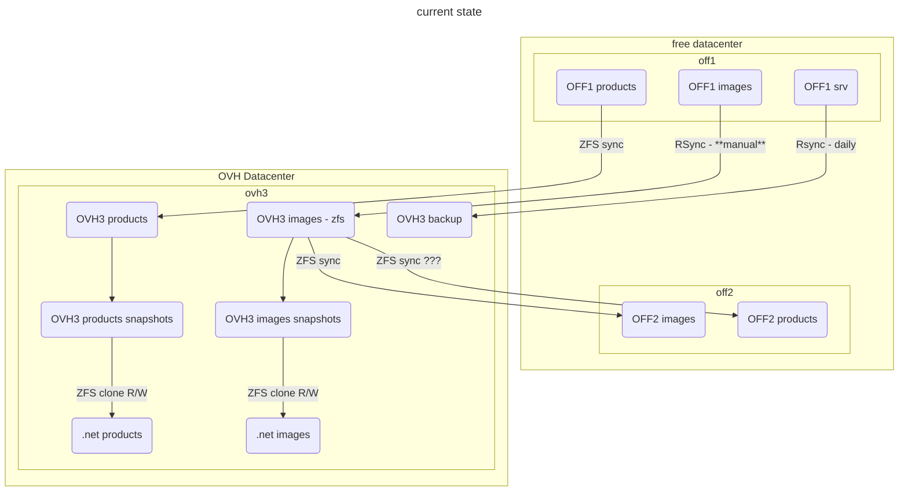

# 2023-03 OFF2 reinstall

## Current Storage situation




## NGINX reverse proxy install

I followed [How to create a new Container](../promox.md#how-to-create-a-new-container)

I add a problem running `ct_postinstall` as it wasn't able to fetch debian archives. Indeed there was no network in the CT.

1. I had to choose vmbr1 as the network bridge
2. I had to edit the host settings for vmbr1 in `/etc/network/interfaces` to add:
   ```
        post-up echo 1 > /proc/sys/net/ipv4/ip_forward
        post-up   iptables -t nat -A POSTROUTING -s '10.1.0.0/16' -o vmbr0 -j MASQUERADE
        post-down iptables -t nat -D POSTROUTING -s '10.1.0.0/16' -o vmbr0 -j MASQUERADE
    ```
    I also tweak a bit to have
    ```bash
    # ip route list
    default via 213.36.253.222 dev vmbr0 proto kernel onlink 
    10.0.0.0/8 dev vmbr1 proto kernel scope link src 10.0.0.2 
    213.36.253.192/27 dev vmbr0 proto kernel scope link src 213.36.253.208 
    ```
3. I also had to reboot the host

I then simply install `nginx` and `stunnel4` using apt.

I also [configure postfix](../mail#postfix-configuration) and tested it.

## Open Pet Food Facts install

### Creating CT

I created a CT followings [How to create a new Container](../promox.md#how-to-create-a-new-container) it went all smooth.

I also [configure postfix](../mail#postfix-configuration) and tested it.

### Installing packages

Then I installed needed package following docker container:

```
apt install -y apache2 apt-utils cpanminus g++ gcc less libapache2-mod-perl2 make gettext wget imagemagick graphviz tesseract-ocr libtie-ixhash-perl libwww-perl libimage-magick-perl libxml-encoding-perl libtext-unaccent-perl libmime-lite-perl libcache-memcached-fast-perl libjson-pp-perl libclone-perl libcrypt-passwdmd5-perl libencode-detect-perl libgraphics-color-perl libbarcode-zbar-perl libxml-feedpp-perl liburi-find-perl libxml-simple-perl libexperimental-perl libapache2-request-perl libdigest-md5-perl libtime-local-perl libdbd-pg-perl libtemplate-perl liburi-escape-xs-perl libmath-random-secure-perl libfile-copy-recursive-perl libemail-stuffer-perl liblist-moreutils-perl libexcel-writer-xlsx-perl libpod-simple-perl liblog-any-perl liblog-log4perl-perl liblog-any-adapter-log4perl-perl libgeoip2-perl libemail-valid-perl libmath-fibonacci-perl libev-perl libprobe-perl-perl libmath-round-perl libsoftware-license-perl libtest-differences-perl libtest-exception-perl libmodule-build-pluggable-perl libclass-accessor-lite-perl libclass-singleton-perl libfile-sharedir-install-perl libnet-idn-encode-perl libtest-nowarnings-perl libfile-chmod-perl libdata-dumper-concise-perl libdata-printer-perl libdata-validate-ip-perl libio-compress-perl libjson-maybexs-perl liblist-allutils-perl liblist-someutils-perl libdata-section-simple-perl libfile-which-perl libipc-run3-perl liblog-handler-perl libtest-deep-perl libwant-perl libfile-find-rule-perl liblinux-usermod-perl liblocale-maketext-lexicon-perl liblog-any-adapter-tap-perl libcrypt-random-source-perl libmath-random-isaac-perl libtest-sharedfork-perl libtest-warn-perl libsql-abstract-perl libauthen-sasl-saslprep-perl libauthen-scram-perl libbson-perl libclass-xsaccessor-perl libconfig-autoconf-perl libdigest-hmac-perl libpath-tiny-perl libsafe-isa-perl libspreadsheet-parseexcel-perl libtest-number-delta-perl libdevel-size-perl gnumeric libreadline-dev libperl-dev
```

We also want nginx in this container:
```bash
apt install nginx
```

### Getting the code

I then rsync the content of `/srv/opff` from off1 to the machine, (with -x to avoid sending crossing filesystems and excluding logs and html/images/products/).


I logged with -A (forward user agent) on off2, and use `sudo -E` to keep it !

```
sudo mkdir /zfs-hdd/pve/subvol-110-disk-0/srv/opff/
sudo -E - rsync -x -a --info=progress2 --exclude "logs/" --exclude "html/images/products/" off1.openfoodfacts.org:/srv/opff/ /zfs-hdd/pve/subvol-110-disk-0/srv/opff/
```

Strangely /srv/opff/lang was not world readable, I changed this on off1: `chmod a+rX -R lang/` and did rsync again.

In the container:

* I created user off: `adduser off` with a complex password that I immediately forgot (on purpose).
* I give ownership to off user and group to `/srv/opff`: `chown off:off -R /srv/opff` --> it fails.
  In fact I don't have the permissions, it's because we are in a LXC container.

* On the host, we have to setup ownership correctly on `/zfs-hdd/pve/subvol-110-disk-0/srv/opff/`
  but we have to apply user id translation (see UID Mapping in [man lxc.containers.conf](https://linuxcontainers.org/lxc/manpages/man5/lxc.container.conf.5.html))
* To get correct Id:
  * in the container, I created a simple file  `/srv/off.txt` and gave ownership to `off`
  * on the host I `ls -ln /zfs-hdd/pve/subvol-110-disk-0/srv/off.txt` and get the id: 101000:101000.
* Then on the host: `sudo chown 101000:101000 -R /zfs-hdd/pve/subvol-110-disk-0/srv/opff/`
* In the container, I then created logs and html/images/products/:
  ```bash
  sudo mkdir logs
  sudo mkdir html/images/products/
  sudo chown off:off html/images/products/ logs
  ```

lrwxrwxrwx 1 off off 20 22 févr.  2021 /srv/opff/products -> /rpool/opff/products
lrwxrwxrwx 1 off off 14 25 sept.  2018 /srv/opff/users -> /srv/off/users
lrwxrwxrwx 1 off off 24 29 janv.  2021 /srv/opff/html/robots.txt -> /srv/off/html/robots.txt


### Putting data in zfs datasets

Finding broken links:
`find /srv/opff -xtype l | xargs ls -l`

We have a lot in new_images and in html images folders, we can just remove them all
`find /srv/opff/new_images/ /srv/opff/html/images/bak/misc/ /srv/opff/html/images/misc.nok/ -xtype l |xargs -L 1 unlink`


We also have some html contents linked to off **FIXME decide what to do**
* /srv/opff/products -> /rpool/opff/products
* /srv/opff/ingredients/additifs/authorized_additives.txt -> /home/off-fr/cgi/authorized_additives.pl

#### creating datasets

I init a dataset for each projects: `zfs create opff`, `zfs create opff`, etc for `off`, `off-pro`, `obf` and `opf`

#### Products

Notice: the script to sync is not working out of the box because it use `-i` even if distant snapshot is empty !

Initiate:
real	0m0.714s
```bash
time zfs send rpool/opff/products@20230405-1800 |ssh  10.0.0.2 zfs recv zfs-hdd/opff/products

```
```bash
time zfs send rpool/opf/products@20230405-1730 |ssh  10.0.0.2 zfs recv  zfs-hdd/opf/products
real	0m11.802s
```

```bash
time zfs send rpool/obf/products@20230405-1730 |ssh  10.0.0.2 zfs recv  zfs-hdd/obf/products
real	2m6.629s
```

```bash
time zfs send rpool/off/products@20230405-1730 |ssh  10.0.0.2 zfs recv  zfs-hdd/off/products
real    117m16.799s
```

```bash
# time zfs send rpool/off-pro/products@20230406-1000 |ssh  10.0.0.2 zfs recv  zfs-hdd/off-pro
/products

real    5m59.378s
```

#### users

Users are not currently in a zfs on prod but we have them on zfs on ovh3 and there is a sync every day.

So we can use zfs sync from ovh3 to off2.


#### Snapshots and Syncs

I decided to use [sanoid](https://github.com/jimsalterjrs/sanoid) (packaged on debian bullseyes) to handle snapshots and syncs.


On OVH3 I have [to install it](https://github.com/jimsalterjrs/sanoid/blob/master/INSTALL.md#debianubuntu).
I exactly follow the instructions.

```bash
git clone https://github.com/jimsalterjrs/sanoid.git
cd sanoid
# checkout latest stable release or stay on master for bleeding edge stuff (but expect bugs!)
git checkout $(git tag | grep "^v" | tail -n 1)
ln -s packages/debian .
dpkg-buildpackage -uc -us
sudo apt install ../sanoid_*_all.deb
```

And enabled it:
```bash
sudo systemctl enable --now sanoid.timer
```

~~On off2, I just apt installed it.~~[^sanoid_debian] 

On off2 I install same package as the one on ovh3 (`scp ovh3.openfoodfacts.org:/home/alex/sanoid_2.1.0_all.deb` and `sudo apt install ./sanoid_2.1.0_all.deb` and `sudo systemctl enable --now sanoid.timer`)

On ovh3 I wrote the `/etc/sanoid/sanoid.conf` file to snapshot users regularly.

On off2 I wrote the `etc/sandoid.conf`


Tested it:
```bash
$ /usr/sbin/sanoid --take-snapshots --verbose
FATAL ERROR: I don't understand the setting template you've set in [zfs-hdd/off/users] in /etc/sanoid/sanoid.conf.
```
Had to modify my conf (I wrote `template=` instead of `use_template=`)

```bash
$ /usr/sbin/sanoid --take-snapshots --verbose
INFO: cache expired - updating from zfs list.
INFO: taking snapshots...
taking snapshot zfs-hdd/off/users@autosnap_2023-04-07_16:16:24_monthly
taking snapshot zfs-hdd/off/users@autosnap_2023-04-07_16:16:24_daily
taking snapshot zfs-hdd/off/users@autosnap_2023-04-07_16:16:24_hourly
INFO: cache expired - updating from zfs list.
```


I added off2 root public key (`cat /root/.ssh/id_rsa.pub`) to ovh3 (`/root/.ssh/authorized_keys`).

Made first syncoid by hand from off2, as root:
```bash
$ time syncoid root@ovh3.openfoodfacts.org:rpool/off/users zfs-hdd/off/users
INFO: Sending oldest full snapshot rpool/off/users@20211113111816 (~ 154.6 MB) to new target filesystem:
 270MiB 0:00:02 [ 103MiB/s] [=====================================================] 174%            
INFO: Updating new target filesystem with incremental rpool/off/users@20211113111816 ... syncoid_off2_2023-04-07:14:40:28 (~ 420.1 MB):
 772MiB 0:00:18 [41,2MiB/s] [=====================================================] 183%            

real	0m59,934s

$ time syncoid root@ovh3.openfoodfacts.org:rpool/off/users zfs-hdd/off/users
Sending incremental rpool/off/users@syncoid_off2_2023-04-07:14:40:28 ... syncoid_off2_2023-04-07:14:42:46 (~ 4 KB):
1,52KiB 0:00:00 [3,27KiB/s] [===================>                                  ] 38%            

real	0m2,535s
```

I decide to use `--no-sync-snap` as we already have a snapshot strategy.

Also supprisingly, the `root@` specification is mandatory.

Now I need to do a systemd service and timer on off2 for syncoid.

Did the systemd service. It's working fine (after some tweaking of the interface)

```bash
cat /etc/sanoid/syncoid-args.conf
--no-sync-snap root@ovh3.openfoodfacts.org:rpool/off/users zfs-hdd/off/users
```

[^sanoid_debian]:
    There seems to be a difference between debian bullseye packaging: it uses `cron.d` and `/etc/sanoid.conf`,
    while the last stable version uses systemd timerss and `/etc/sanoid/sanoid.conf`.
    So I prefered to go for the same version on all servers, and install the 2.1.0 deb that I built on ovh3.


## Setting up services

### Mounting volumes

We will use bind mounts to make zfs datasets available inside the machine.

See: https://pve.proxmox.com/wiki/Linux_Container#_bind_mount_points

#### linking data


**FIXME**
```
sudo ln -s 
```

### NGINX

Installed nginx `apt install nginx`.

Removed default site ` unlink /etc/nginx/sites-enabled/default`

Copied production nginx configuration of off1 in `/etc/nginx/sites-enabled/opff` to off2 in `/srv/opff/conf/nginx/sites-available/opff`

Modified it's configuration to remove ssl section (**FIXME:** to be commited in off-server)

Then made a symlink: `ln -s /srv/opff/conf/nginx/sites-available/opff /etc/nginx/sites-enabled/opff /`


### Apache

On off1 conf is in `/etc/apache2-opff/`, here we can set it up in directly in system apache configuration.

On off2:

* Remove default config (or it will conflict on port 80 with nginx):
  ```bash
  sudo unlink /etc/apache2/sites-enabled/000-default.conf
  ```

* We disable mpm event and enable mpm prefork:
  ```bash
  sudo a2dismod mpm_event
  sudo a2enmod mpm_prefork
  ```

* add the configuration for opff (as stored openfoodfacts-server project)
  copied the opff.conf file in `/etc/apache2/sites-available` and activate it:
  ```bash
  sudo a2ensite opff.conf
  ```

* edit `/etc/apache2-opf/envvars`
  ```
  #export APACHE_RUN_USER=www-data
  export APACHE_RUN_USER=off
  #export APACHE_RUN_GROUP=www-data
  export APACHE_RUN_GROUP=off
  ```

* edit `/etc/apache2/mods-available/mpm_prefork.conf`
  ```
        StartServers                     2
        MinSpareServers           2
        MaxSpareServers          4
        MaxRequestWorkers         20
        MaxConnectionsPerChild   500
  ```
