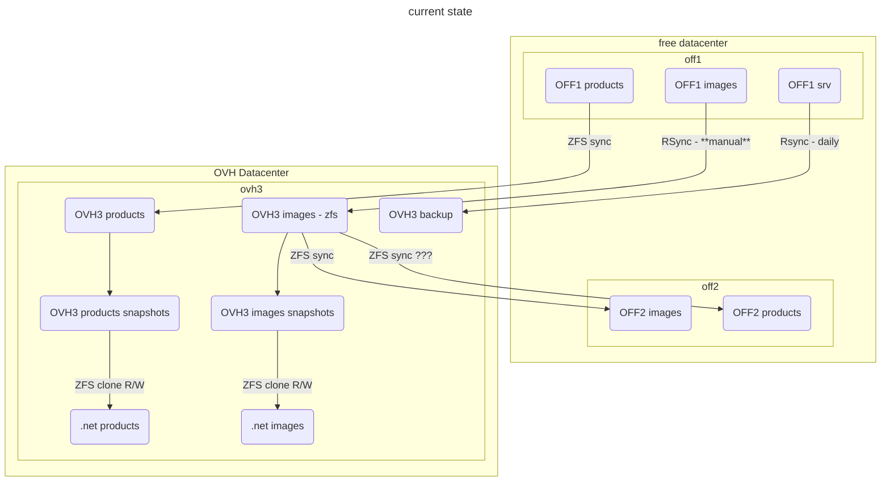

# 2023-03 OFF2 reinstall

## Current Storage situation

```mermaid
---
title: current state
---
flowchart TB
    subgraph free datacenter
        subgraph off1
            OFF1products(OFF1 products)
            OFF1srv(OFF1 srv)
            OFF1images(OFF1 images - non ZFS)
        end
        subgraph off2
            OFF2images(OFF2 images)
            OFF2products(OFF2 products)
        end
    end
    subgraph OVH Datacenter
        subgraph ovh3
            OVH3products(OVH3 products)
            OVH3images(OVH3 images - zfs)
            OVH3backup(OVH3 backup)
            OVH3products --> OVH3ProdSnapshots(OVH3 products snapshots)
            OVH3ProdSnapshots -->|ZFS clone R/W| DotNETProdclone(.net products)
            OVH3images --> OVH3ImgSnapshots(OVH3 images snapshots)
            OVH3ImgSnapshots -->|ZFS clone R/W| DotNetImgclone(.net images)
        end
    end
    %% inter graph links
    OFF1srv -->|Rsync - daily| OVH3backup
    OFF1products -->|ZFS sync| OVH3products
    OFF1images(OFF1 images) -->|RSync - **manual**| OVH3images
    OVH3images -->|ZFS sync| OFF2images
    OVH3images -->|ZFS sync ???| OFF2products
```

## NGINX reverse proxy install

**FIXME**