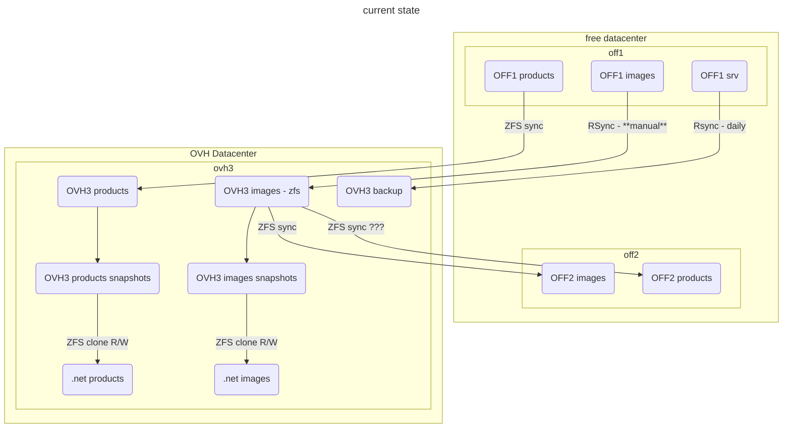

# 2023-03 OFF2 reinstall

## Current Storage situation




## NGINX reverse proxy install

### Installing VM

I followed [How to create a new Container](../promox.md#how-to-create-a-new-container)

I add a problem running `ct_postinstall` as it wasn't able to fetch debian archives. Indeed there was no network in the CT.

1. I had to choose vmbr1 as the network bridge
2. I had to edit the host settings for vmbr1 in `/etc/network/interfaces` to add:
   ```
        post-up echo 1 > /proc/sys/net/ipv4/ip_forward
        post-up   iptables -t nat -A POSTROUTING -s '10.1.0.0/16' -o vmbr0 -j MASQUERADE
        post-down iptables -t nat -D POSTROUTING -s '10.1.0.0/16' -o vmbr0 -j MASQUERADE
    ```
    I also tweak a bit to have
    ```bash
    # ip route list
    default via 213.36.253.222 dev vmbr0 proto kernel onlink
    10.0.0.0/8 dev vmbr1 proto kernel scope link src 10.0.0.2
    213.36.253.192/27 dev vmbr0 proto kernel scope link src 213.36.253.208
    ```
3. I also had to reboot the host

I then simply install `nginx` and `stunnel4` using apt.

I also [configure postfix](../mail#postfix-configuration) and tested it.

### Adding the IP

Using proxmox interface, on container 110, I add net1, on vmbr0, IP 213.36.253.214/27, Gateway 213.36.253.222 (copied from Host config).

**Important**: I removed the gateway on net0 (see [here](../nginx-reverse-proxy.md#network-specific-interface)).

I reboot the container 101, and it seems to work.


## Open Pet Food Facts install

### Creating CT

I created a CT followings [How to create a new Container](../promox.md#how-to-create-a-new-container) it went all smooth.

I also [configure postfix](../mail#postfix-configuration) and tested it.

### Installing packages

Then I installed needed package following docker container:

```
apt install -y apache2 apt-utils cpanminus g++ gcc less libapache2-mod-perl2 make gettext wget imagemagick graphviz tesseract-ocr libtie-ixhash-perl libwww-perl libimage-magick-perl libxml-encoding-perl libtext-unaccent-perl libmime-lite-perl libcache-memcached-fast-perl libjson-pp-perl libclone-perl libcrypt-passwdmd5-perl libencode-detect-perl libgraphics-color-perl libbarcode-zbar-perl libxml-feedpp-perl liburi-find-perl libxml-simple-perl libexperimental-perl libapache2-request-perl libdigest-md5-perl libtime-local-perl libdbd-pg-perl libtemplate-perl liburi-escape-xs-perl libmath-random-secure-perl libfile-copy-recursive-perl libemail-stuffer-perl liblist-moreutils-perl libexcel-writer-xlsx-perl libpod-simple-perl liblog-any-perl liblog-log4perl-perl liblog-any-adapter-log4perl-perl libgeoip2-perl libemail-valid-perl libmath-fibonacci-perl libev-perl libprobe-perl-perl libmath-round-perl libsoftware-license-perl libtest-differences-perl libtest-exception-perl libmodule-build-pluggable-perl libclass-accessor-lite-perl libclass-singleton-perl libfile-sharedir-install-perl libnet-idn-encode-perl libtest-nowarnings-perl libfile-chmod-perl libdata-dumper-concise-perl libdata-printer-perl libdata-validate-ip-perl libio-compress-perl libjson-maybexs-perl liblist-allutils-perl liblist-someutils-perl libdata-section-simple-perl libfile-which-perl libipc-run3-perl liblog-handler-perl libtest-deep-perl libwant-perl libfile-find-rule-perl liblinux-usermod-perl liblocale-maketext-lexicon-perl liblog-any-adapter-tap-perl libcrypt-random-source-perl libmath-random-isaac-perl libtest-sharedfork-perl libtest-warn-perl libsql-abstract-perl libauthen-sasl-saslprep-perl libauthen-scram-perl libbson-perl libclass-xsaccessor-perl libconfig-autoconf-perl libdigest-hmac-perl libpath-tiny-perl libsafe-isa-perl libspreadsheet-parseexcel-perl libtest-number-delta-perl libdevel-size-perl gnumeric libreadline-dev libperl-dev
```

We also want nginx in this container:
```bash
apt install nginx
```

### Getting the code

I then rsync the content of `/srv/opff` from off1 to the machine, (with -x to avoid sending crossing filesystems and excluding logs and html/images/products/).

I copied the `/root/.ssh/id_rsa.pub`  off off2 in the `/root/.ssh/authorized_keys` of off1


On off2:

```
sudo mkdir /zfs-hdd/pve/subvol-110-disk-0/srv/opff/
sudo rsync -x -a --info=progress2 --exclude "logs/" --exclude "html/images/products/" off1.openfoodfacts.org:/srv/opff/ /zfs-hdd/pve/subvol-110-disk-0/srv/opff/
```

Strangely /srv/opff/lang was not world readable, I changed this on off1: `chmod a+rX -R lang/` and did rsync again.

In the container:

* I created user off: `adduser off` with a complex password that I immediately forgot (on purpose).
* I give ownership to off user and group to `/srv/opff`: `chown off:off -R /srv/opff` --> it fails.
  In fact I don't have the permissions, it's because we are in a LXC container.

* On the host, we have to setup ownership correctly on `/zfs-hdd/pve/subvol-110-disk-0/srv/opff/`
  but we have to apply user id translation (see UID Mapping in [man lxc.containers.conf](https://linuxcontainers.org/lxc/manpages/man5/lxc.container.conf.5.html))
* To get correct Id:
  * in the container, I created a simple file  `/srv/off.txt` and gave ownership to `off`
  * on the host I `ls -ln /zfs-hdd/pve/subvol-110-disk-0/srv/off.txt` and get the id: 101000:101000.
* Then on the host: `sudo chown 101000:101000 -R /zfs-hdd/pve/subvol-110-disk-0/srv/opff/`
* In the container, I then created logs and html/images/products/:
  ```bash
  sudo mkdir logs
  sudo mkdir html/images/products/
  sudo chown off:off html/images/products/ logs
  ```

lrwxrwxrwx 1 off off 20 22 févr.  2021 /srv/opff/products -> /rpool/opff/products
lrwxrwxrwx 1 off off 14 25 sept.  2018 /srv/opff/users -> /srv/off/users
lrwxrwxrwx 1 off off 24 29 janv.  2021 /srv/opff/html/robots.txt -> /srv/off/html/robots.txt


### Putting data in zfs datasets

Finding broken links:
`find /srv/opff -xtype l | xargs ls -l`

We have a lot in new_images and in html images folders, we can just remove them all
`find /srv/opff/new_images/ /srv/opff/html/images/bak/misc/ /srv/opff/html/images/misc.nok/ -xtype l |xargs -L 1 unlink`


We also have some html contents linked to off **FIXME decide what to do**
* /srv/opff/products -> /rpool/opff/products
* /srv/opff/ingredients/additifs/authorized_additives.txt -> /home/off-fr/cgi/authorized_additives.pl

#### creating datasets

I init a dataset for each projects: `zfs create opff`, `zfs create opff`, etc for `off`, `off-pro`, `obf` and `opf`

I then create `zfs create zfs-hdd/opff/data`, `zfs create zfs-hdd/opff/images`, `zfs create zfs-hdd/opff/cache` (not products because we will sync it).

And change permissions of directories:

```bash
sudo chown 1000:1000  /zfs-hdd/opff/ /zfs-hdd/opff/data /zfs-hdd/opff/images /zfs-hdd/opff/cache
```

Add them to `sanoid.conf`
```
[zfs-hdd/opff]
  use_template=prod_data
  recursive=no

[zfs-hdd/opff/cache]
  use_template=prod_data
  recursive=no

[zfs-hdd/opff/data]
  use_template=prod_data
  recursive=no

[zfs-hdd/opff/images]
  use_template=prod_data
  recursive=no

```

For opff it's a bit more complicated because I had it created already on off2 and ovh3, so no sync possible ! (at time of doing it I had products and images)

To be able to sync it, here is what I did:
* on off2, sync opff to a dataset with a temporary name on ovh3:
  ```bash
   sudo syncoid --no-sync-snap zfs-hdd/opff  root@ovh3.openfoodfacts.org:rpool/opff-new
  ```
* on ovh3:

  * on off2 temporarily disable the syncoid service
    ```bash
    sudo systemctl disable syncoid
    ```
  * choose a time far from the products updates (to avoid having to disable it)
  * on ovh3
    * move products and images dataset to opff-new
      ```bash
      sudo zfs rename rpool/opff{,-new}/products
      sudo zfs rename rpool/opff{,-new}/images
      ```
    * move opff to opff-old
      ```bash
      sudo zfs rename rpool/opff{,-old}
      ```
    * rename opff-new to opff
      ```bash
      sudo zfs rename rpool/opff{-new,}
      ```
  * on off2 reactivate syncoid service
    ```bash
    sudo systemctl enable syncoid
    ```
  * on ovh3
    * verify opff-old is empty
      ```bash
      sudo ls -a /rpool/opff-old
      sudo zfs list rpool/opff-old
      sudo zfs list rpool/opff-old -t snapshot
      ```
    * and destroy it
      ```bash
      sudo zfs destroy rpool/opff-old
      ```

Finally I added the opff sync to `syncoid-args.conf` on ovh3 and the snapshoting as synced on ovh3 in `sanoid.conf`

I also did it for the data and cache dataset:

```bash
# from off2 to ovh3
--no-sync-snap zfs-hdd/opff root@ovh3.openfoodfacts.org:rpool/opff
--no-sync-snap zfs-hdd/opff/cache root@ovh3.openfoodfacts.org:rpool/opff/cache
--no-sync-snap zfs-hdd/opff/data root@ovh3.openfoodfacts.org:rpool/opff/data
```

> **NOTE** renaming dataset:
> I had to rename data to html_data (I didn't spot there was another data dataset).
> `zfs rename zfs-hdd/opff/data zfs-hdd/opff/html_data` on both ovh3 and off2
> Then changed `/etc/sanoid/sanoid.conf` and `/etc/sanoid/syncoid_args.conf`

#### Products

Notice: the script to sync is not working out of the box because it use `-i` even if distant snapshot is empty !

Initiate:
real	0m0.714s
```bash
time zfs send rpool/opff/products@20230405-1800 |ssh  10.0.0.2 zfs recv zfs-hdd/opff/products

```
```bash
time zfs send rpool/opf/products@20230405-1730 |ssh  10.0.0.2 zfs recv  zfs-hdd/opf/products
real	0m11.802s
```

```bash
time zfs send rpool/obf/products@20230405-1730 |ssh  10.0.0.2 zfs recv  zfs-hdd/obf/products
real	2m6.629s
```

```bash
time zfs send rpool/off/products@20230405-1730 |ssh  10.0.0.2 zfs recv  zfs-hdd/off/products
real    117m16.799s
```

```bash
# time zfs send rpool/off-pro/products@20230406-1000 |ssh  10.0.0.2 zfs recv  zfs-hdd/off-pro
/products

real    5m59.378s
```

#### users

Users are not currently in a zfs on prod but we have them on zfs on ovh3 and there is a sync every day.

So we can use zfs sync from ovh3 to off2.

**FIXME:** we have to fix the users case !

#### Products images

We will do a rsync, that we will have to repeat when putting in production.

On off2 (in a screen):

```bash
sudo rsync --info=progress2 -a -x 10.0.0.1:/srv/opff/html/images/products  /zfs-hdd/opff/images
```
this took 12 minutes.

Then I sync to ovh3:

```bash
time sudo  syncoid --no-sync-snap zfs-hdd/opff/images root@ovh3.openfoodfacts.org:rpool/opff/images
```

After first sync (which took 44 min), I also added it to sanoid.conf ovh3, but using synced template.

I also add the main dataset and images to be synced to ovh3 by adding to `/etc/sanoid/syncoid-args.conf`
```bash
--no-sync-snap zfs-hdd/opff/images root@ovh3.openfoodfacts.org:rpool/opff/images
```

#### other data (and cache)

I rsync cache data on ofF2:

```bash
rsync --info=progress2 -a -x 10.0.0.1:/srv/opff/{build-cache,tmp,debug,new_images} /zfs-hdd/opff/cache
```
`build-cache` does not exist, not a problem !

I rsync other data on ofF2:
```bash
rsync --info=progress2 -a -x 10.0.0.1:/srv/opff/{deleted.images,data} /zfs-hdd/opff/
```

#### Snapshots and Syncs

I decided to use [sanoid](https://github.com/jimsalterjrs/sanoid) (packaged on debian bullseyes) to handle snapshots and syncs.


On OVH3 I have [to install it](https://github.com/jimsalterjrs/sanoid/blob/master/INSTALL.md#debianubuntu).
I exactly follow the instructions.

```bash
git clone https://github.com/jimsalterjrs/sanoid.git
cd sanoid
# checkout latest stable release or stay on master for bleeding edge stuff (but expect bugs!)
git checkout $(git tag | grep "^v" | tail -n 1)
ln -s packages/debian .
dpkg-buildpackage -uc -us
sudo apt install ../sanoid_*_all.deb
```

And enabled it:
```bash
sudo systemctl enable --now sanoid.timer
```

~~On off2, I just apt installed it.~~[^sanoid_debian] 

On off2 I install same package as the one on ovh3 (`scp ovh3.openfoodfacts.org:/home/alex/sanoid_2.1.0_all.deb` and `sudo apt install ./sanoid_2.1.0_all.deb` and `sudo systemctl enable --now sanoid.timer`)

On ovh3 I wrote the `/etc/sanoid/sanoid.conf` file to snapshot users regularly.

On off2 I wrote the `etc/sandoid.conf`


Tested it:
```bash
$ /usr/sbin/sanoid --take-snapshots --verbose
FATAL ERROR: I don't understand the setting template you've set in [zfs-hdd/off/users] in /etc/sanoid/sanoid.conf.
```
Had to modify my conf (I wrote `template=` instead of `use_template=`)

```bash
$ /usr/sbin/sanoid --take-snapshots --verbose
INFO: cache expired - updating from zfs list.
INFO: taking snapshots...
taking snapshot zfs-hdd/off/users@autosnap_2023-04-07_16:16:24_monthly
taking snapshot zfs-hdd/off/users@autosnap_2023-04-07_16:16:24_daily
taking snapshot zfs-hdd/off/users@autosnap_2023-04-07_16:16:24_hourly
INFO: cache expired - updating from zfs list.
```


I added off2 root public key (`cat /root/.ssh/id_rsa.pub`) to ovh3 (`/root/.ssh/authorized_keys`).

Made first syncoid by hand from off2, as root:
```bash
$ time syncoid root@ovh3.openfoodfacts.org:rpool/off/users zfs-hdd/off/users
INFO: Sending oldest full snapshot rpool/off/users@20211113111816 (~ 154.6 MB) to new target filesystem:
 270MiB 0:00:02 [ 103MiB/s] [=====================================================] 174%            
INFO: Updating new target filesystem with incremental rpool/off/users@20211113111816 ... syncoid_off2_2023-04-07:14:40:28 (~ 420.1 MB):
 772MiB 0:00:18 [41,2MiB/s] [=====================================================] 183%            

real	0m59,934s

$ time syncoid root@ovh3.openfoodfacts.org:rpool/off/users zfs-hdd/off/users
Sending incremental rpool/off/users@syncoid_off2_2023-04-07:14:40:28 ... syncoid_off2_2023-04-07:14:42:46 (~ 4 KB):
1,52KiB 0:00:00 [3,27KiB/s] [===================>                                  ] 38%            

real	0m2,535s
```

I decide to use `--no-sync-snap` as we already have a snapshot strategy.

Also supprisingly, the `root@` specification is mandatory.

Now I need to do a systemd service and timer on off2 for syncoid.

Did the systemd service. It's working fine (after some tweaking of the interface)

```bash
cat /etc/sanoid/syncoid-args.conf
--no-sync-snap root@ovh3.openfoodfacts.org:rpool/off/users zfs-hdd/off/users
```

And we notify systemd:

```bash
$ sudo systemctl daemon-reload
```

[^sanoid_debian]:
    There seems to be a difference between debian bullseye packaging: it uses `cron.d` and `/etc/sanoid.conf`,
    while the last stable version uses systemd timerss and `/etc/sanoid/sanoid.conf`.
    So I prefered to go for the same version on all servers, and install the 2.1.0 deb that I built on ovh3.


## Setting up services

### Mounting volumes

We will use bind mounts to make zfs datasets available inside the machine.

See: https://pve.proxmox.com/wiki/Linux_Container#_bind_mount_points

and https://pve.proxmox.com/wiki/Unprivileged_LXC_containers

We edit /etc/subuid and /etc/subgid to add `root:1000:10`. This allow container started by root to map ids 1000 to their same ids on system.

We edit 110 conf to add sub_id exceptions:

```
# uid map: from uid 0 map 999 uids (in the ct) to the range starting 100000 (on the host)
# so 0..999 (ct) → 100000..100999 (host)
lxc.idmap = u 0 100000 999
lxc.idmap = g 0 100000 999
# we map 10 uid starting from uid 1000 onto 1000, so 1000..1010 → 1000..1010
lxc.idmap = u 1000 1000 10
lxc.idmap = g 1000 1000 10
# we map the rest of 65535 from 1010 upto 101010, so 1010..65535 → 101010..165535
lxc.idmap = u 1011 101011 64525
lxc.idmap = g 1011 101011 64525
```


```
# volumes
mp0: /zfs-hdd/opff,mp=/mnt/opff
mp1: /zfs-hdd/opff/products/,mp=/mnt/opff/products
mp2: /zfs-hdd/off/users/,mp=/mnt/opff/users
mp3: /zfs-hdd/opff/images,mp=/mnt/opff/images
mp4: /zfs-hdd/opff/html_data,mp=/mnt/opff/html_data
mp5: /zfs-hdd/opff/cache,mp=/mnt/opff/cache
```
**Important**: the order is important for the first one, otherwise `/mnt/opff/products` will be invisibilized by the mount of `/mnt/opff`.


We restart `pct reboot 110`

But we have a problem: we loose access to our home directory because of uids changes.
We fix this from the host:

```
root@off2:# chown 1001:1001 -R /zfs-hdd/pve/subvol-110-disk-0/home/alex
root@off2:# chown 1000:1000 -R /zfs-hdd/pve/subvol-110-disk-0/home/off
```
#### linking data

Unless stated operation are done with user off.

Create a backup folder to be sure
```bash
sudo mkdir /srv/backup/
sudo chown off:off /srv/backup/
```

Remove old links:
```bash
unlink /srv/opff/products
unlink /srv/opff/users
mv /srv/opff/users_emails.sto /srv/backup
```

Create links for users and products
```bash
ln -s /mnt/opff/products /srv/opff/products
ln -s /mnt/opff/users /srv/opff/users
# old versions of Product opener needs users_emails.sto in /srv/xxx
ln -s /mnt/opff/users/users_emails.sto /srv/opff/users_emails.sto
```

Create links for data folders, also moving data zfs parts:

```bash
# html data
sudo rsync -a /srv/opff/html/data/ /mnt/opff/html_data/
sudo mv /srv/opff/html/data/ /srv/backup/
ln -s /mnt/opff/html_data/ /srv/opff/html/data
# product images
sudo rmdir /srv/opff/html/images/products/
ln -s /mnt/opff/images/products  /srv/opff/html/images/products
# deleted.images
mv /srv/opff/deleted.images /mnt/opff/
ln -s  /{mnt,srv}/opff/deleted.images
# data (was non existent)
mkdir /mnt/opff/data
ln -s  /{mnt,srv}/opff/data
```

We also want to move Lang file in data folder but keep compatibility (it's an old version)

```bash
mv /srv/opff/Lang.openpetfoodfacts.org.sto /mnt/opff/data/
ln -s /mnt/opff/data/Lang.openpetfoodfacts.org.sto /srv/opff/
```

Same for cache folders
```bash
# build-cache (was non existent)
mkdir /mnt/opff/cache/build-cache
ln -s /mnt/opff/cache/build-cache /srv/opff/build-cache
mv /srv/{opff,backup}/tmp/
ln -s /mnt/opff/cache/tmp /srv/opff/tmp
mv /srv/{opff,backup}/debug 
ln -s /mnt/opff/cache/debug /srv/opff/debug
mv /srv/{opff,backup}/new_images
ln -s /mnt/opff/cache/new_images /srv/opff/new_images
```


#### linking logs

We want logs to go in /var/logs.

We will create a directory for opff and also add links to nginx and apache2 logs.

```bash
sudo mkdir /var/log/opff
sudo chown off:off -R /var/log/opff
sudo -u off rmdir /srv/opff/logs/
sudo -u off ln -s /var/log/opff /srv/opff/logs
sudo  -u off ln -s ../apache2 /var/log/opff
sudo -u off ln -s ../nginx /var/log/opff
```

#### verify config links

They where normaly kept in the transfer, but for the record:
```bash
ls -l /srv/opff/lib/ProductOpener/{SiteLang,Config}.pm
lrwxrwxrwx 1 off off 14 30 mars    2017 /srv/opff/lib/ProductOpener/Config.pm -> Config_opff.pm
lrwxrwxrwx 1 off off 16  2 janv.   2018 /srv/opff/lib/ProductOpener/SiteLang.pm -> SiteLang_opff.pm
```
and `/srv/opff/lib/ProductOpener/Config2.pm` is specific.

### NGINX

Installed nginx `apt install nginx`.

Removed default site ` unlink /etc/nginx/sites-enabled/default`

Copied production nginx configuration of off1 in `/etc/nginx/sites-enabled/opff` to off2 in `/srv/opff/conf/nginx/sites-available/opff`

Modified it's configuration to remove ssl section (**FIXME:** to be commited in off-server)

Then made a symlink: `ln -s /srv/opff/conf/nginx/sites-available/opff /etc/nginx/sites-enabled/opff /`


### Apache

On off1 conf is in `/etc/apache2-opff/`, here we can set it up in directly in system apache configuration.

On off2:

* Remove default config (or it will conflict on port 80 with nginx):
  ```bash
  sudo unlink /etc/apache2/sites-enabled/000-default.conf
  ```

* We disable mpm event and enable mpm prefork:
  ```bash
  sudo a2dismod mpm_event
  sudo a2enmod mpm_prefork
  ```

* add the configuration for opff (as stored openfoodfacts-server project)
  copied the opff.conf file in `/etc/apache2/sites-available` and activate it:
  ```bash
  sudo a2ensite opff.conf
  ```

* edit `/etc/apache2-opf/envvars`
  ```
  #export APACHE_RUN_USER=www-data
  export APACHE_RUN_USER=off
  #export APACHE_RUN_GROUP=www-data
  export APACHE_RUN_GROUP=off
  ```

* edit `/etc/apache2/mods-available/mpm_prefork.conf`
  ```
        StartServers                     2
        MinSpareServers           2
        MaxSpareServers          4
        MaxRequestWorkers         20
        MaxConnectionsPerChild   500
  ```

* change ports apache is listening in `/etc/apache2/ports.conf` (because we need port 80 for nginx):
  ```
  Listen 8001

  #<IfModule ssl_module>
  #       Listen 443
  #</IfModule>

  #<IfModule mod_gnutls.c>
  #       Listen 443
  #</IfModule>
  ```

We also have to change permissions on log since we changed run user:

```bash
sudo chown off:off -R /var/log/apache2 /var/run/apache2
```


### Finding OPFF version

on off1 in /srv/opff:
```bash
find . -xdev  -iregex ".*\.\(pl\|pm\|txt\)"|xargs ls -l --time-style=+'%Y-%m-%d'|tr -s ' ' ' '|cut -d ' ' -f 6-|sort
```

Interesting data retained `2020-05-30`.

To get modified files along with versions `git log --name-only`

I then compared code with various commits. Finally I put the tag [OPFF-v1](https://github.com/openfoodfacts/openfoodfacts-server/releases/tag/OPFF-v1) on commit [34a1c35](https://github.com/openfoodfacts/openfoodfacts-server/commit/34a1c355049b2c1017a65b9ab6419c79fe083f3c)

It's approximate because we apparently got less up to date taxonomies.


## Using git

Created /srv/opff-git to clone and compare:
```bash
sudo mkdir /srv/opff-git
sudo chown off:off /srv/opff-git
```

Create a key for off (as off user), without a passphrase:
```bash
ssh-keygen -t ed25519 -C "off@opff.openfoodfacts.org"
cat /home/off/.ssh/id_ed25519.pub
```

In github add the `/home/off/.ssh/id_ed25519.pub` to deploy keys for openfoodfacts-server ([github docs](https://docs.github.com/en/authentication/connecting-to-github-with-ssh/managing-deploy-keys#deploy-keys)): going to settings / deploy keys / add deploy key. I did not gave write access.

With user off, clone git:
```bash
cd /srv/opff-git/
git clone -b OPFF-v1 --single-branch --depth=10 git@github.com:openfoodfacts/openfoodfacts-server.git .
```
Compared both:
```bash
diff --no-dereference /srv/opff-git/ /srv/opff > /tmp/opff.diff
```
Important differences spotted:
* cpanfile -- many differences ! But in fact on off1 it was not really use, so we will take the one in git
* bower.json is no more in git, not a problem
* log.conf
  ```diff
  diff --no-dereference --ignore-space-change --strip-trailing-cr /srv/opff-git/log.conf /srv/opff/log.conf
  3,4d2
  < log4perl.PatternLayout.cspec.S = sub { my $context = Log::Log4perl::MDC->get_context; use Data::Dumper (); local $Data::Dumper::Indent    = 0; local $Data::Dumper::Terse     = 1; local $Data::Dumper::Sortkeys  = 1; local $Data::Dumper::Quotekeys = 0; local $Data::Dumper::Deparse   = 1; my $str = Data::Dumper::Dumper($context); $str =~ s/[\n\r]/ /g; return $str; }
  < 
  6c4
  < log4perl.appender.LOGFILE.filename=./logs/log4perl.log
  ---
  > log4perl.appender.LOGFILE.filename=/srv/opff/logs/log4perl.log
  10c8
  < log4perl.appender.LOGFILE.layout.ConversionPattern=[%r] %F %L %c %S %m{chomp}%n
  ---
  > log4perl.appender.LOGFILE.layout.ConversionPattern=[%r] %F %L %c - %m%n
  ```

### Replacing with git repo

```bash
sudo mv /srv/opff{,-old}
sudo mv /srv/opff{-git,}
```
Update needed file:

1. apache and nginx conf is wrong, copy it in git version:

```bash
cp /etc/apache2/sites-available/opff.conf conf/apache-2.4/sites-available/opff.conf
cp /srv/opff-old/conf/nginx/sites-available/opff conf/nginx/sites-available/opff
```

**TODO**: verify lgos.conf works

### Using link for system files

```bash
sudo ln -s /srv/opff/conf/nginx/sites-available /etc/nginx/sites-enabled/opff
sudo ln -s /srv/opff/conf/nginx/expires-no-json-xml.conf /etc/nginx/
sudo rm /etc/nginx/mime.types
sudo ln -s /srv/opff/conf/nginx/mime.types /etc/nginx/


```

## Installing CPAN

```bash
cd /srv/opff
sudo cpanm --notest --quiet --skip-satisfied --installdeps .
Successfully installed CLDR-Number-0.19
Successfully installed Mojolicious-9.31
Successfully installed Minion-10.25
You have CLDR::Number (0.19)
Successfully installed Modern-Perl-1.20230106
Successfully installed Heap-0.80
Successfully installed Set-Object-1.42
Successfully installed Graph-0.9726
Successfully installed GraphViz2-2.67
Successfully installed Algorithm-CheckDigits-v1.3.6
You have CLDR::Number::Format::Percent (0.19)
Successfully installed XML-Rules-1.16
Successfully installed Text-Fuzzy-0.29
Successfully installed LEOCHARRE-DEBUG-1.14
Successfully installed LEOCHARRE-CLI-1.19
Successfully installed Image-OCR-Tesseract-1.26
Successfully installed Action-CircuitBreaker-0.1
Successfully installed Text-CSV_XS-1.50
Successfully installed Spreadsheet-CSV-0.20
Successfully installed UUID-URandom-0.001
Successfully installed MongoDB-v2.2.2
You have Mojolicious::Lite (undef)
Successfully installed Module-Build-Pluggable-CPANfile-0.05
Successfully installed IO-Interactive-Tiny-0.2
Successfully installed Data-Dumper-AutoEncode-1.00
Successfully installed SQL-Abstract-2.000001 (upgraded from 1.87)
Successfully installed SQL-Abstract-Pg-1.0
Successfully installed Mojo-Pg-4.27
Successfully installed Encode-Punycode-1.002
Successfully installed B-Keywords-1.24
Successfully installed Config-Tiny-2.29
Successfully installed Task-Weaken-1.06
Successfully installed PPI-1.276
Successfully installed PPIx-Regexp-0.088
You have PPIx::Regexp::Util (0.088)
Successfully installed PPIx-Utils-0.003
Successfully installed String-Format-1.18
You have PPI (1.276)
You have PPI::Node (1.276)
Successfully installed PPIx-QuoteLike-0.023
You have PPI::Token::Quote::Single (1.276)
Successfully installed Perl-Tidy-20230309
You have PPI::Document::File (1.276)
You have PPI::Document (1.276)
Successfully installed Lingua-EN-Inflect-1.905
Successfully installed Pod-Spell-1.26
Successfully installed Perl-Critic-1.150
You have Perl::Critic::Utils (1.150)
Successfully installed MCE-1.884
You have Perl::Critic::Violation (1.150)
Successfully installed Test-Perl-Critic-1.04
Successfully installed Text-CSV-2.02
/usr/bin/tar: Action-Retry-0.24/README: Cannot change ownership to uid 3957780, gid 10902869: Invalid argument
/usr/bin/tar: Action-Retry-0.24/Changes: Cannot change ownership to uid 3957780, gid 10902869: Invalid argument
/usr/bin/tar: Action-Retry-0.24/LICENSE: Cannot change ownership to uid 3957780, gid 10902869: Invalid argument
/usr/bin/tar: Action-Retry-0.24/dist.ini: Cannot change ownership to uid 3957780, gid 10902869: Invalid argument
/usr/bin/tar: Action-Retry-0.24/META.yml: Cannot change ownership to uid 3957780, gid 10902869: Invalid argument
/usr/bin/tar: Action-Retry-0.24/MANIFEST: Cannot change ownership to uid 3957780, gid 10902869: Invalid argument
/usr/bin/tar: Action-Retry-0.24/Build.PL: Cannot change ownership to uid 3957780, gid 10902869: Invalid argument
/usr/bin/tar: Action-Retry-0.24/t/linear.t: Cannot change ownership to uid 3957780, gid 10902869: Invalid argument
/usr/bin/tar: Action-Retry-0.24/t: Cannot change ownership to uid 3957780, gid 10902869: Invalid argument
/usr/bin/tar: Action-Retry-0.24/Makefile.PL: Cannot change ownership to uid 3957780, gid 10902869: Invalid argument
/usr/bin/tar: Action-Retry-0.24/t/constant.t: Cannot change ownership to uid 3957780, gid 10902869: Invalid argument
/usr/bin/tar: Action-Retry-0.24/t/fibonacci.t: Cannot change ownership to uid 3957780, gid 10902869: Invalid argument
/usr/bin/tar: Action-Retry-0.24/t/00-compile.t: Cannot change ownership to uid 3957780, gid 10902869: Invalid argument
/usr/bin/tar: Action-Retry-0.24/t/nonblocking.t: Cannot change ownership to uid 3957780, gid 10902869: Invalid argument
/usr/bin/tar: Action-Retry-0.24/t/check_params.t: Cannot change ownership to uid 3957780, gid 10902869: Invalid argument
/usr/bin/tar: Action-Retry-0.24/lib/Action/Retry.pm: Cannot change ownership to uid 3957780, gid 10902869: Invalid argument
/usr/bin/tar: Action-Retry-0.24/lib/Action: Cannot change ownership to uid 3957780, gid 10902869: Invalid argument
/usr/bin/tar: Action-Retry-0.24/t/release-distmeta.t: Cannot change ownership to uid 3957780, gid 10902869: Invalid argument
/usr/bin/tar: Action-Retry-0.24/t/release-pod-coverage.t: Cannot change ownership to uid 3957780, gid 10902869: Invalid argument
/usr/bin/tar: Action-Retry-0.24/lib/Action/Retry/Strategy.pm: Cannot change ownership to uid 3957780, gid 10902869: Invalid argument
/usr/bin/tar: Action-Retry-0.24/lib/Action/Retry/Strategy/Linear.pm: Cannot change ownership to uid 3957780, gid 10902869: Invalid argument
/usr/bin/tar: Action-Retry-0.24/lib/Action/Retry/Strategy/Constant.pm: Cannot change ownership to uid 3957780, gid 10902869: Invalid argument
/usr/bin/tar: Action-Retry-0.24/lib/Action/Retry/Strategy/Fibonacci.pm: Cannot change ownership to uid 3957780, gid 10902869: Invalid argument
/usr/bin/tar: Action-Retry-0.24/lib/Action/Retry/Strategy/HelperRole/RetriesLimit.pm: Cannot change ownership to uid 3957780, gid 10902869: Invalid argument
/usr/bin/tar: Action-Retry-0.24/lib/Action/Retry/Strategy/HelperRole/SleepCapping.pm: Cannot change ownership to uid 3957780, gid 10902869: Invalid argument
/usr/bin/tar: Action-Retry-0.24/lib/Action/Retry/Strategy/HelperRole/SleepTimeout.pm: Cannot change ownership to uid 3957780, gid 10902869: Invalid argument
/usr/bin/tar: Action-Retry-0.24/lib/Action/Retry/Strategy/HelperRole: Cannot change ownership to uid 3957780, gid 10902869: Invalid argument
/usr/bin/tar: Action-Retry-0.24/lib/Action/Retry/Strategy: Cannot change ownership to uid 3957780, gid 10902869: Invalid argument
/usr/bin/tar: Action-Retry-0.24/lib/Action/Retry: Cannot change ownership to uid 3957780, gid 10902869: Invalid argument
/usr/bin/tar: Action-Retry-0.24: Cannot change ownership to uid 3957780, gid 10902869: Invalid argument
/usr/bin/tar: Exiting with failure status due to previous errors
Successfully installed Action-Retry-0.24
Successfully installed Locale-Maketext-Lexicon-Getcontext-0.05
Successfully installed Crypt-ScryptKDF-0.010
44 distributions installed

```


## Still TODO

**FIXME** off-net sur OVH1 !

- notification when important task fails
- IP failover ? (maybe after off1 setup)
- verify if we need to in nginx config: install Apache2::Connection::XForwardedFor (see [wiki]())
- GEOIP updates (should be regular updates IMO) see https://manpages.debian.org/bullseye/geoipupdate/geoipupdate.1.en.html
- Generate JS assets via github action
- Minions for off
- vérifier que la compression fonctionne ?


## TODO at final production switch

1. rsync products images:
   `sudo rsync --info=progress2 -a -x 10.0.0.1:/srv/opff/html/images/products  /zfs-hdd/opff/images`
1. rsync html/data
   `sudo rsync --info=progress2 -a -x 10.0.0.1:/srv/opff/html/data  /zfs-hdd/opff/data`
1. verify /srv/opff is not too different