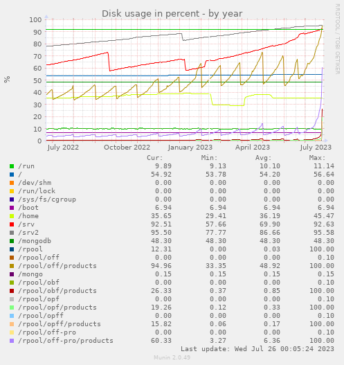

# 2023-07-26 rpool/off/products dataset full on off1

## What happened

Tuesday 2023-07-25 at 22:30, Teleperion signaled us on slack an error while saving a product using the website:

```
Software error:
can't write into /srv/off/products/805/325/960/8031/10.sto: No space left on device at /srv/off/lib/ProductOpener/Store.pm line 235.
```

## Investigating

/srv/off/products points to /rpool/off/products

The ZFS rpool dataset is indeed full, with no space left on device.

We did get an alert for this in mails, but first one was the same day (25/07) at 20:07 !

> CRITICALs: /rpool/off/products is 99.51 (outside range [:98]).

## Solving

First step was to remove the opf obf and opff datasets, as they were already moved to off2 and weren't needed anymore
But this gained 22 Go only, which does not seems to be a solution for more than the very short term.

After that we investigate more thanks to Pierre and Raphaël. Looking at munin graphs, specially the yearly one, we saw that the /rpool/off/products dataset was growing fast, but in the past we saw the hard cut corresponding to snapshot deletion, making it loose 1/3 of the size (BTW it's not that easy [to get to this yearly graphic](https://www.computel.fr/munin/openfoodfacts/off1.openfoodfacts/df.html)). It occured to me that I did a change to sto-products-sync.sh following incident on ovh3 synchronization (see [2012-06-08 Stalled ZFS Sync for off products on ovh3](./2023-06-08-stalled-zfs-sync-off-products.md)) to avoid removing snapshot too quickly… and the simple solution had been to keep more snapshots.



As we are about to move to off2, a temporary solution is to just remove some of the daily snapshosts from last month.

```bash
zfs destroy rpool/off/products@20230602-0000
zfs destroy rpool/off/products@20230603-0000
...
zfs destroy rpool/off/products@20230629-0000
zfs destroy rpool/off/products@20230630-0000
```

After that we are back to 174G of disk free space.

## Post operations

The 98% range on disk space alert is really too high and should be 90% - it's a lesson to bare in mind for off2

It seems illogical that the intermediary snapshots take so much disk space.
We opened a bug to investigate why it is the case, because that might also be associated with a potential performance gain for the app: [Understand why zfs snapshots take so much place on products dataset bug](https://github.com/openfoodfacts/openfoodfacts-server/issues/8740)

The high disk usage might also explain the poor performances of the server this week (with some 504 on product page visualization, which normally does not involve MongoDB). (EDIT: nope, poor performance continues…)

### removal on august

On the 2023-08-10 I manually removed snapshots from 20230702-0000 to 20230719-0000 to insure we do not go full again until off2 migration.
