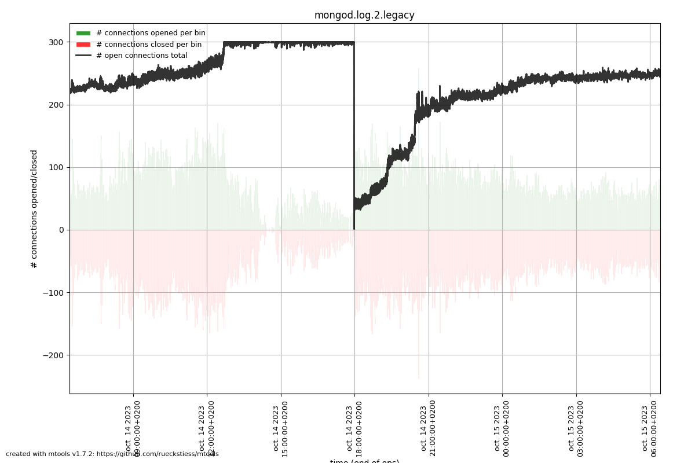
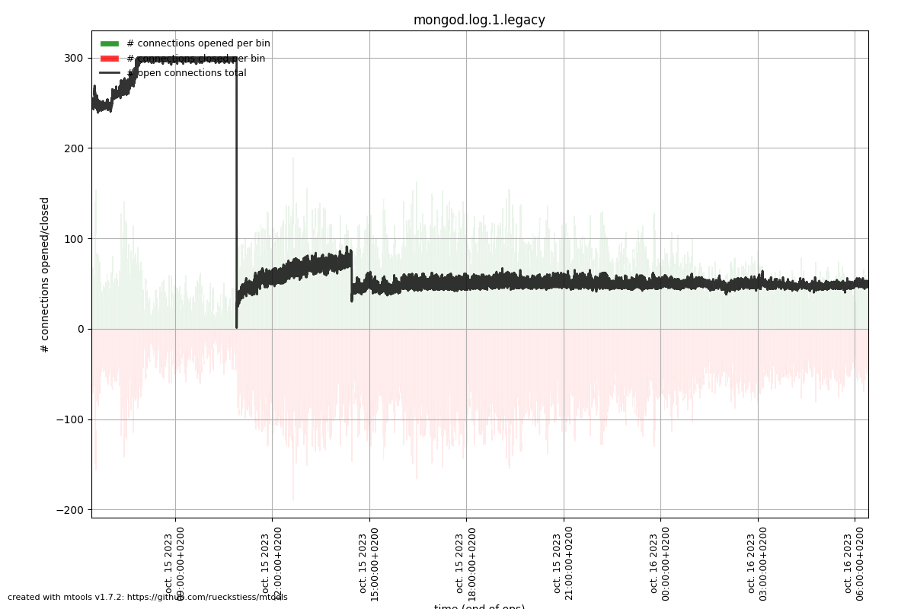
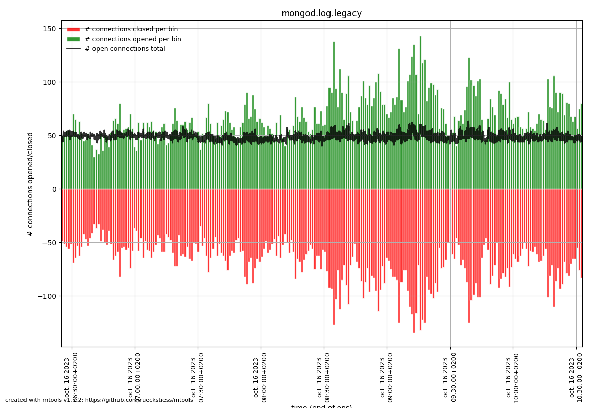

# 2023-10-14: mongodb-down

## What happened?

* On Sunday, 2023-10-14 from ~12:00 (maybe before) to 17:55 CEST, Open Food Facts core websites (world.openfoodfacts.org + [all.countries].openfoodfacts.org) were experiencing issues: either "Software error" or "No products" when asking for a list of products.
* API and core websites were working for product pages, eg. https://world.openfoodfacts.org/product/3168930010265/cruesli-melange-de-noix-quaker
* On off3, hosting mongodb, load were very high and 80+ of the ram was full.

## Solving (Charles)
Around 17:55 I just restarted mongodb -- `systemctl restart mongod`  --  and things get back to work: load get back to ~1, RAM was arround 50%, sites were working.

## Later on
Same issue occurs on Sunday at ~10:55, except server load and RAM were normal. I have also restarted mongod and things get back to work.

## Investigation (Stéphane)

### MongoDB connections refused: too many active connections (300)

The MongoDB logs on off3 show a lot of connections refused:

/var/log/mongodb/mongod.log.1:

`{"t":{"$date":"2023-10-15T10:54:09.661+02:00"},"s":"I",  "c":"NETWORK",  "id":22942,   "ctx":"listener","msg":"Connection refused because there are too many open connections","attr":{"connectionCount":301}}`

The current maximum number of connections is 300:

`off3:/var/log/mongodb# grep maxIncoming /etc/mongod.conf 
  maxIncomingConnections: 300`

### Plotting connection counts with mtools

The mplotqueries tool from mtools can be used to plot the number of connections being opened and closed and the current active connections. See: https://rueckstiess.github.io/mtools/mplotqueries.html#connection-churn-plot

Note: mtools has not been updated in years, and it works with the very old (not JSON) MongoDB log format. The logs can be converted to the old format with https://github.com/ricojf-mongodb/convert-json-logs-to-legacy

#### Saturday 14/10/2023

On Saturday we reached the 300 connections limit until Charles restarted MongoDB, but the connections then continued to pile up.

#### Sunday 15/10/2023

On Sunday morning, we reached the maximum again, until Charles again restarted MongoDB. The connections started to climb again, but then went back to normal in the early afternoon.

#### Monday 16/10/2023

On Monday everything is normal.

### Determining why active connections are climbing

In the MongoDB logs we can see that MongoDB connections are coming from different IP addresses. e.g. with the Saturday logs:

`grep -c 51.210.154.203  mongod.log.2.legacy
119320

grep -c 10.1.0.110 mongod.log.2.legacy
11194

grep -c 10.1.0.111 mongod.log.2.legacy
42185

grep -c 10.1.0.112 mongod.log.2.legacy
10281

grep -c 10.0.0.1 mongod.log.2.legacy
129725`

10.0.0.1 is off1 currently running off and off-pro, 10.1.0.* are the containers on off2 for obf, opf, and opff, and 51.210.154.203 is ovh2.

#### track_connections_in_mongodb_log.py

What's relevant for this issue is not the number of connections, but the number of active connections.

I created a script to track the number of active connections per client ip address: track_connections_in_mongodb_log.py

`track_connections_in_mongodb_log.py --log mongod.log.2
[..]
IP address: 10.0.0.1, Active connections: 14
IP address: 10.1.0.112, Active connections: 3
IP address: 10.1.0.111, Active connections: 4
IP address: 51.210.154.203, Active connections: 433
IP address: 10.1.0.110, Active connections: 11
IP address: 127.0.0.1, Active connections: 0`

It appears that 51.210.154.203 (ovh2) is the remote that accumulates connections and makes us hit the maximum (300).

Note: the number of active connections reported by the script is above 300 because it's a full day log and in the middle MongoDB was restarted.

From the mongodb logs, we can see that the corresponding client is written in Python:

`{"t":{"$date":"2023-10-15T01:17:54.641+02:00"},"s":"I",  "c":"NETWORK",  "id":51800,   "ctx":"conn39884","msg":"client metadata","attr":{"remote":"51.210.154.203:43260","client":"conn39884","doc":{"driver":{"name":"PyMongo","version":"3.12.3"},"os":{"type":"Linux","name":"Linux","architecture":"x86_64","version":"5.10.0-19-amd64"},"platform":"CPython 3.11.5.final.0"}}}`

## Robotoff side investigation (Raphaël)

After some investigation, it's not clear why there were so many connections attempts from pymongo. It's clear however that it tried to reconnect many times to MongoDB: [sentry issue](https://openfoodfacts.sentry.io/issues/4339801224/events/92bac62eb9ea4ad1a38cb207af088060/?project=1415205)

Connection pooling is handled by Pymongo entirely, and we're currently respecting client creation best practices (not creating the client before forking).
In Pymongo 4.0, one of the improvement is [a better connection management to avoid "connection storms"](https://pymongo.readthedocs.io/en/stable/changelog.html#breaking-changes-in-4-0), upgrading from 3.12 to 4.5 would possibly help.

This was done in [robtooff PR #1267](https://github.com/openfoodfacts/robotoff/pull/1267)
