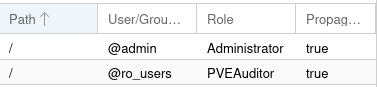

# 2023-12-18 off1 upgrade

This is the same operation as [# 2023-02-17 Off2 Upgrade](./2023-02-17-off2-upgrade.md)
but for off1.

We will:
* add four 14T disks
* add an adapter card for SSD
* add two 2T nvme disk and one 14G optane, while keeping existing nvme
* completely reinstall the system with Proxmox 7.4.1
  * rpool in mirror-0 for the system
    * using a 70Gb part on all hdd disks
  * zfs-hdd in raidz1-0 for the data
    * using a 14T-70G par on all hdd disks
  * zfs-nvme in raidz1-0 for data that needs to be fast
    * using the two 2T nvme
    * using 8G part on octane for logs

## 2023-12-18 server physical upgrade at free datacenter

## 2023-12-21 continuing server install

### First ssh connexion

Using root: `ssh root@off1 -o PubkeyAuthentication=no`

### Update and add some base packages

Change `/etc/apt/sources.list.d/pve-enterprise.list` for `/etc/apt/sources.list.d/pve-install-repo.list`,
with inside: 

```bash
apt update
apt upgrade
apt install munin-node sudo vim parted tree etckeeper rsync screen fail2ban git curl htop lsb-release bsd-mailx
```

### Configure locale

```bash
vim /etc/locale.gen
# uncomment fr_FR.UTF-8, and exit
locale-gen
```

### Network configuration

In `/etc/network/interfaces` added the `vmbr1` bridge interface (on eno2):
```conf
auto vmbr1
iface vmbr1 inet static
        address 10.0.0.1/8
        bridge-ports eno2
        bridge-stp off
        bridge-fd 0
        post-up echo 1 > /proc/sys/net/ipv4/ip_forward
        post-up   iptables -t nat -A POSTROUTING -s '10.1.0.0/16' -o vmbr0 -j MASQUERADE
        post-down iptables -t nat -D POSTROUTING -s '10.1.0.0/16' -o vmbr0 -j MASQUERADE
```

Then `systemctl restart networking`

And verify with `ip address list` and `ip route list`
```
default via 213.36.253.222 dev vmbr0 proto kernel onlink 
10.0.0.0/8 dev vmbr1 proto kernel scope link src 10.0.0.1 
213.36.253.192/27 dev vmbr0 proto kernel scope link src 213.36.253.206 
```

### Creating users


First created off user (to ensure it have 1000 id):

```bash
adduser --shell /usr/sbin/nologin off
```

Then add other sudo users, like:
```bash
adduser alex
...
adduser alex sudo
```
and copy ssh keys.

I also copied password hash for off2 to off1 (user can then decide to change their password altogether).

### Creating ZFS pools

We already have rpool where the distribution is installed.


#### Partition disks


First we need to create partitions on our four HDD to be part of `zfs-hdd`.
They already have a partition for the system (participating in `rpool`)

Running:
```bash
for name in a b c d; do parted /dev/sd$name print; done
```
show us the same pattern for all disks:
```
Model: ATA TOSHIBA MG07ACA1 (scsi)
Disk /dev/sdd: 14,0TB
Sector size (logical/physical): 512B/4096B
Partition Table: gpt
Disk Flags: 
Number  Start   End     Size    File system  Name  Flags
 1      17,4kB  1049kB  1031kB                     bios_grub
 2      1049kB  1075MB  1074MB  fat32              boot, esp
 3      1075MB  69,8GB  68,7GB  zfs
```

We can print sectors to know where to start next partition more precisely:

```bash
for name in a b c d; do parted /dev/sd$name 'unit s print'; done

...
Number  Start     End         Size        File system  Name  Flags
...
 3      2099200s  136314880s  134215681s  zfs

```

We add 2048 to 136314880 to be better aligned.

So now we create the partitions on the remaining space:
```bash
for name in a b c d; do parted /dev/sd$name mkpart zfs-hdd zfs 136316928s 100%; done
```

We also want to partition the SSDs and octane.

Listing them to know which is which:
```bash
for device in /dev/nvme?;do echo $device "--------";smartctl -a $device|grep -P '(Model|Size/Capacity)';done

/dev/nvme0 --------
Model Number:                       WD_BLACK SN770 2TB
Namespace 1 Size/Capacity:          2 000 398 934 016 [2,00 TB]
/dev/nvme1 --------
Model Number:                       INTEL MEMPEK1J016GA
Namespace 1 Size/Capacity:          14 403 239 936 [14,4 GB]
/dev/nvme2 --------
Model Number:                       Samsung SSD 970 EVO Plus 1TB
Namespace 1 Size/Capacity:          1 000 204 886 016 [1,00 TB]
```
(at the time of install, one 2TB SSD is missing because it was impossible to boot with it).

So:
* /dev/nvme0 is the 2TB SSD
* /dev/nvme1 is the octane (14,4 GB)
* /dev/nvme2 is the (old) 1TB SSD

I follow the partitioning of off2:

```bash
# 2TB SSD is devoted entirely to zfs-nvme
parted /dev/nvme0n1 mklabel gpt
parted /dev/nvme0n1 mkpart zfs-nvme zfs 2048s 100%

# Octane is divided as log for zfs-hdd and zfs-nvme
parted /dev/nvme1n1 mklabel gpt
parted /dev/nvme1n1 \
  mkpart log-zfs-nvme zfs 2048s 50% \
  mkpart log-zfs-hdd zfs 50% 100%

# 1TB SSD will be cache for zfs-hdd
parted /dev/nvme2n1 mklabel gpt
# we need to have a xfs partition, I don't know exactly why !
# but without it, the zfs partition is changed to a xfs one…
parted /dev/nvme2n1 \
  mkpart xfs 2048s 64G \
  mkpart zfs-hdd-cache zfs 64G 100%
```

We can see all our partition on the disk:
```bash
ls /dev/sd?? /dev/nvme?n1p?

lsblk
```

#### Creating zfs pools

We creates a zfs-hdd pool with partitions mounted as zraid1 and (sda4, sdb4, sdc4 and sdd4) and a partition on the octane disk as log and some properties.

```bash
zpool create zfs-hdd -o ashift=12 raidz1 sda4 sdb4 sdc4 sdd4
zfs set compress=on xattr=sa atime=off zfs-hdd
zpool add zfs-hdd log nvme1n1p2
zpool add zfs-hdd cache nvme2n1p2
```

Note:
Doing the later I got: `/dev/nvme1n1p2 is part of potentially active pool 'zfs-hdd'`
This is because octane was used in a previous install on off2.
I just did: `zpool labelclear -f nvme1n1`, `zpool labelclear -f nvme1n1p2` and `zpool labelclear -f nvme2n1p2`
(for real, tried to clear the label on any not yet used partition).

We creates a zfs-nvme pool but with only nvme0n1p1, as it's the only SSD and a partition on the octane disk as log and some properties. It can't be a mirror yet because there is only one device… we will have to backup, destroy and re-create it with new nvme to be able to have a mirror.

```bash
zpool create zfs-nvme -o ashift=12 nvme0n1p1
zfs set compress=on xattr=sa atime=off zfs-nvme
zpool add zfs-nvme log nvme1n1p1
```

## Joining PVE cluster

It's time to join the cluster. We will join it using internal ip !


### preparing /etc/hosts

I edited /etc/hosts on off1 to have:

```conf
127.0.0.1 localhost.localdomain localhost
# 213.36.253.206 off1.openfoodfacts.org off1
10.0.0.1 off1.openfoodfacts.org off1 pve-localhost
10.0.0.2 off2.openfoodfacts.org off2
...
```

And on off2:
```conf
127.0.0.1 localhost.localdomain localhost
10.0.0.2 off2.openfoodfacts.org off2 pve-localhost
#213.36.253.208 off2.openfoodfacts.org off2
10.0.0.1 off1.openfoodfacts.org off1
...
```

### creating the cluster on off2

See [official docs](https://pve.proxmox.com/pve-docs-6/chapter-pvecm.html)

On off2:
```bash
pvecm create off-free
pvecm status
```

### joining the cluster from off1

On off1
```bash
pvecm add 10.0.0.2 --fingerprint "43:B6:2A:DC:BF:17:C8:70:8F:3C:A4:A8:2D:D5:F8:24:18:6B:78:6D:24:8A:65:DA:71:04:A3:FE:E0:45:DE:B6"
```

Note: first time I did it without `--fingerprint` option.
I verified the fingerprint by looking at the certificate of proxmox manager in firefox.

### Using systemd-timesyncd

As it's [proposed by Proxmox guide](https://pve.proxmox.com/pve-docs-6/pve-admin-guide.html#_time_synchronization)
I installed `systemd-timesyncd` on off1 and off2.


### adding the storages

We create pve pools:

```bash
zfs create zfs-hdd/pve
zfs create zfs-nvme/pve
```
They are immediatly availabe in proxmox !

```
pvesm status
Name            Type     Status           Total            Used       Available        %
backups          dir     active     39396965504             256     39396965248    0.00%
local            dir     active        64475008        11079168        53395840   17.18%
zfs-hdd      zfspool     active     39396965446             139     39396965307    0.00%
zfs-nvme     zfspool     active      1885863288              96      1885863192    0.00%
```

Also the backups dir automatically get on zfs-hdd, but I don't really know why !
`cat /etc/pve/storage.cfg` helps see that.

## Adding ro_users group to proxmox

We have a `ro_users` group for users to have read-only access to the proxmox interface.

I created the group, going to cluster interface in proxmox and using `create`.

I then go to `permissions` and give the PVEAuditor role to the group on `/` with *propagate*.



## Getting containers templates

See [proxmox docs on container images](https://pve.proxmox.com/wiki/Linux_Container#pct_container_images)

```bash
pveam update
pveam available|grep 'debian-.*-standard'
pveam download local debian-11-standard_11.7-1_amd64.tar.zst
pveam download local debian-12-standard_12.2-1_amd64.tar.zst
```

## Adding openfoodfacts-infrastructure repository

Added root ssh pub key (`cat /root/.ssh/id_rsa.pub`) as a [deploy key to github infrastructure repository](https://github.com/openfoodfacts/openfoodfacts-infrastructure/settings/keys)


```bash
cd /opt
git clone git@github.com:openfoodfacts/openfoodfacts-infrastructure.git
```

## Adding Munin monitoring

Simply following [our Munin doc on how to configure a server](../munin.md#how-to-configure-a-server)

## Configuring snapshots and syncoid

I first installed sanoid following [install instructions](../sanoid.md#building-sanoid-deb)

We want to pull snapshots from off1 and to let ovh3 pull our snapshots.


### Enabling sanoid

```bash
for unit in email-failures@.service sanoid_check.service sanoid_check.timer sanoid.service.d; \
  do ln -s /opt/openfoodfacts-infrastructure/confs/off1/systemd/system/$unit /etc/systemd/system ; \
done
systemctl daemon-reload
systemctl enable --now  sanoid_check.timer
systemctl enable --now  sanoid.service
```

### creating off2operator on off1

```bash
adduser off2operator

mkdir /home/off2operator/.ssh
vim /home/off2operator/.ssh/authorized_keys
# copy off2 public key

chown off2operator:off2operator -R /home/off2operator
chmod go-rwx -R /home/off2operator/.ssh
```

Adding needed permissions to pull zfs syncs
```bash
zfs allow off2operator hold,send zfs-hdd
zfs allow off2operator hold,send zfs-nvme
zfs allow off2operator hold,send rpool

```

On off2, test ssh connection:

```bash
ssh off1operator@10.0.0.2
```

### sync from off2 to off1

Create conf for syncoid

```bash
ln -s /opt/openfoodfacts-infrastructure/confs/off1/sanoid/syncoid-args.conf /etc/sanoid/
```

Do first sync by hand in a screen (because it will take a very long time):

```bash
set -x; \
grep -v "^#" /etc/sanoid/syncoid-args.conf | \
while read -a sync_args; \
do syncoid "${sync_args[@]}" </dev/null || echo FAILED; done
```

On off1 enable syncoid service:
```bash
ln -s /opt/openfoodfacts-infrastructure/confs/off1/systemd/system/syncoid.service /etc/systemd/system
systemctl daemon-reload
systemctl enable --now  syncoid.service
```


### creating off1operator on off2

Similar as off2operator on off1

```bash
adduser off1operator
... add ssh pub key ...

zfs allow off1operator hold,send zfs-hdd
zfs allow off1operator hold,send zfs-nvme
zfs allow off2operator hold,send rpool
```

On off1, test ssh connection
```bash
ssh off1operator@10.0.0.2
```

