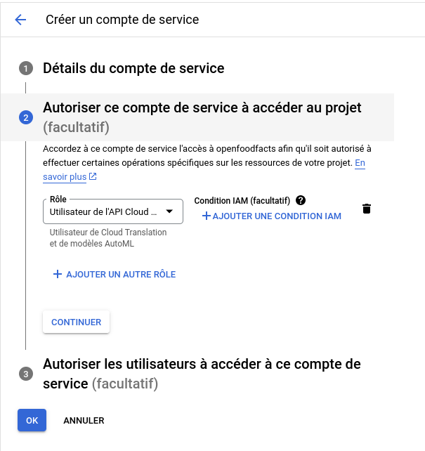

# 2024-02-13 Chatwoot translation

Adding translation to chatwoot.

See https://www.chatwoot.com/docs/product/features/google-translate/

## Configure a google account

Following https://cloud.google.com/translate/docs/setup

I wanted to create a specific project in Google Cloud Platform but I'm not able to link it to the invoice account that we use for robotoff. We have two project using this account.
I will add my API key to *openfoodfacts* (under no organization).

First Activate translation API:

* From project home page
* API and services --> Activated API and services --> + activate API and services button
* search translation
* choose cloud translation API
* activate

(in my case it was already activated !)

Create identifier:
* From project home page
* API and services --> Identifier
* click create identifiers / Service account
* Add a sensible name and description to the account (here chatwoot translation)
* Enable it to access to google translation as a user

  

* and create
* then go to this account,
* go to keys tab and add a key, json
* it creates a key and a json file is downloaded

## Configure Chatwoot

Go in parameters / applications / configure Google Translate

* Paste project ID (you get it in google cloud console, on project home page)
* Paste the content of the JSON file uploaded as key was created in google cloud