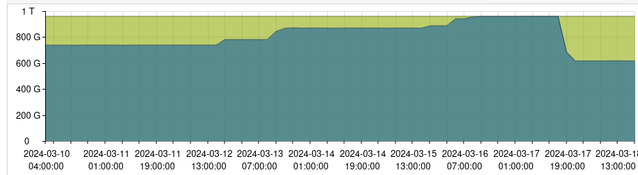

# 2024-03-17 OVH1 Down

## Alert

On 2024-03-17 10h47 CEST someone alert us on slack that prices.openfoodfacts.org is down.

## Investigation

Charles and Stephane sees that it's because the nginx reverse proxy is stopped and cannot be restarted (see [slack thread](https://openfoodfacts.slack.com/archives/C1FPYCWM7/p1710679669777739)).

Charles then see that ZFS hard drive is full.

## Mitigation

Charles removed an old snapshot of the wiki and one from the blog. We are at 99% disk full.

He restarts the nginx reverse proxy container.

Christian removed some old replication snapshot that was out of date (because we do not replicate the VM anymore)  `rpool/vm-200-disk-0` this frees 244G.

Later Alex removed the snapshot he did before the split-disk operation (splitting VM 200 disk in two) it's another important gain.

He also restart the dockers-staging VM (200) and the discourse VM (202).

A bit later, John signal that openfoodfacts-query can't join production Redis. This is because the stunnel container 113, is also shutdown, so Alex restarts it.

The day after we also had to restart the Proxmox Mail Gateway container (102) because a lot of mail where defered (most with a connection lost error).
Blog also was in error because postgres database was down and needs to be restarted.

Notice that we had an alert because ovh1 disk was above 80% threshold by email, but the email was only sent on saturday.

## What happened

Alex did the split disk operation on staging dockers VM on friday.
He decided to leave the snapshot before the split disk operation,
to be able to restore it if needed later on if there were unexpected problems
(or at least mount a clone of it to recover files if needed).
But he didn't check the general space left on device after this operation,
and also he did not anticipate the fact that during the week-end, there would have been the MongoDB import from production.

Saturday March 16th, we got from 884,54 G up to 937G which later on leads to 100%

## Lessons learned

It's a good idea to look at the proxmox graph about disk usage as it might be easier to read than zpool list command.

**DONE**: Alex [added blog, odoo (connect) and wiki to monitored site in prometheus](https://github.com/openfoodfacts/openfoodfacts-monitoring/commit/02934b1d7ccf18432617de54b5b9c55b3661202d).

**TODO**: Alex thinks we really need a close monitoring of systemd to avoid having services down without noticing (it also happened with mail service).
The best would be to use systemd exporter for prometheus and monitor general systemctl state and state of important services. This would help restarting all needed services after that kind off incidents. ([see issue](https://github.com/openfoodfacts/openfoodfacts-infrastructure/issues/326))

**TODO** a prometheus exporter on ZFS could have alerted on slack about disk space usage, which might have lead to better reactivity, maybe even before incident.([see issue](https://github.com/openfoodfacts/openfoodfacts-infrastructure/issues/327))

**DOING** the mongodb import on staging (github action) should check for available disk space before trying to get the MongoDB file and fail otherwise. ([see PR](https://github.com/openfoodfacts/openfoodfacts-server/pull/9959))