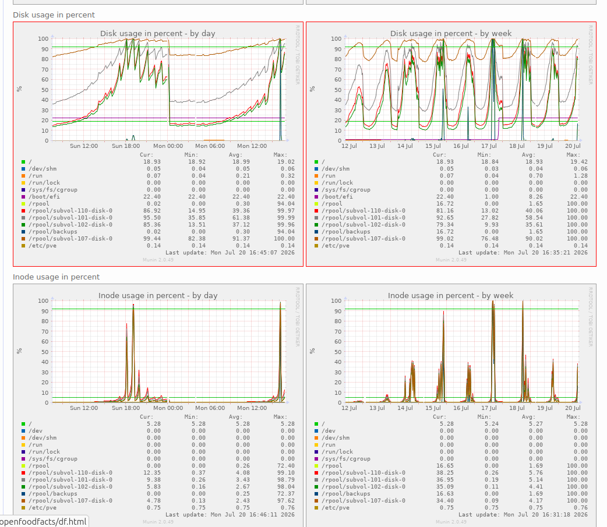

# 2026-07-21 OVH2 Instability

Starting from 2026-07-16 we rad instability on OVH2.

The symptoms where the following:
1. postgresql of Odoo CRM in CT 110, stopping without any log
2. VM 201 (docker-prod) containing various docker compose deployment failing:
   all services and the VM became unreachable (even using proxmox VNC terminal)
3. analytics (matomo) in CT 107 also had mysql failing but not as much

1 and 2 seems to appear at the same moment.

## Analysis

I spent time on 16/07 to try to find the problem.
I had no traces of the bug in any syslog or software.
(retrospectively, I think I missed on line of inode problem and space on device on proxmox host…)

### Not a memory problem

I though of a memory limit problem, and because of a misreading of proxmox metrics,
in particular CAdvisor, which is reporting an entry for cumulated memory taken by containers
(that I misunderstood as one of a particular container, my eyes being fooled by small long lines in the interface…).
So I probe memory but indeed this was not the problem.[^memory-log-commands]

[^memory-log-commands]: I used commands like:
  * ```bash
    while true; do echo $(date +"%Y-%m-%d %H:%M:%S") "####################" >> top-memory.log; ps aux --sort=-%mem | head -20 >> top-memory.log ; sleep 120; done
    ```
  * ```bash
    while true; do echo $(date +"%Y-%m-%d %H:%M:%S") $(free -w|grep Mem) >> free-mem.log; sleep 120; done
    ```
### A disk space problem

Finally looking at more closely at [munin schemas for ovh2](https://www.computel.fr/munin/openfoodfacts/ovh2.openfoodfacts/index.html),
I saw there was a problem with disk space:

{width=50%}

So at this point I knew the culprit.

Indeed `zpool list` shows there is really few space left on device.
And `zfs list -r rpool` also shows where this space goes.

I did log into the docker staging VM to try to remove files,
I did remove some old files (also put a limit on docker log files in docker daemon settings),
but I also realized that disk usage was already not that high,
but the same, the ZFS corresponding ZVOL[^VM-ZVOL] was not reflecting the size of data inside,
but a bigger size (630G vs 67G) !

It looks like, as Zvol is formatted using ext4, ZFS does not see the blocks that were freed by the filesystem. I did try to defrag with `e4defrag` but it had no effect.


[^VM-ZVOL] it is a VM so we can't mount datasets in it, we use ZFS ZVOL formatted as ext4

## Resolution

Thanks to glm5.2, I found the solution:

On SSD, space is freed thanks to `fstrim` command,
which is normally launched regularly.
But depending on your VM disk definition it might not notify ZFS
which does not free the blocks.
We have to add the `discard=on` option to the disk definition in the VM configuration.

So I edited the VM configuration `/etc/pve/qemu-server/201.conf`
and I added the `discard=on` to both disks:
```bash
scsi0: zfs:vm-201-disk-0,backup=0,iothread=1,size=702G,ssd=1,discard=on
scsi1: zfs:vm-201-disk-1,backup=0,iothread=1,size=144G,ssd=1,discard=on
```

Then I shutdown and restart the VM:
```bash
qm shutdown 201
qm start 201
```

and then in the VM, I did run `fstrim`:
```bash
fstrim -av
# also verify it will run autonomously
systemctl status fstrim.timer
```

And *voilà*, the real disk size is now reflected in ZFS.
`zfs list` on the host confirms it.

But the space is really freed if the old snapshots still olding it are also removed.
On ovh2, we keep only some snapshots, but to avoid errors,
after two hours (so that I have some newer snapshot, and ovh3 replication already occured,)
i removed the old snapshots manually… and the space change was really spectacular !

I also applied this to
* ovh1 VMs (docker staging and discourse)
* osm45 VM (docker prod 2)
* hetzner-02 and hetzner-03
* scaleway-02 (but there I did not restart the VM… yet as it's not urgent)
* scaleway-03 (docker-prod-2)

## Lessons learned

* Really look at graph more closely… (it remains complicated to spot the right thing).

* Deploying prometheus on proxmox host would really be important, so that we get an alert on low disk space (munin alerts do not work that well), see https://github.com/openfoodfacts/openfoodfacts-infrastructure/issues/597

* We don't use ansible to create VM right now (too seldom and a bit complicated to handle well…).
  But we should have a check for certain options on CT / VMs, etc. (it could be a job).
  see https://github.com/openfoodfacts/openfoodfacts-infrastructure/issues/669