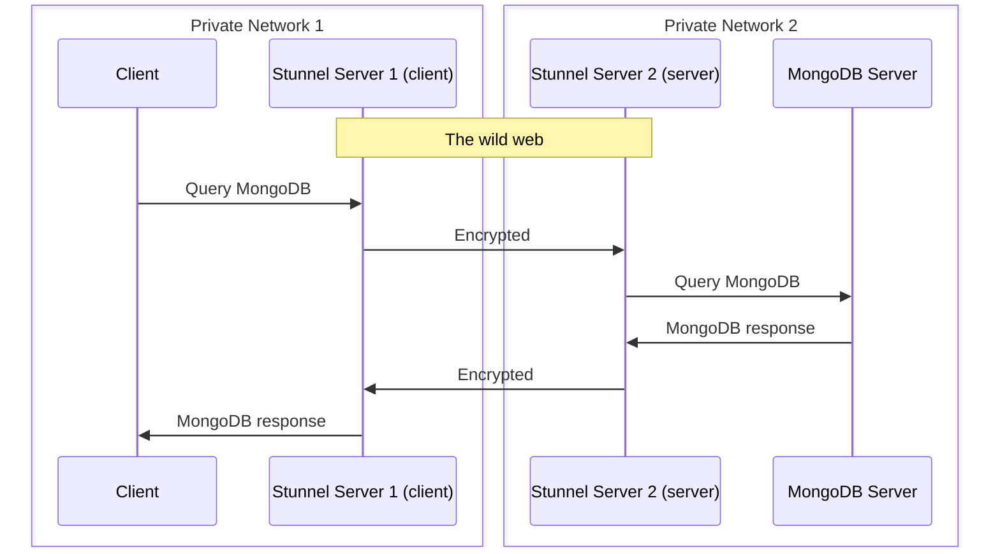

# Stunnel

Stunnel enables us to secure (TCP) connection between distant servers.

It encrypts traffic with openssl.

It is installed on the reverse proxy of off2 and ovh1.

Illustration:

## Client vs Server

When we configure stunnel, there are two side:
* the side, where connection happens (*Stunnel Server 1* on the diagram)  is called **client side**
* the other side accepts connections only from other stunnel instances and forward them to the exposed service, it is the **server side**

Where as the **server side** port needs to be exposed publicly on the web, we want to avoid **client side** to be exposed on a public IP even inadvertently. 

That's why we:
* use reverse proxy for stunnel **server** services, and only those
* use a specific container for stunnel **client** entrypoints, with only a private IP exposed.

## Configuration

Configuration is in `/etc/stunnel/off.conf` this is the `off` instance (and meant to be the only one for now),
we can add as many entries to serve different services as we want.

When you configure stunnel, on the side, where connection happens (*Stunnel Server 1* on the diagram) you have to specify `client=yes`. On the other side it's `client=no` (server side), it accepts connections only from other stunnel instances and forward them to the exposed service.

It's better to only listen on private network on the client side and to avoid exposing the entry to the public, we only do it on a private container (while the server side must expose to a public IP).

## Systemd service

The stunnel@off service is the one that correspond to  `/etc/stunnel/off.conf`

We had to override the systemctl service a bit for pid file to work:
* stunnel needs to be launch as `root` to get some privilege (and then change user)
* but pid file is created with running user
* so we use group stunnel4 in service definition and add group write permission to runtime directory to ensure stunnel can create the pid file

Also note that it is launched in foreground for we let systemd handle the process.

