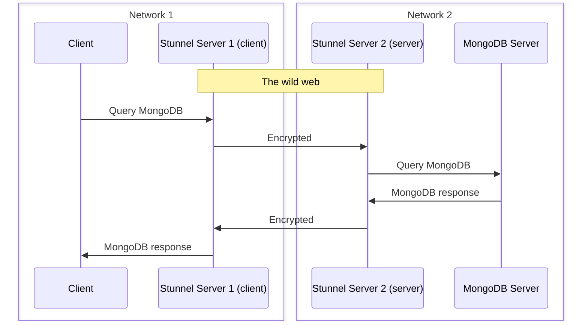

# Stunnel

Stunnel enables us to secure (TCP) connection between distant servers.

It encrypts traffic with openssl.

It is installed on the reverse proxy of off2 and ovh1.

Illustration:

## Configuration

**FIXME**
