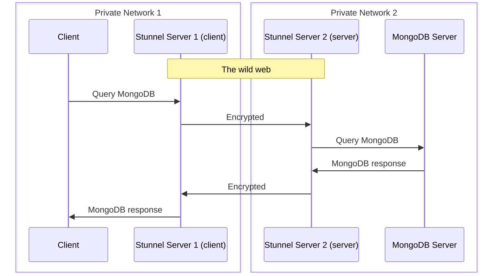

# Stunnel

Stunnel enables us to secure (TCP) connection between distant servers.

It encrypts traffic with openssl.

It is installed on the reverse proxy of off2, and on a specific VM (113) on ovh1. For more details about why we use a new VM for the client (ovh), see [the install report](./reports/2024-01-04-setting-up-stunnel.md).

Illustration:

## Client vs Server

When we configure stunnel, there are two side:
* the side, where connection happens (*Stunnel Server 1* on the diagram)  is called **client side**
* the other side accepts connections only from other stunnel instances and forward them to the exposed service, it is the **server side**

**VERY IMPORTANT**

Whereas the **server side** port needs to be exposed publicly on the web, we want to avoid **client side** to be exposed on a public IP even inadvertently.

That's why we:
* use **reverse proxy** for stunnel **server** services, and only those
* use a **specific internal container** for stunnel **client** entrypoints, with only a private IP exposed.

## Configuration

### Location and server/client

Configuration is in `/etc/stunnel/off.conf` this is the `off` instance (and meant to be the only one for now),
we can add as many entries to serve different services as we want.

When you configure stunnel, on the side, where connection happens (*Stunnel Server 1* on the diagram) you have to specify `client=yes`. On the other side it's `client=no` (server side), it accepts connections only from other stunnel instances and forward them to the exposed service.

**IMPORTANT** always double check to only use client=yes on the internal container (on private network), never on the proxy

### PSK

We use psk (Private Shared Key) for security (easier and more performant than setting up certificates).

The psk file must be in /etc/stunnel/psk/ and must not be commited in this repository, but remain on the servers only, and be private (`chmod -R go-rwx /etc/stunnel/psk/`)

To generate a psk, use `pwgen 32`.

Keep each username really unique for each server, but also for each services (otherwise it will conflict !).

### Test configuration before restarting service

BEWARE that stunnel is used for other services !

So don't restart the service without first testing your configuration.

On way to test is to try to start another instance of stunnel. It will fail because it's unable to bind to already occupied ports, but you will be able to see if configuration was parsed correctly: `stunnel /etc/stunnel/off.conf`

When you are ready, you can use: `systemctl restart stunnel@off`

## Systemd service

The stunnel@off service is the one that correspond to  `/etc/stunnel/off.conf`

We had to override the systemctl service a bit for pid file to work:
* stunnel needs to be launch as `root` to get some privilege (and then change user)
* but pid file is created with running user
* so we use group stunnel4 in service definition and add group write permission to runtime directory to ensure stunnel can create the pid file

Also note that it is launched in foreground for we let systemd handle the process.

