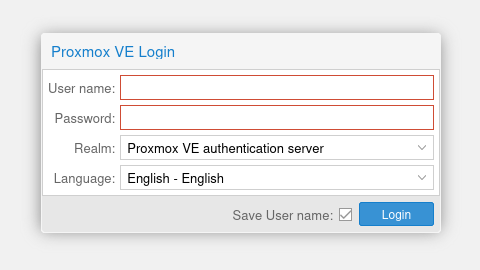

# How to access Proxmox admin interface

Getting access to [Proxmox](../proxmox.md) admin interface allows you to:

- visualize all servers of the cluster, and associated VMs and CTs
- update many server or VMs/CTs configuration

This tutorial will show you how to get access to the admin console.

## Connecting through SSH on one of the host servers

The Proxmox cluster is made of several "host" servers. First, we will need to connect through SSH to one of the server.

Let's say we want to access `hetzner-02` server. You could connect to the admin interface through any host server that is part of the Proxmox cluster.

At Open Food Facts, all servers are listed in [the Ansible inventory file](https://github.com/openfoodfacts/openfoodfacts-infrastructure/blob/develop/ansible/inventory.production.ini).

On the inventory file, there is a line defining the `hetzner-02` server:

```
hetzner-02 ansible_ssh_host=88.99.90.100 extra_host_ips="2a01:4f8:10a:1a95::2" proxmox_api_local_port=8102
```

So we now know the server IP address: `88.99.90.100`.

If Ansible was used to configure the server, your user should already exist on the server. Your username should be the same as your Github username. You can check [here](https://github.com/openfoodfacts/openfoodfacts-infrastructure/blob/develop/ansible/group_vars/all/system-users.yml) that you're part of the registered users.

Also, make sure that:

- you have locally the private key associated with the key registered in your Github account (accessible at `https://github.com/{YOUR_GITHUB_USERNAME}.keys`). This key was added automatically in `~/.ssh/authorized_keys` for your user on each server configured with Ansible.
- this SSH key was registered to you ssh-agent

Connect to the server using SSH, with:

```bash
ssh {YOUR_GITHUB_USERNAME}@88.99.90.100
```

The connection should be successful, and the system should ask you to change your password.

For convenience, you can add this entry to your SSH config locally (`~/.ssh/config`):

```
Host heztner-02
    Hostname 88.99.90.100
    User <YOUR_GITHUB_USERNAME>
```

Make sure to replace `<YOUR_GITHUB_USERNAME>` by your real Github username.

## Getting access to the admin interface

The Proxmox admin interface is not directly accessible on the internet. It's only exposed on `127.0.0.1:8006`, on the host server.

To access to it, you need to dynamically forward the SSH port so that you can load access the page.

Add the following section on your SSH config:

```bash
Host hetzner-02-proxmox
    Hostname 88.99.90.100
    User <YOUR_GITHUB_USERNAME>
    LocalForward 8007 127.0.0.1:8006
```

If you run `ssh hetzner-02-proxmox`, you should be able to display the Proxmox admin interface on [https://127.0.0.1:8007](https://127.0.0.1:8007)!

A login prompt looking as follow asks you to login:



To log in on Proxmox, you will use a different username than your Github username.
All Proxmox users are listed in [this file](https://github.com/openfoodfacts/openfoodfacts-infrastructure/blob/develop/ansible/group_vars/proxmox_nodes/proxmox-secrets.yml) (not accessible publicly).

It's usually in the following format: the first letter of your first name, followed by your last name, suffixed with `@pve`. If your name is Alex Doe, then your Proxmox username is `adoe@pve`.

Now that we have your username, we finally need to reset your password.

## Resetting your password

> **Note**: If you don't have super-admin rights, ask an administrator to reset the password for you!

First, connect to the host server:

```bash
ssh hetzner-02
```

Then, run the following command to reset your password:
```bash
sudo pveum passwd <YOUR_PROXMOX_USERNAME>
```

Replace `<YOUR_PROXMOX_USERNAME>` by your actual Proxmox username.

You should then be able to log in with your new password! Make sure that the "Proxmox VE Authentication server" is selected under the "Realm" dropdown.
